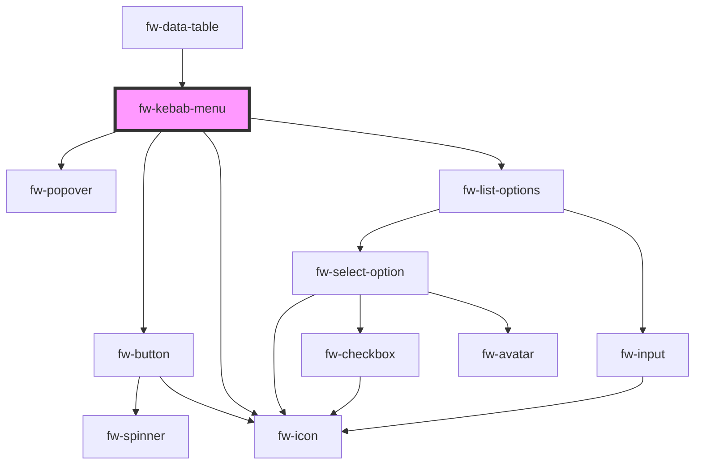

# Kebab Menu (fw-kebab-menu)

fw-kebab-menu displays a kebab icon which on clicking displays a list or drop-down box that enables selection of an option from an available list of values.

`fwSelect` event will be triggered when selecting a value from the list.

## Demo

```html live
<fw-label value="Standard variant"></fw-label>
<fw-kebab-menu id="standard-kebab-menu"></fw-kebab-menu>
<br /><br />
<fw-label value="Icon variant"></fw-label>
<fw-kebab-menu id="icon-kebab-menu" variant="icon"></fw-kebab-menu>
<br />

<script type="application/javascript">
  var standardDataSource = [
    {
      value: 'move_up',
      text: 'Move Up',
    },
    {
      value: 'move_down',
      text: 'Move Down',
    },
    {
      value: 'remove',
      text: 'Remove',
    },
  ];
  var iconDataSource = [
    {
      value: 'move_up',
      text: 'Move Up',
      graphicsProps: { name: 'arrow-up' },
    },
    {
      value: 'move_down',
      text: 'Move Down',
      graphicsProps: { name: 'arrow-down' },
    },
    {
      value: 'remove',
      text: 'Remove',
      graphicsProps: { name: 'delete' },
    },
  ];
  var standardVariant = document.getElementById('standard-kebab-menu');
  standardVariant.options = iconDataSource;
  standardVariant.addEventListener('fwSelect', (e) => {
    console.log('standard variant fwSelect event', e.detail);
  })
  var iconVariant = document.getElementById('icon-kebab-menu');
  iconVariant.options = iconDataSource;
  iconVariant.addEventListener('fwSelect', (e) => {
    console.log('icon variant fwSelect event', e.detail);
  })
</script>
```

## Usage

<code-group>
  <code-block title="HTML">
  ```html 
    <fw-label value="Standard variant"></fw-label>
    <fw-kebab-menu id="standard-kebab-menu"></fw-kebab-menu>
    <br /><br />
    <fw-label value="Icon variant"></fw-label>
    <fw-kebab-menu id="icon-kebab-menu" variant="icon"></fw-kebab-menu>
    <br />

    <script type="application/javascript">
  var standardDataSource = [
    {
      value: 'move_up',
      text: 'Move Up',
    },
    {
      value: 'move_down',
      text: 'Move Down',
    },
    {
      value: 'remove',
      text: 'Remove',
    },
  ];
  var iconDataSource = [
    {
      value: 'move_up',
      text: 'Move Up',
      graphicsProps: { name: 'arrow-up' },
    },
    {
      value: 'move_down',
      text: 'Move Down',
      graphicsProps: { name: 'arrow-down' },
    },
    {
      value: 'remove',
      text: 'Remove',
      graphicsProps: { name: 'delete' },
    },
  ];
  var standardVariant = document.getElementById('standard-kebab-menu');
  standardVariant.options = iconDataSource;
  standardVariant.addEventListener('fwSelect', (e) => {
    console.log('standard variant fwSelect event', e.detail);
  })
  var iconVariant = document.getElementById('icon-kebab-menu');
  iconVariant.options = iconDataSource;
  iconVariant.addEventListener('fwSelect', (e) => {
    console.log('icon variant fwSelect event', e.detail);
  })
</script>
  ```
  </code-block>

  <code-block title="React">

```jsx
  import React from "react";
  import { FwKebabMenu } from "@freshworks/crayons/react";
  function App() {

    var standardDataSource = [
    {
      value: 'move_up',
      text: 'Move Up',
    },
    {
      value: 'move_down',
      text: 'Move Down',
    },
    {
      value: 'remove',
      text: 'Remove',
    },
  ];
  var iconDataSource = [
    {
      value: 'move_up',
      text: 'Move Up',
      graphicsProps: { name: 'arrow-up' },
    },
    {
      value: 'move_down',
      text: 'Move Down',
      graphicsProps: { name: 'arrow-down' },
    },
    {
      value: 'remove',
      text: 'Remove',
      graphicsProps: { name: 'delete' },
    },
  ];

    return (
      <>
        <FwKebabMenu id="standardVariant" options={standardDataSource}></FwKebabMenu>
        <FwKebabMenu id="iconVariant" variant="icon" options={iconDataSource}></FwKebabMenu>
      </>
    );
  }
```

</code-block>
</code-group>

<!-- Auto Generated Below -->


## Properties

| Property  | Attribute | Description                                                                                                                                                                                       | Type                   | Default      |
| --------- | --------- | ------------------------------------------------------------------------------------------------------------------------------------------------------------------------------------------------- | ---------------------- | ------------ |
| `options` | --        | The data for the kebab menu component, the options will be of type array of fw-select-options.                                                                                                    | `any[]`                | `[]`         |
| `variant` | `variant` | Standard is the default option without any graphics other option is icon which places the icon at the beginning of the row. The props for the icon are passed as an object via the graphicsProps. | `"icon" \| "standard"` | `'standard'` |


## Events

| Event      | Description                                                        | Type               |
| ---------- | ------------------------------------------------------------------ | ------------------ |
| `fwSelect` | fwSelect event is emitted when an option is clicked from the list. | `CustomEvent<any>` |


## Dependencies

### Used by

 - [fw-data-table](../data-table)

### Depends on

- [fw-popover](../popover)
- [fw-button](../button)
- [fw-icon](../icon)
- [fw-list-options](../options-list)

### Graph


----------------------------------------------

Built with ❤ at Freshworks
