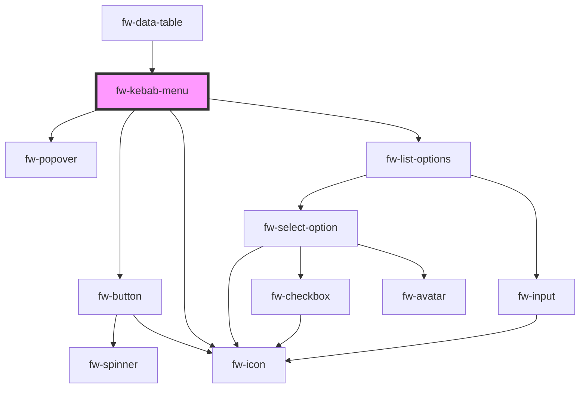

# fw-kebab-menu

<!-- Auto Generated Below -->

## Properties

| Property  | Attribute | Description                                                                                                                                                                                       | Type                   | Default      |
| --------- | --------- | ------------------------------------------------------------------------------------------------------------------------------------------------------------------------------------------------- | ---------------------- | ------------ |
| `options` | --        | The data for the kebab menu component, the options will be of type array of fw-select-options.                                                                                                    | `any[]`                | `[]`         |
| `variant` | `variant` | Standard is the default option without any graphics other option is icon which places the icon at the beginning of the row. The props for the icon are passed as an object via the graphicsProps. | `"icon" \| "standard"` | `'standard'` |

## Events

| Event      | Description                                                        | Type               |
| ---------- | ------------------------------------------------------------------ | ------------------ |
| `fwSelect` | fwSelect event is emitted when an option is clicked from the list. | `CustomEvent<any>` |

## Dependencies

### Used by

 - [fw-data-table](../data-table)

### Depends on

- [fw-popover](../popover)
- [fw-button](../button)
- [fw-icon](../icon)
- [fw-list-options](../options-list)

### Graph

----------------------------------------------

Built with ❤ at Freshworks
