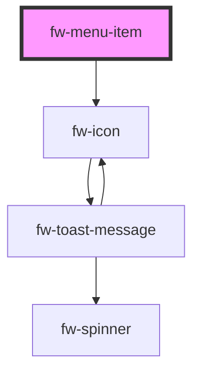

# Menu Item (fw-menu-item)

## Usage

Menu item is a component to define each row of a `fw-menu` components. It takes in `prefix`, `suffix` and default slot to place content either at beginning or end or middle of the row respectively.

```html live
<section>
  <fw-label value="Item with prefix and suffix"></fw-label>
  <fw-menu style="--fw-menu-max-width: 300px">
    <fw-menu-item
      >Messages
      <fw-icon name="email" size="16" slot="prefix"></fw-icon>
      <div class="badge" slot="suffix">10</div>
    </fw-menu-item>

    <fw-menu-item>
      <fw-avatar initials="PT" size="xsmall" slot="prefix"></fw-avatar>
      User name
      <fw-button slot="suffix" color="primary">Log Out</fw-button>
    </fw-menu-item>
  </fw-menu>
</section>

<br />

<section>
  <fw-label value="Click handler on row"></fw-label>
  <fw-menu style="--fw-menu-max-width: 200px">
    <fw-menu-item onclick="showAlert('help!!')"
      >Help
      <fw-icon name="help" size="16" slot="prefix"></fw-icon>
    </fw-menu-item>

    <fw-menu-item onclick="showAlert('info!!!')"
      >More Information
      <fw-icon name="info" size="16" slot="prefix"></fw-icon>
    </fw-menu-item>
  </fw-menu>
</section>

<br />

<section>
  <fw-label value="Selectable Menu item"></fw-label>
  <fw-menu style="--fw-menu-max-width: 200px">
    <fw-menu-item selectable>First Option</fw-menu-item>
    <fw-menu-item selectable>Second Option</fw-menu-item>
    <fw-menu-item selectable>Third Option</fw-menu-item>
  </fw-menu>
</section>

<script type="application/javascript">
  function showAlert(x) {
    alert(x);
  }
</script>
```

<!-- Auto Generated Below -->


## Properties

| Property     | Attribute    | Description                                                                                                                                                                              | Type      | Default |
| ------------ | ------------ | ---------------------------------------------------------------------------------------------------------------------------------------------------------------------------------------- | --------- | ------- |
| `selectable` | `selectable` | Sets the state of the option to selected. The selected option is highlighted and a check mark is displayed next to it. If the attribute’s value is undefined, the value is set to false. | `boolean` | `false` |
| `selected`   | `selected`   | Sets the state of the option to selected. The selected option is highlighted and a check mark is displayed next to it. If the attribute’s value is undefined, the value is set to false. | `boolean` | `false` |


## CSS Custom Properties

| Name                           | Description                                        |
| ------------------------------ | -------------------------------------------------- |
| `--fw-menu-item-background`    | Border of the fw-menu-item popover content.        |
| `--fw-menu-item-border`        | Border of the fw-menu-item popover content.        |
| `--fw-menu-item-border-radius` | Border Radius of the fw-menu-item popover content. |
| `--fw-menu-item-box-shadow`    | Box Shadow of the fw-menu-item popover content.    |


## Dependencies

### Depends on

- [fw-icon](../icon)

### Graph


----------------------------------------------

Built with ❤ at Freshworks
