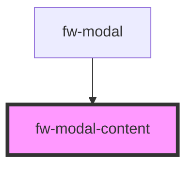

# Modal Content (fw-modal-content)

Displays the content inside the component.

<!-- Auto Generated Below -->

## Dependencies

### Used by

 - [fw-modal](../modal)

### Graph

----------------------------------------------

Built with ❤ at Freshworks
