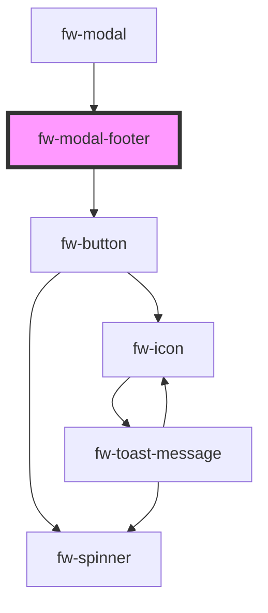

# Modal Footer (fw-modal-footer)

<!-- Auto Generated Below -->

## Properties

| Property         | Attribute         | Description                         | Type                                                       | Default     |
| ---------------- | ----------------- | ----------------------------------- | ---------------------------------------------------------- | ----------- |
| `cancelText`     | `cancel-text`     | The text for the cancel button      | `string`                                                   | `''`        |
| `close`          | `close`           | Function to call on close of modal  | `any`                                                      | `() => {}`  |
| `submit`         | `submit`          | Function to call on submit of modal | `any`                                                      | `() => {}`  |
| `submitColor`    | `submit-color`    | The color of submit button          | `"danger" \| "link" \| "primary" \| "secondary" \| "text"` | `'primary'` |
| `submitDisabled` | `submit-disabled` | Default state of submit button      | `boolean`                                                  | `false`     |
| `submitText`     | `submit-text`     | The text for the submit button      | `string`                                                   | `''`        |

## Dependencies

### Used by

 - [fw-modal](../modal)

### Depends on

- [fw-button](../button)

### Graph

----------------------------------------------

Built with ❤ at Freshworks
