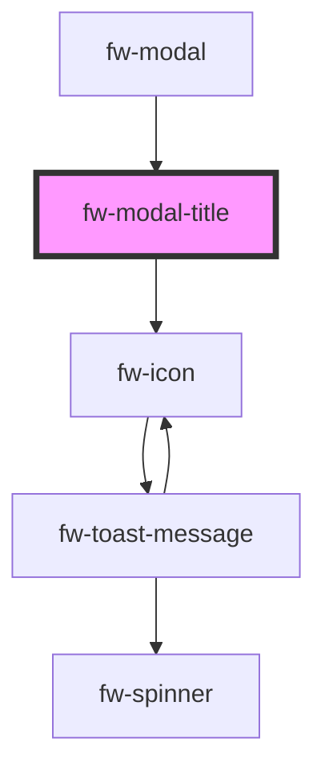

# Modal Title (fw-modal-title)

<!-- Auto Generated Below -->

## Properties

| Property      | Attribute     | Description                                 | Type     | Default     |
| ------------- | ------------- | ------------------------------------------- | -------- | ----------- |
| `description` | `description` | The title text to be displayed on the modal | `string` | `undefined` |
| `icon`        | `icon`        | The icon to be displayed with the title     | `string` | `''`        |
| `titleText`   | `title-text`  | The title text to be displayed on the modal | `string` | `undefined` |

## Dependencies

### Used by

 - [fw-modal](../modal)

### Depends on

- [fw-icon](../icon)

### Graph

----------------------------------------------

Built with ❤ at Freshworks
