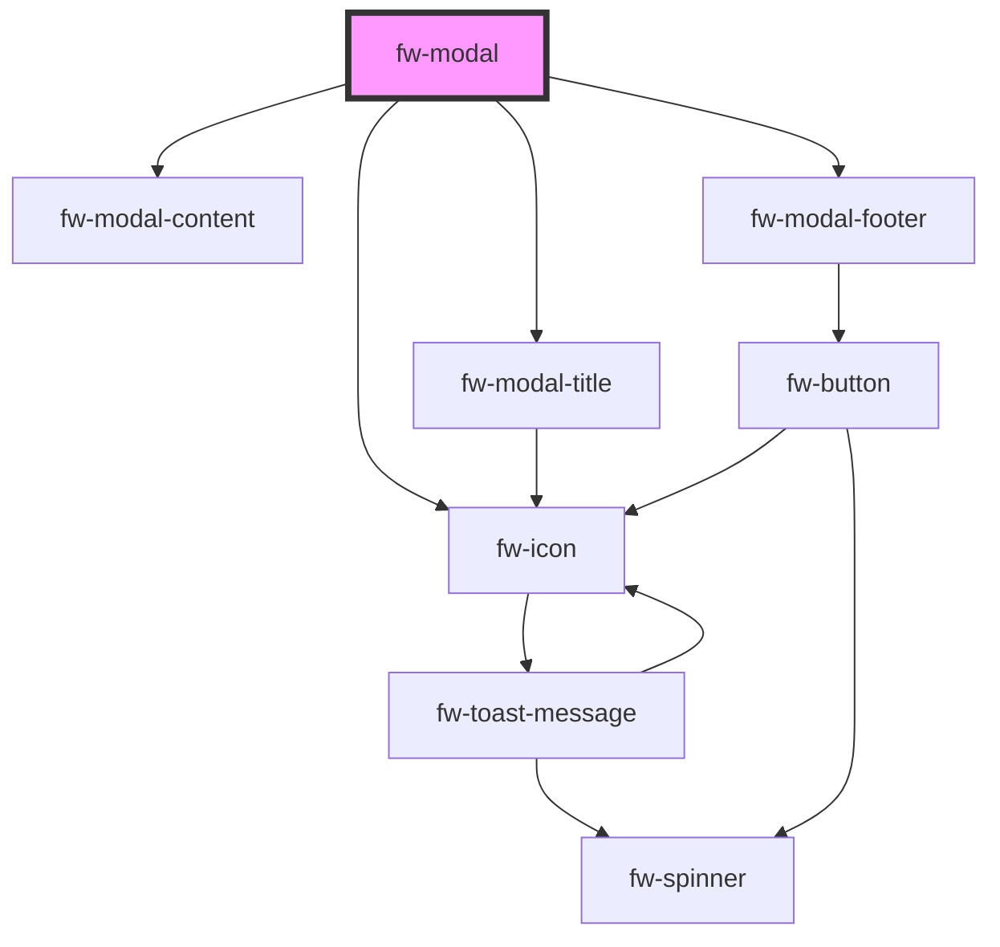

# Modal (fw-modal)

Modals are used as an overlay to display information. It can also be used as confirm boxes to take user inputs.


## Demo & Usage

#### Basic demo

```html live
  <fw-button modal-trigger-id='welcome'> Open Modal </fw-button>
  <fw-modal id='welcome' title-text="Welcome">
    Hello, Welcome to Crayons
  </fw-modal>

  <fw-button modal-trigger-id='welcome-large'> Open Large Modal </fw-button>
  <fw-modal id='welcome-large' title-text="Welcome" size="large" submit-disabled="true">
    Lorem ipsum dolor sit amet, consectetur adipiscing elit. Pellentesque nec vulputate erat. Nulla eu sagittis felis. Sed vel porta felis, vitae sollicitudin enim. Mauris id tellus vel elit tincidunt cursus eu eget nisl. Nunc fringilla massa ac magna dapibus accumsan. Aliquam vehicula lacinia ipsum sed vehicula. Aenean pharetra suscipit nibh, ac sollicitudin justo. Suspendisse vulputate nisl auctor ornare mattis. Morbi vitae tellus ac purus faucibus aliquet ac nec purus.
    Etiam nec dolor vitae mi tincidunt ultricies nec eu augue. Donec eget odio auctor, accumsan eros et, tristique diam. In lacinia neque a laoreet scelerisque. Suspendisse est ipsum, varius eget consequat a, varius vel nunc. Pellentesque posuere ipsum sapien, non consectetur massa pellentesque eu. In hac habitasse platea dictumst. Nulla quis tincidunt arcu, ac lacinia arcu. Donec ac tellus eu velit auctor rhoncus.
    Aenean at eros nibh. Duis a nibh sed eros elementum sagittis. Sed erat tellus, mattis vitae mi id, condimentum bibendum purus. Nulla eget accumsan ipsum. Aenean dolor odio, tristique vel aliquam vel, faucibus eu ligula. Nulla sodales nisl pretium purus finibus, non ultricies dolor tempus. Cras felis arcu, varius a ipsum sed, laoreet laoreet diam. Donec accumsan tortor sed aliquet tempus. Pellentesque maximus, dolor sed imperdiet faucibus, neque dolor viverra lorem, ac vulputate odio purus vitae erat. Sed mollis ac orci et viverra. Curabitur sagittis, leo placerat vestibulum rutrum, leo diam ornare ligula, id sodales nisi augue vitae sapien. In hac habitasse platea dictumst. Vestibulum suscipit metus sed risus placerat, sit amet pretium lectus malesuada. Pellentesque pellentesque, mi et hendrerit elementum, augue lectus lobortis risus, ornare commodo ex odio vitae lectus.
    Phasellus ut purus felis. Proin et turpis ac leo lacinia pulvinar ut et diam. Donec elit enim, semper sed maximus non, tristique quis turpis. Donec venenatis ante dapibus elementum sagittis. Maecenas consequat lectus sit amet ipsum tempor tincidunt. Praesent velit est, volutpat sed malesuada sed, molestie efficitur sem. Vivamus tellus risus, feugiat eu sagittis sed, eleifend vel elit. Vivamus semper porta tempor. Maecenas ut nulla mauris.
    Sed pulvinar orci in lacus semper, nec volutpat lectus pellentesque. Aliquam dictum suscipit tellus, eu rutrum nulla tincidunt vitae. Interdum et malesuada fames ac ante ipsum primis in faucibus. Aliquam egestas, diam eu tincidunt ullamcorper, dui libero lacinia augue, non fermentum augue libero eget diam. Quisque at interdum erat. Sed lobortis sit amet mauris nec rutrum. Aliquam sit amet risus iaculis, tempor lectus commodo, varius ipsum.
    Lorem ipsum dolor sit amet, consectetur adipiscing elit. Pellentesque nec vulputate erat. Nulla eu sagittis felis. Sed vel porta felis, vitae sollicitudin enim. Mauris id tellus vel elit tincidunt cursus eu eget nisl. Nunc fringilla massa ac magna dapibus accumsan. Aliquam vehicula lacinia ipsum sed vehicula. Aenean pharetra suscipit nibh, ac sollicitudin justo. Suspendisse vulputate nisl auctor ornare mattis. Morbi vitae tellus ac purus faucibus aliquet ac nec purus.
    Etiam nec dolor vitae mi tincidunt ultricies nec eu augue. Donec eget odio auctor, accumsan eros et, tristique diam. In lacinia neque a laoreet scelerisque. Suspendisse est ipsum, varius eget consequat a, varius vel nunc. Pellentesque posuere ipsum sapien, non consectetur massa pellentesque eu. In hac habitasse platea dictumst. Nulla quis tincidunt arcu, ac lacinia arcu. Donec ac tellus eu velit auctor rhoncus.
    Aenean at eros nibh. Duis a nibh sed eros elementum sagittis. Sed erat tellus, mattis vitae mi id, condimentum bibendum purus. Nulla eget accumsan ipsum. Aenean dolor odio, tristique vel aliquam vel, faucibus eu ligula. Nulla sodales nisl pretium purus finibus, non ultricies dolor tempus. Cras felis arcu, varius a ipsum sed, laoreet laoreet diam. Donec accumsan tortor sed aliquet tempus. Pellentesque maximus, dolor sed imperdiet faucibus, neque dolor viverra lorem, ac vulputate odio purus vitae erat. Sed mollis ac orci et viverra. Curabitur sagittis, leo placerat vestibulum rutrum, leo diam ornare ligula, id sodales nisi augue vitae sapien. In hac habitasse platea dictumst. Vestibulum suscipit metus sed risus placerat, sit amet pretium lectus malesuada. Pellentesque pellentesque, mi et hendrerit elementum, augue lectus lobortis risus, ornare commodo ex odio vitae lectus.
    Phasellus ut purus felis. Proin et turpis ac leo lacinia pulvinar ut et diam. Donec elit enim, semper sed maximus non, tristique quis turpis. Donec venenatis ante dapibus elementum sagittis. Maecenas consequat lectus sit amet ipsum tempor tincidunt. Praesent velit est, volutpat sed malesuada sed, molestie efficitur sem. Vivamus tellus risus, feugiat eu sagittis sed, eleifend vel elit. Vivamus semper porta tempor. Maecenas ut nulla mauris.
    Sed pulvinar orci in lacus semper, nec volutpat lectus pellentesque. Aliquam dictum suscipit tellus, eu rutrum nulla tincidunt vitae. Interdum et malesuada fames ac ante ipsum primis in faucibus. Aliquam egestas, diam eu tincidunt ullamcorper, dui libero lacinia augue, non fermentum augue libero eget diam. Quisque at interdum erat. Sed lobortis sit amet mauris nec rutrum. Aliquam sit amet risus iaculis, tempor lectus commodo, varius ipsum.
  </fw-modal>
```

#### Basic usage

<code-group>
<code-block title="HTML">
```html 
  <fw-button modal-trigger-id='welcome'> Open Modal </fw-button>
  <fw-modal id='welcome' title-text="Welcome">
    Hello, Welcome to Crayons
  </fw-modal>

  <fw-button modal-trigger-id='welcome-large'> Open Large Modal </fw-button>
  <fw-modal id='welcome-large' title-text="Welcome" size="large" submit-disabled="true">
    Hello, Welcome to Crayons
  </fw-modal>
```
</code-block>

<code-block title="React">
```jsx
import React from "react";
import ReactDOM from "react-dom";
import { FwButton, FwModal } from "@freshworks/crayons/react";
function App() {
  return (<div>
    <FwButton modalTriggerId='welcome'> Open Modal </FwButton>
    <FwModal id='welcome' titleText="Welcome">
      Hello, Welcome to Crayons
    </FwModal>

    <FwButton modalTriggerId='welcome-large'> Open Large Modal </FwButton>
    <FwModal id='welcome-large' titleText="Welcome" size="large" submitDisabled>
      Hello, Welcome to Crayons
    </FwModal>
 </div>);
}
```
</code-block>
</code-group>

#### Simple composition Demo 
```html live 
  <fw-button modal-trigger-id='small'> Open Modal </fw-button>
  <fw-modal id='small' size="small" submit-color="danger">
    <fw-modal-title title-text="Welcome"></fw-modal-title>
    <fw-modal-content><div>Content text</div></fw-modal-content>
    <fw-modal-footer></fw-modal-footer>
  </fw-modal>
```

#### Simple composition Usage 

<code-group>
<code-block title="HTML">
```html 
  <fw-button modal-trigger-id='small'> Open Modal </fw-button>
  <fw-modal id='small' size="small" submit-color="danger">
    <fw-modal-title title-text="Welcome"></fw-modal-title>
    <fw-modal-content><div>Content text</div></fw-modal-content>
    <fw-modal-footer></fw-modal-footer>
  </fw-modal>
```
</code-block>

<code-block title="React">
```jsx
import React from "react";
import ReactDOM from "react-dom";
import { FwButton, FwModal, FwModalTitle, FwModalContent, FwModalFooter } from "@freshworks/crayons/react";
function App() {
  return (<div>
    <FwButton modalTriggerId='small'> Open Modal </FwButton>
    <FwModal id='small' size="small" submitColor="danger">
      <FwModalTitle titleText="Welcome"></FwModalTitle>
      <FwModalContent><div>Content text</div></FwModalContent>
      <FwModalFooter></FwModalFooter>
    </FwModal>
 </div>);
}
```
</code-block>
</code-group>

#### Custom composition Demo

```html live 
  <fw-button modal-trigger-id='composition'> Open confirmation Modal </fw-button>
  <fw-modal id='composition' size="small" submit-color="danger" submit-text="Delete">
    <fw-modal-title>
      <span>Delete message</span>
    </fw-modal-title>
    <fw-modal-content>
      <span>Are you sure you want to delete this Message?</span>
    </fw-modal-content>
  </fw-modal>
```

#### Custom composition Usage

<code-group>
<code-block title="HTML">
```html 
  <fw-button modal-trigger-id='composition'> Open confirmation Modal </fw-button>
  <fw-modal id='composition' size="small" submit-color="danger" submit-text="Delete">
    <fw-modal-title>
      <span>Delete message</span>
    </fw-modal-title>
    <fw-modal-content>
      <span>Are you sure you want to delete this Message?</span>
    </fw-modal-content>
  </fw-modal>
```
</code-block>

<code-block title="React">
```jsx
import React from "react";
import ReactDOM from "react-dom";
import { FwButton, FwModal, FwModalTitle, FwModalContent, FwModalFooter } from "@freshworks/crayons/react";
function App() {
  return (<div>
    <FwButton modal-trigger-id='composition'> Open confirmation Modal </FwButton>
    <FwModal id='composition' size="small" submit-color="danger" submit-text="Delete">
      <FwModalTitle>
        <span>Delete message</span>
      </FwModalTitle>
      <FwModalContent>
        <span>Are you sure you want to delete this Message?</span>
      </FwModalContent>
    </FwModal>
 </div>);
}
```
</code-block>
</code-group>


#### Hide footer of the modal Demo

```html live 
  <fw-button modal-trigger-id='large'> Open modal </fw-button>
  <fw-modal id='large' icon="agent" size="large" hide-footer="true">
    <fw-modal-title>
      <span>Header text</span>
    </fw-modal-title>
    <fw-modal-content>
      <div>Content text</div>
    </fw-modal-content>
  </fw-modal>
```

#### Hide footer of the modal Usage

<code-group>
<code-block title="HTML">
```html 
  <fw-button modal-trigger-id='large'> Open modal </fw-button>
  <fw-modal id='large' icon="agent" size="large" hide-footer="true">
    <fw-modal-title>
      <span>Header text</span>
    </fw-modal-title>
    <fw-modal-content>
      <div>Content text</div>
    </fw-modal-content>
  </fw-modal>
```
</code-block>

<code-block title="React">
```jsx
import React from "react";
import ReactDOM from "react-dom";
import { FwButton, FwModal, FwModalTitle, FwModalContent, FwModalFooter } from "@freshworks/crayons/react";
function App() {
  return (<div>
      <FwButton modalTriggerId='large'> Open modal </FwButton>
      <FwModal id='large' icon="agent" size="large" hideFooter>
        <FwModalTitle>
          <span>Header text</span>
        </FwModalTitle>
        <FwModalContent>
          <div>Content text</div>
        </FwModalContent>
      </fw-modal>
 </div>);
}
```
</code-block>
</code-group>

#### Slider

This is a variation of model that takes the entire viewport as height and slides from right of the screen when entering. Properties and composition are same as modal with the exception of size property. Slider has only one standard size.

```html live 
  <fw-button modal-trigger-id='modal-slider'> Open slider </fw-button>
  <fw-modal id='modal-slider' slider='true'>
    <fw-modal-title>
      <span>Header text</span>
    </fw-modal-title>
    <fw-modal-content>
      <div>
        Lorem ipsum dolor sit amet, consectetur adipiscing elit. Pellentesque nec vulputate erat. Nulla eu sagittis felis. Sed vel porta felis, vitae sollicitudin enim. Mauris id tellus vel elit tincidunt cursus eu eget nisl. Nunc fringilla massa ac magna dapibus accumsan. Aliquam vehicula lacinia ipsum sed vehicula. Aenean pharetra suscipit nibh, ac sollicitudin justo. Suspendisse vulputate nisl auctor ornare mattis. Morbi vitae tellus ac purus faucibus aliquet ac nec purus.
        Etiam nec dolor vitae mi tincidunt ultricies nec eu augue. Donec eget odio auctor, accumsan eros et, tristique diam. In lacinia neque a laoreet scelerisque. Suspendisse est ipsum, varius eget consequat a, varius vel nunc. Pellentesque posuere ipsum sapien, non consectetur massa pellentesque eu. In hac habitasse platea dictumst. Nulla quis tincidunt arcu, ac lacinia arcu. Donec ac tellus eu velit auctor rhoncus.
        Aenean at eros nibh. Duis a nibh sed eros elementum sagittis. Sed erat tellus, mattis vitae mi id, condimentum bibendum purus. Nulla eget accumsan ipsum. Aenean dolor odio, tristique vel aliquam vel, faucibus eu ligula. Nulla sodales nisl pretium purus finibus, non ultricies dolor tempus. Cras felis arcu, varius a ipsum sed, laoreet laoreet diam. Donec accumsan tortor sed aliquet tempus. Pellentesque maximus, dolor sed imperdiet faucibus, neque dolor viverra lorem, ac vulputate odio purus vitae erat. Sed mollis ac orci et viverra. Curabitur sagittis, leo placerat vestibulum rutrum, leo diam ornare ligula, id sodales nisi augue vitae sapien. In hac habitasse platea dictumst. Vestibulum suscipit metus sed risus placerat, sit amet pretium lectus malesuada. Pellentesque pellentesque, mi et hendrerit elementum, augue lectus lobortis risus, ornare commodo ex odio vitae lectus.
        Phasellus ut purus felis. Proin et turpis ac leo lacinia pulvinar ut et diam. Donec elit enim, semper sed maximus non, tristique quis turpis. Donec venenatis ante dapibus elementum sagittis. Maecenas consequat lectus sit amet ipsum tempor tincidunt. Praesent velit est, volutpat sed malesuada sed, molestie efficitur sem. Vivamus tellus risus, feugiat eu sagittis sed, eleifend vel elit. Vivamus semper porta tempor. Maecenas ut nulla mauris.
        Sed pulvinar orci in lacus semper, nec volutpat lectus pellentesque. Aliquam dictum suscipit tellus, eu rutrum nulla tincidunt vitae. Interdum et malesuada fames ac ante ipsum primis in faucibus. Aliquam egestas, diam eu tincidunt ullamcorper, dui libero lacinia augue, non fermentum augue libero eget diam. Quisque at interdum erat. Sed lobortis sit amet mauris nec rutrum. Aliquam sit amet risus iaculis, tempor lectus commodo, varius ipsum.
        Lorem ipsum dolor sit amet, consectetur adipiscing elit. Pellentesque nec vulputate erat. Nulla eu sagittis felis. Sed vel porta felis, vitae sollicitudin enim. Mauris id tellus vel elit tincidunt cursus eu eget nisl. Nunc fringilla massa ac magna dapibus accumsan. Aliquam vehicula lacinia ipsum sed vehicula. Aenean pharetra suscipit nibh, ac sollicitudin justo. Suspendisse vulputate nisl auctor ornare mattis. Morbi vitae tellus ac purus faucibus aliquet ac nec purus.
        Etiam nec dolor vitae mi tincidunt ultricies nec eu augue. Donec eget odio auctor, accumsan eros et, tristique diam. In lacinia neque a laoreet scelerisque. Suspendisse est ipsum, varius eget consequat a, varius vel nunc. Pellentesque posuere ipsum sapien, non consectetur massa pellentesque eu. In hac habitasse platea dictumst. Nulla quis tincidunt arcu, ac lacinia arcu. Donec ac tellus eu velit auctor rhoncus.
        Aenean at eros nibh. Duis a nibh sed eros elementum sagittis. Sed erat tellus, mattis vitae mi id, condimentum bibendum purus. Nulla eget accumsan ipsum. Aenean dolor odio, tristique vel aliquam vel, faucibus eu ligula. Nulla sodales nisl pretium purus finibus, non ultricies dolor tempus. Cras felis arcu, varius a ipsum sed, laoreet laoreet diam. Donec accumsan tortor sed aliquet tempus. Pellentesque maximus, dolor sed imperdiet faucibus, neque dolor viverra lorem, ac vulputate odio purus vitae erat. Sed mollis ac orci et viverra. Curabitur sagittis, leo placerat vestibulum rutrum, leo diam ornare ligula, id sodales nisi augue vitae sapien. In hac habitasse platea dictumst. Vestibulum suscipit metus sed risus placerat, sit amet pretium lectus malesuada. Pellentesque pellentesque, mi et hendrerit elementum, augue lectus lobortis risus, ornare commodo ex odio vitae lectus.
        Phasellus ut purus felis. Proin et turpis ac leo lacinia pulvinar ut et diam. Donec elit enim, semper sed maximus non, tristique quis turpis. Donec venenatis ante dapibus elementum sagittis. Maecenas consequat lectus sit amet ipsum tempor tincidunt. Praesent velit est, volutpat sed malesuada sed, molestie efficitur sem. Vivamus tellus risus, feugiat eu sagittis sed, eleifend vel elit. Vivamus semper porta tempor. Maecenas ut nulla mauris.
        Sed pulvinar orci in lacus semper, nec volutpat lectus pellentesque. Aliquam dictum suscipit tellus, eu rutrum nulla tincidunt vitae. Interdum et malesuada fames ac ante ipsum primis in faucibus. Aliquam egestas, diam eu tincidunt ullamcorper, dui libero lacinia augue, non fermentum augue libero eget diam. Quisque at interdum erat. Sed lobortis sit amet mauris nec rutrum. Aliquam sit amet risus iaculis, tempor lectus commodo, varius ipsum.
      </div>
    </fw-modal-content>
    <fw-modal-footer>
      <fw-button>OK</fw-button>
    </fw-modal-footer>
  </fw-modal>
```

#### Slider Usage

<code-group>
<code-block title="HTML">
```html 
  <fw-button modal-trigger-id='modal-slider'> Open slider </fw-button>
  <fw-modal id='modal-slider' slider='true'>
    <fw-modal-title>
      <span>Header text</span>
    </fw-modal-title>
    <fw-modal-content>
      <div>
        Context text.
      </div>
    </fw-modal-content>
    <fw-modal-footer>
      <fw-button>OK</fw-button>
    </fw-modal-footer>
  </fw-modal>
```
</code-block>

<code-block title="React">
```jsx
import React from "react";
import ReactDOM from "react-dom";
import { FwButton, FwModal, FwModalTitle, FwModalContent, FwModalFooter } from "@freshworks/crayons/react";
function App() {
  return (<div>
      <FwButton modal-trigger-id='modal-slider'>Hello</FwButton>
      <FwModal id='modal-slider' slider>
        <FwModalTitle>
          <span>Header text</span>
        </FwModalTitle>
        <FwModalContent>
          <div>
            Context text.
          </div>
        </FwModalContent>
        <FwModalFooter>
          <FwButton>OK</FwButton>
        </FwModalFooter>
      </FwModal>
 </div>);
}
```
</code-block>
</code-group>

#### Using modal methods 

<code-group>
<code-block title="HTML">
```html 
  <fw-modal id='modal-slider' slider='true'>
    <fw-modal-title>
      <span>Header text</span>
    </fw-modal-title>
    <fw-modal-content>
      <div>
        Context text.
      </div>
    </fw-modal-content>
    <fw-modal-footer>
      <fw-button>OK</fw-button>
    </fw-modal-footer>
  </fw-modal>
```

```js
  document.querySelector('fw-modal#modal-slider').open();
  document.querySelector('fw-modal#modal-slider').close()
```
</code-block>

<code-block title="React">
```jsx
import React, { useRef } from "react";
import ReactDOM from "react-dom";
import { FwButton, FwModal, FwModalTitle, FwModalContent, FwModalFooter } from "@freshworks/crayons/react";
function App() {

  const modal = useRef(null);
  return (<div>
      <FwButton onClick={() => modal.current.open() }>Open Modal using methods</FwButton>
      <FwModal id='modal-slider' slider ref={modal}>
        <FwModalTitle>
          <span>Header text</span>
        </FwModalTitle>
        <FwModalContent>
          <div>
            Context text.
          </div>
        </FwModalContent>
        <FwModalFooter>
          <FwButton>OK</FwButton>
        </FwModalFooter>
      </FwModal>
 </div>);
}
```
</code-block>
</code-group>

<!-- Auto Generated Below -->


## Properties

| Property             | Attribute               | Description                                               | Type                                                       | Default      |
| -------------------- | ----------------------- | --------------------------------------------------------- | ---------------------------------------------------------- | ------------ |
| `cancelText`         | `cancel-text`           | The text for the cancel button                            | `string`                                                   | `''`         |
| `description`        | `description`           | The description text to be displayed on the modal         | `string`                                                   | `undefined`  |
| `hasCloseIconButton` | `has-close-icon-button` | Property to add or remove the top right close icon button | `boolean`                                                  | `true`       |
| `hideFooter`         | `hide-footer`           | Hide footer for the modal                                 | `boolean`                                                  | `false`      |
| `icon`               | `icon`                  | The icon to be displayed with the title                   | `string`                                                   | `''`         |
| `isOpen`             | `is-open`               | Toggle the visibility of the modal                        | `boolean`                                                  | `false`      |
| `size`               | `size`                  | Size of the modal                                         | `"large" \| "small" \| "standard"`                         | `'standard'` |
| `slider`             | `slider`                | Convert modal to slider                                   | `boolean`                                                  | `false`      |
| `submitColor`        | `submit-color`          | The color of submit button                                | `"danger" \| "link" \| "primary" \| "secondary" \| "text"` | `'primary'`  |
| `submitDisabled`     | `submit-disabled`       | Default state of submit button                            | `boolean`                                                  | `false`      |
| `submitText`         | `submit-text`           | The text for the submit button                            | `string`                                                   | `''`         |
| `titleText`          | `title-text`            | The title text to be displayed on the modal               | `string`                                                   | `undefined`  |


## Events

| Event      | Description                                          | Type                |
| ---------- | ---------------------------------------------------- | ------------------- |
| `fwClose`  | Triggered when modal is closed.                      | `CustomEvent<void>` |
| `fwOpen`   | Triggered when modal is opened.                      | `CustomEvent<void>` |
| `fwSubmit` | Triggered when the default action button is clicked. | `CustomEvent<void>` |


## Methods

### `close() => Promise<boolean>`

Method available from the component to perform close action on the modal

#### Returns

Type: `Promise<boolean>`

promise that resolves to true

### `open() => Promise<boolean>`

Method available from the component to perform open action on the modal

#### Returns

Type: `Promise<boolean>`

promise that resolves to true


## Dependencies

### Depends on

- [fw-icon](../icon)
- [fw-modal-title](../modal-title)
- [fw-modal-content](../modal-content)
- [fw-modal-footer](../modal-footer)

### Graph


----------------------------------------------

Built with ❤ at Freshworks
