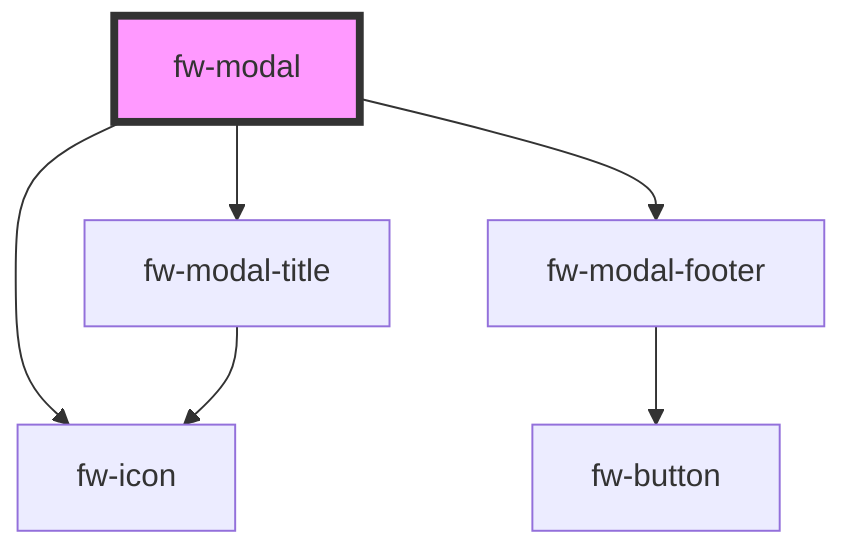

# Modal (fw-modal)

Modals are used as an overlay to display information. It can also be used as confirm boxes to take user inputs.

## Usage

#### Basic usage
```html live
  <fw-button modal-trigger-id='welcome'> Open Modal </fw-button>
  <fw-modal id='welcome' title-text="Welcome">
    Hello,
    Welcome to Crayons
  </fw-modal>
```

#### Composition example
```html live 
  <fw-button modal-trigger-id='small'> Open Small Modal </fw-button>
  <fw-modal id='small' size="small" submit-disabled="true" submit-color="danger">
    <fw-modal-title title-text="Welcome">Header text</fw-modal-title>
    <fw-modal-content><div style="padding: 20px 40px;">Content text</div></fw-modal-content>
    <fw-modal-footer></fw-modal-footer>
  </fw-modal>
```

#### Custom composition example
```html live 
  <fw-button modal-trigger-id='large'> Open Large Modal </fw-button>
  <fw-modal id='large' icon="agent" description="Subtitle goes here" size="large">
    <fw-modal-title custom>
      <div style="padding: 20px 40px;">
        <span style="font-weight: bold;">Modal Header</span>
        <a
          style="float: right;"
          href="javascript:void(0)"
          onclick="document.querySelector('fw-modal#large').close()">
          Close
        </a>
      </div>
    </fw-modal-title>
    <fw-modal-content>
      <div style="padding: 20px 40px;">Content text</div>
    </fw-modal-content>
    <fw-modal-footer custom>
      <div style="padding: 20px 40px; background: #EEE;">Custom footer</div>
    </fw-modal-footer>
  </fw-modal>
```


<!-- Auto Generated Below -->


## Properties

| Property         | Attribute         | Description                                       | Type                                                       | Default      |
| ---------------- | ----------------- | ------------------------------------------------- | ---------------------------------------------------------- | ------------ |
| `cancelText`     | `cancel-text`     | The text for the cancel button                    | `string`                                                   | `'Cancel'`   |
| `description`    | `description`     | The description text to be displayed on the modal | `string`                                                   | `undefined`  |
| `icon`           | `icon`            | The icon to be displayed with the title           | `string`                                                   | `''`         |
| `isOpen`         | `is-open`         | Toggle the visibility of the modal                | `boolean`                                                  | `false`      |
| `size`           | `size`            | Size of the modal                                 | `"large" \| "small" \| "standard"`                         | `'standard'` |
| `submitColor`    | `submit-color`    | The color of submit button                        | `"danger" \| "link" \| "primary" \| "secondary" \| "text"` | `'primary'`  |
| `submitDisabled` | `submit-disabled` | Default state of submit button                    | `boolean`                                                  | `false`      |
| `submitText`     | `submit-text`     | The text for the submit button                    | `string`                                                   | `'OK'`       |
| `titleText`      | `title-text`      | The title text to be displayed on the modal       | `string`                                                   | `undefined`  |


## Events

| Event      | Description                                          | Type                |
| ---------- | ---------------------------------------------------- | ------------------- |
| `fwclose`  | Triggered when modal is closed.                      | `CustomEvent<void>` |
| `fwopen`   | Triggered when modal is opened.                      | `CustomEvent<void>` |
| `fwsubmit` | Triggered when the default action button is clicked. | `CustomEvent<void>` |


## Methods

### `close() => Promise<boolean>`


#### Returns

Type: `Promise<boolean>`


## Dependencies

### Depends on

- [fw-icon](../icon)
- [fw-modal-title](../modal-title)
- [fw-modal-footer](../modal-footer)

### Graph


----------------------------------------------

Built with ❤ at Freshworks
