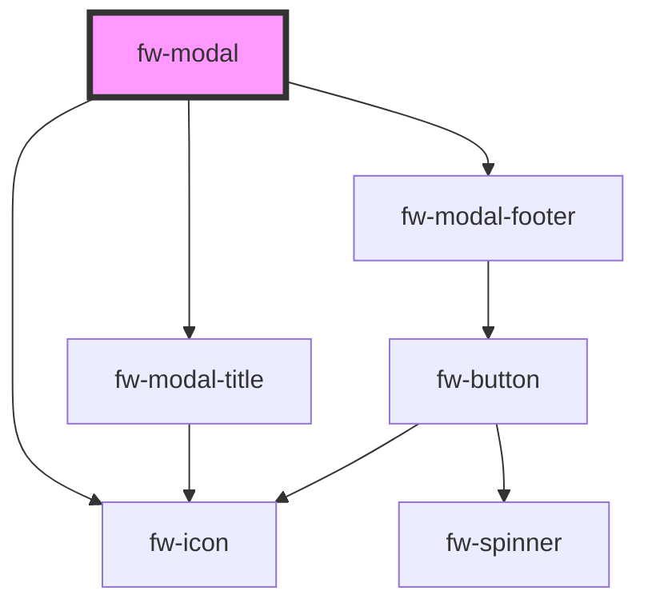

# Modal (fw-modal)

Modals are used as an overlay to display information. It can also be used as confirm boxes to take user inputs.


## Demo & Usage

#### Basic demo

```html live
  <fw-button modal-trigger-id='welcome'> Open Modal </fw-button>
  <fw-modal id='welcome' title-text="Welcome">
    Hello, Welcome to Crayons
  </fw-modal>

  <fw-button modal-trigger-id='welcome-large'> Open Large Modal </fw-button>
  <fw-modal id='welcome-large' title-text="Welcome" size="large" submit-disabled="true">
    Hello, Welcome to Crayons
  </fw-modal>
```

#### Basic usage

<code-group>
<code-block title="HTML">
```html 
  <fw-button modal-trigger-id='welcome'> Open Modal </fw-button>
  <fw-modal id='welcome' title-text="Welcome">
    Hello, Welcome to Crayons
  </fw-modal>

  <fw-button modal-trigger-id='welcome-large'> Open Large Modal </fw-button>
  <fw-modal id='welcome-large' title-text="Welcome" size="large" submit-disabled="true">
    Hello, Welcome to Crayons
  </fw-modal>
```
</code-block>

<code-block title="React">
```jsx
import React from "react";
import ReactDOM from "react-dom";
import { FwButton, FwModal } from "@freshworks/crayons/react";
function App() {
  return (<div>
    <FwButton modalTriggerId='welcome'> Open Modal </FwButton>
    <FwModal id='welcome' titleText="Welcome">
      Hello, Welcome to Crayons
    </FwModal>

    <FwButton modalTriggerId='welcome-large'> Open Large Modal </FwButton>
    <FwModal id='welcome-large' titleText="Welcome" size="large" submitDisabled>
      Hello, Welcome to Crayons
    </FwModal>
 </div>);
}
```
</code-block>
</code-group>

#### Simple composition Demo 
```html live 
  <fw-button modal-trigger-id='small'> Open Modal </fw-button>
  <fw-modal id='small' size="small" submit-color="danger">
    <fw-modal-title title-text="Welcome"></fw-modal-title>
    <fw-modal-content><div>Content text</div></fw-modal-content>
    <fw-modal-footer></fw-modal-footer>
  </fw-modal>
```

#### Simple composition Usage 

<code-group>
<code-block title="HTML">
```html 
  <fw-button modal-trigger-id='small'> Open Modal </fw-button>
  <fw-modal id='small' size="small" submit-color="danger">
    <fw-modal-title title-text="Welcome"></fw-modal-title>
    <fw-modal-content><div>Content text</div></fw-modal-content>
    <fw-modal-footer></fw-modal-footer>
  </fw-modal>
```
</code-block>

<code-block title="React">
```jsx
import React from "react";
import ReactDOM from "react-dom";
import { FwButton, FwModal, FwModalTitle, FwModalContent, FwModalFooter } from "@freshworks/crayons/react";
function App() {
  return (<div>
    <FwButton modalTriggerId='small'> Open Modal </FwBuutton>
    <FwModal id='small' size="small" submitColor="danger">
      <FwModalTitle titleText="Welcome"></FwModalTitle>
      <FwModalContent><div>Content text</div></FwModalContent>
      <FwModalFooter></FwModalFooter>
    </FwModal>
 </div>);
}
```
</code-block>
</code-group>

#### Custom composition Demo

```html live 
  <fw-button modal-trigger-id='composition'> Open modal </fw-button>
  <fw-modal id='composition'>
    <fw-modal-title>
      <div>
        <span style="font-weight: bold;">Header text</span>
      </div>
    </fw-modal-title>
    <fw-modal-content>
      <div>Content text</div>
    </fw-modal-content>
    <fw-modal-footer>
      <fw-button>OK</fw-button>
    </fw-modal-footer>
  </fw-modal>
```

#### Custom composition Usage

<code-group>
<code-block title="HTML">
```html 
  <fw-button modal-trigger-id='composition'> Open modal </fw-button>
  <fw-modal id='composition'>
    <fw-modal-title>
      <div>
        <span style="font-weight: bold;">Header text</span>
      </div>
    </fw-modal-title>
    <fw-modal-content>
      <div>Content text</div>
    </fw-modal-content>
    <fw-modal-footer>
      <fw-button>OK</fw-button>
    </fw-modal-footer>
  </fw-modal>
```
</code-block>

<code-block title="React">
```jsx
import React from "react";
import ReactDOM from "react-dom";
import { FwButton, FwModal, FwModalTitle, FwModalContent, FwModalFooter } from "@freshworks/crayons/react";
function App() {
  return (<div>
      <FwButton modalTriggerId='composition'> Open modal </FwButton>
      <FwModal id='composition'>
        <FwModalTitle>
          <div>
            <span style="font-weight: bold;">Header text</span>
          </div>
        </FwModalTitle>
        <FwModalContent>
          <div>Content text</div>
        </FwModalContent>
        <FwModalFooter>
          <FwButton>OK</FwButton>
        </FwModalFooter>
      </FwModal>
 </div>);
}
```
</code-block>
</code-group>


#### Hide footer of the modal Demo

```html live 
  <fw-button modal-trigger-id='large'> Open modal </fw-button>
  <fw-modal id='large' icon="agent" size="large" hide-footer="true">
    <fw-modal-title>
      <span style="font-weight: bold;">Header text</span>
    </fw-modal-title>
    <fw-modal-content>
      <div>Content text</div>
    </fw-modal-content>
  </fw-modal>
```

#### Hide footer of the modal Usage

<code-group>
<code-block title="HTML">
```html 
  <fw-button modal-trigger-id='large'> Open modal </fw-button>
  <fw-modal id='large' icon="agent" size="large" hide-footer="true">
    <fw-modal-title>
      <span style="font-weight: bold;">Header text</span>
    </fw-modal-title>
    <fw-modal-content>
      <div>Content text</div>
    </fw-modal-content>
  </fw-modal>
```
</code-block>

<code-block title="React">
```jsx
import React from "react";
import ReactDOM from "react-dom";
import { FwButton, FwModal, FwModalTitle, FwModalContent, FwModalFooter } from "@freshworks/crayons/react";
function App() {
  return (<div>
      <FwButton modalTriggerId='large'> Open modal </FwButton>
      <FwModal id='large' icon="agent" size="large" hideFooter>
        <FwModalTitle>
          <span style="font-weight: bold;">Header text</span>
        </FwModalTitle>
        <FwModalContent>
          <div>Content text</div>
        </FwModalContent>
      </fw-modal>
 </div>);
}
```
</code-block>
</code-group>

<!-- Auto Generated Below -->


## Properties

| Property         | Attribute         | Description                                       | Type                                                       | Default      |
| ---------------- | ----------------- | ------------------------------------------------- | ---------------------------------------------------------- | ------------ |
| `cancelText`     | `cancel-text`     | The text for the cancel button                    | `string`                                                   | `'Cancel'`   |
| `description`    | `description`     | The description text to be displayed on the modal | `string`                                                   | `undefined`  |
| `hideFooter`     | `hide-footer`     | Hide footer for the modal                         | `boolean`                                                  | `false`      |
| `icon`           | `icon`            | The icon to be displayed with the title           | `string`                                                   | `''`         |
| `isOpen`         | `is-open`         | Toggle the visibility of the modal                | `boolean`                                                  | `false`      |
| `size`           | `size`            | Size of the modal                                 | `"large" \| "small" \| "standard"`                         | `'standard'` |
| `submitColor`    | `submit-color`    | The color of submit button                        | `"danger" \| "link" \| "primary" \| "secondary" \| "text"` | `'primary'`  |
| `submitDisabled` | `submit-disabled` | Default state of submit button                    | `boolean`                                                  | `false`      |
| `submitText`     | `submit-text`     | The text for the submit button                    | `string`                                                   | `'OK'`       |
| `titleText`      | `title-text`      | The title text to be displayed on the modal       | `string`                                                   | `undefined`  |


## Events

| Event      | Description                                          | Type                |
| ---------- | ---------------------------------------------------- | ------------------- |
| `fwClose`  | Triggered when modal is closed.                      | `CustomEvent<void>` |
| `fwOpen`   | Triggered when modal is opened.                      | `CustomEvent<void>` |
| `fwSubmit` | Triggered when the default action button is clicked. | `CustomEvent<void>` |


## Methods

### `close() => Promise<boolean>`

Method available from the component to perform close action on the modal

#### Returns

Type: `Promise<boolean>`

promise that resolves to true

### `open() => Promise<boolean>`

Method available from the component to perform open action on the modal

#### Returns

Type: `Promise<boolean>`

promise that resolves to true


## Dependencies

### Depends on

- [fw-icon](../icon)
- [fw-modal-title](../modal-title)
- [fw-modal-footer](../modal-footer)

### Graph


----------------------------------------------

Built with ❤ at Freshworks
