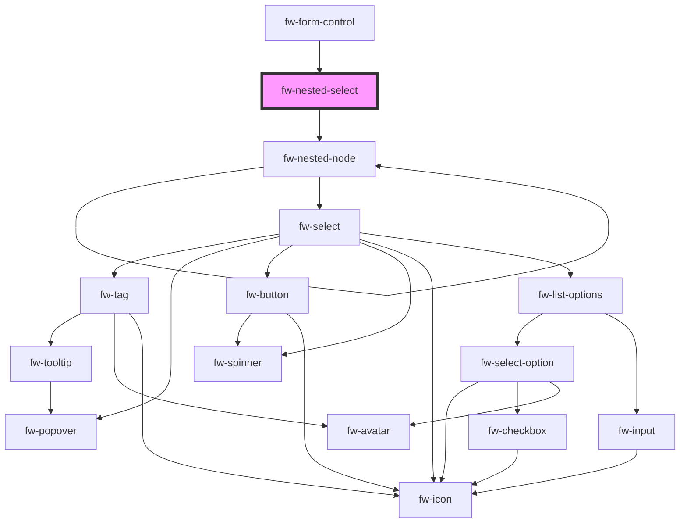

# fw-nested-select

fw-nested-select allows to display nested dropdown choices

## Demo

```html live
<fw-nested-select
  id="nestedSelect"
  name='country'
  label='Country'
  placeholder='select Country'
  
></fw-nested-select>

<script type="application/javascript">
  var nestedChoicesSource = [{
    id: 'india',
    value: 'India',
    label: 'State',
    name: 'state',
    choices: [
      {
        id: 'tamil_nadu',
        value: 'Tamil Nadu',
        name: 'city',
        label: 'City',
        choices: [
          {
            id: 'chennai',
            value: 'Chennai',
          },
          {
            id: 'coimbatore',
            value: 'Coimbatore',
          },
        ],
      },
      {
        id: 'kerala',
        value: 'Kerala',
        name: 'city',
        label: 'City',
        choices: [
          {
            id: 'cochin',
            value: 'Cochin',
          },
          {
            id: 'wayanad',
            value: 'Wayanad',
          },
        ],
      },
    ],
  },
  {
    id: 'europe',
    value: 'Europe',
    label: 'State',
    name: 'state',
    choices: [
      {
        id: 'germany',
        value: 'Germany',
        name: 'city',
        label: 'City',
        choices: [
          {
            id: 'berlin',
            value: 'berlin'
          },
          {
            id: 'hamburg',
            value: 'Hamburg',
          },
        ],
      },
    ],
  }];
  
  // Initialize default values
  var selectProps = (name) => ({ value: initialValues[name] || '' });
  var nestedSelectEl = document.getElementById('nestedSelect');
  nestedSelectEl.options = nestedChoicesSource;
  nestedSelectEl.selectProps = selectProps;
</script>
```

## Usage

<code-group>
<code-block title="HTML">
```html
<fw-nested-select
  id="nestedSelect"
  name='Country'
  label='Dependent field'
  placeholder='select Country'
></fw-nested-select>

<script type="application/javascript">
  var nestedChoicesSource = [{
    id: 'india',
    value: 'India',
    label: 'State',
    name: 'state',
    choices: [
      {
        id: 'tamil_nadu',
        value: 'Tamil Nadu',
        name: 'city',
        label: 'City',
        choices: [
          {
            id: 'chennai',
            value: 'Chennai',
          },
          {
            id: 'coimbatore',
            value: 'Coimbatore',
          },
        ],
      },
      {
        id: 'kerala',
        value: 'Kerala',
        name: 'city',
        label: 'City',
        choices: [
          {
            id: 'cochin',
            value: 'Cochin',
          },
          {
            id: 'wayanad',
            value: 'Wayanad',
          },
        ],
      },
    ],
  },
  {
    id: 'europe',
    value: 'Europe',
    label: 'State',
    name: 'state',
    choices: [
      {
        id: 'germany',
        value: 'Germany',
        name: 'city',
        label: 'City',
        choices: [
          {
            id: 'berlin',
            value: 'berlin'
          },
          {
            id: 'hamburg',
            value: 'Hamburg',
          },
        ],
      },
    ],
  }];
  
  // Initialize default values
  var selectProps = (name) => ({ value: initialValues[name] || '' });
  var nestedSelectEl = document.getElementById('nestedSelect');
  nestedSelectEl.options = nestedChoicesSource;
  nestedSelectEl.selectProps = selectProps;
</script>

```
</code-block>

<code-block title="React">
```jsx
import React from "react";
import ReactDOM from "react-dom";
import { FwNestedSelect } from "@freshworks/crayons/react";
function App() {
  const initialValues = {};
  
  const selectProps = (name) => (
    { value: initialValues[name] || '' }
  );
  
  const options = [{
    id: 'india',
    value: 'India',
    label: 'State',
    name: 'state',
    choices: [
      {
        id: 'tamil_nadu',
        value: 'Tamil Nadu',
        name: 'city',
        label: 'City',
        choices: [
          {
            id: 'chennai',
            value: 'Chennai',
          },
          {
            id: 'coimbatore',
            value: 'Coimbatore',
          },
        ],
      },
      {
        id: 'kerala',
        value: 'Kerala',
        name: 'city',
        label: 'City',
        choices: [
          {
            id: 'cochin',
            value: 'Cochin',
          },
          {
            id: 'wayanad',
            value: 'Wayanad',
          },
        ],
      },
    ],
  },
  {
    id: 'europe',
    value: 'Europe',
    label: 'State',
    name: 'state',
    choices: [
      {
        id: 'germany',
        value: 'Germany',
        name: 'city',
        label: 'City',
        choices: [
          {
            id: 'berlin',
            value: 'berlin'
          },
          {
            id: 'hamburg',
            value: 'Hamburg',
          },
        ],
      },
    ],
  },
];
  
  return (<div>
    <FwNestedSelect
      options={options}
      name="country"
      label="Country"
      selectProps={selectProps}
    >
    </FwNestedSelect>
  </div>)
}
```
</code-block>
</code-group>


<!-- Auto Generated Below -->


## Properties

| Property          | Attribute           | Description                                                                                                                                                   | Type                               | Default     |
| ----------------- | ------------------- | ------------------------------------------------------------------------------------------------------------------------------------------------------------- | ---------------------------------- | ----------- |
| `errorText`       | `error-text`        | Error text displayed below the text box.                                                                                                                      | `string`                           | `''`        |
| `hintText`        | `hint-text`         | Hint text displayed below the text box.                                                                                                                       | `string`                           | `''`        |
| `label`           | `label`             | label                                                                                                                                                         | `string`                           | `''`        |
| `name`            | `name`              | Name of first level field                                                                                                                                     | `string`                           | `''`        |
| `optionLabelPath` | `option-label-path` | OptionLabelPath referred from field                                                                                                                           | `string`                           | `'value'`   |
| `optionValuePath` | `option-value-path` | OptionValuePath referred from field                                                                                                                           | `string`                           | `'id'`      |
| `options`         | --                  | Options to display                                                                                                                                            | `any[]`                            | `[]`        |
| `required`        | `required`          | Specifies the select field as a mandatory field and displays an asterisk next to the label. If the attribute’s value is undefined, the value is set to false. | `boolean`                          | `false`     |
| `selectProps`     | `select-props`      | Function to return initialValues                                                                                                                              | `any`                              | `undefined` |
| `state`           | `state`             | Theme based on which the list box is styled.                                                                                                                  | `"error" \| "normal" \| "warning"` | `'normal'`  |
| `value`           | `value`             | Initial value from first level choices                                                                                                                        | `string`                           | `''`        |
| `warningText`     | `warning-text`      | Warning text displayed below the text box.                                                                                                                    | `string`                           | `''`        |


## Events

| Event      | Description                                          | Type               |
| ---------- | ---------------------------------------------------- | ------------------ |
| `fwChange` | Triggered when nested selection doesn't have choices | `CustomEvent<any>` |


## Dependencies

### Used by

 - [fw-form-control](../form-control)

### Depends on

- [fw-nested-node](.)

### Graph


----------------------------------------------

Built with ❤ at Freshworks
