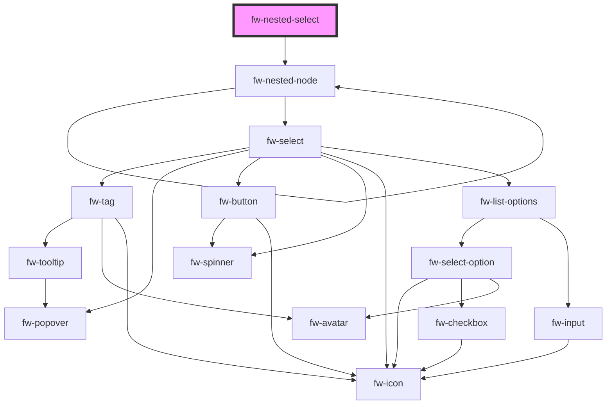

# fw-nested-select

<!-- Auto Generated Below -->

## Properties

| Property  | Attribute | Description | Type    | Default |
| --------- | --------- | ----------- | ------- | ------- |
| `options` | --        |             | `any[]` | `[]`    |

## Dependencies

### Depends on

- [fw-nested-node](.)

### Graph

----------------------------------------------

Built with ❤ at Freshworks
