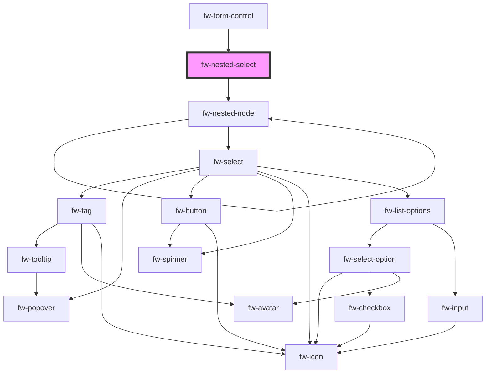

# fw-nested-select

<!-- Auto Generated Below -->

## Properties

| Property          | Attribute           | Description                            | Type     | Default     |
| ----------------- | ------------------- | -------------------------------------- | -------- | ----------- |
| `label`           | `label`             | label                                  | `string` | `''`        |
| `name`            | `name`              | Name of first level field              | `string` | `''`        |
| `optionLabelPath` | `option-label-path` | OptionLabelPath referred from field    | `string` | `'value'`   |
| `optionValuePath` | `option-value-path` | OptionValuePath referred from field    | `string` | `'id'`      |
| `options`         | --                  | Options to display                     | `any[]`  | `[]`        |
| `selectProps`     | `select-props`      | Function to return initialValues       | `any`    | `undefined` |
| `value`           | `value`             | Initial value from first level choices | `string` | `''`        |

## Events

| Event      | Description                                          | Type               |
| ---------- | ---------------------------------------------------- | ------------------ |
| `fwChange` | Triggered when nested selection doesn't have choices | `CustomEvent<any>` |

## Dependencies

### Used by

 - [fw-form-control](../form-control)

### Depends on

- [fw-nested-node](.)

### Graph

----------------------------------------------

Built with ❤ at Freshworks
