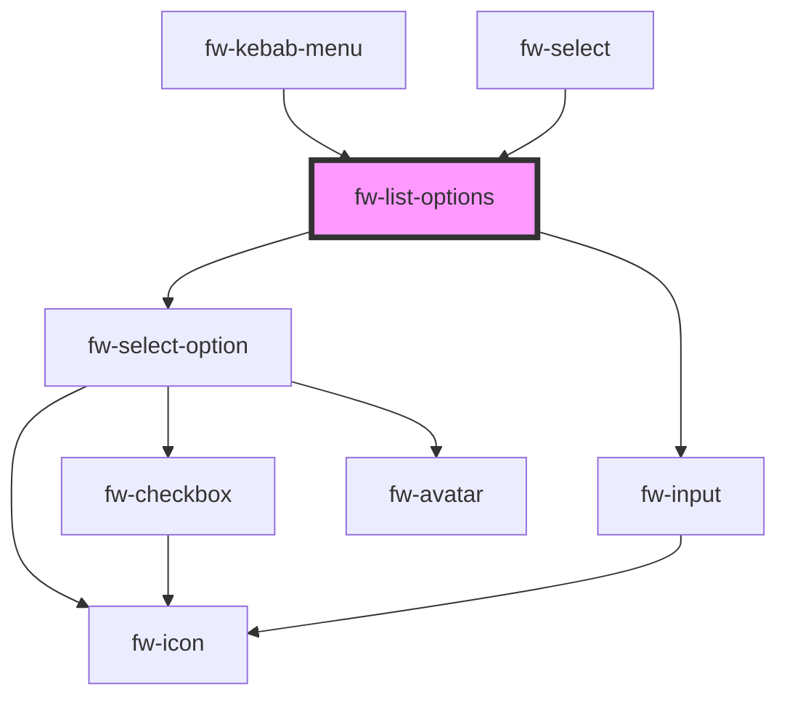

# List Options (fw-list-options)

# Usage

The data-source and the visual variant for the list options can be altered via the props.

```html live
<fw-popover>
  <fw-button slot="popover-trigger">Straw Hats - Click Me!</fw-button>
  <fw-list-options
    id="standardVariant"
    slot="popover-content"
    searchable="true"
    not-found-text="Pirate not found"
    search-text="Search Pirate"
  ></fw-list-options>
</fw-popover>

<br />

<fw-popover same-width="false">
  <fw-button slot="popover-trigger">Click Me!</fw-button>
  <fw-list-options
    variant="icon"
    id="iconVariant"
    slot="popover-content"
  ></fw-list-options>
</fw-popover>

<fw-popover same-width="false">
  <fw-button slot="popover-trigger">Creatable Select - Click Me!</fw-button>
  <fw-list-options
    id="creatableVariant"
    slot="popover-content"
    searchable="true"
    is-creatable="true"
    variant="avatar"
  ></fw-list-options>
</fw-popover>

<script type="application/javascript">
  var dataSource = [
    { value: '1', text: 'Luffy' },
    { value: '2', text: 'Zorro' },
    { value: '3', text: 'Sanji' },
  ];
  var standardVariant = document.getElementById('standardVariant');
  standardVariant.options = dataSource;
  standardVariant.value = ['2'];
  standardVariant.multiple = true;

  var iconDataSource = [
    {
      value: '1',
      text: 'Luffy',
      subText: 'Pirate King',
      graphicsProps: { name: 'verified' },
    },
    {
      value: '2',
      text: 'Zorro',
      subText: 'Best Swordsman',
      graphicsProps: { name: 'magic-wand' },
    },
    {
      value: '3',
      text: 'Sanji',
      subText: 'Best Chef',
      graphicsProps: { name: 'ecommerce' },
    },
  ];
  var iconVariant = document.getElementById('iconVariant');
  iconVariant.options = iconDataSource;

  var creatableDataSource = [
    {
      text: 'Angela Smith',
      subText: 'angela.smith@gmail.com',
      value: 'angela.smith@gmail.com',
      graphicsProps: {
        image:
          'https://images.unsplash.com/photo-1529778873920-4da4926a72c2?ixlib=rb-1.2.1&auto=format&fit=crop&w=300&q=80',
      },
    },
    {
      text: 'Freshdesk support from India and Berlin',
      subText: 'support.india@freshdesk.com',
      value: 'support.india@freshdesk.com',
      graphicsProps: {
        image:
          'https://images.unsplash.com/photo-1529778873920-4da4926a72c2?ixlib=rb-1.2.1&auto=format&fit=crop&w=300&q=80',
      },
    },
    {
      text: 'Angela from Freshdesk',
      subText: 'angela@freshdesk.in',
      value: 'angela@freshdesk.in',
      graphicsProps: {
        image:
          'https://images.unsplash.com/photo-1529778873920-4da4926a72c2?ixlib=rb-1.2.1&auto=format&fit=crop&w=300&q=80',
      },
    },
  ];
  const validateEmail = (email) =>
    String(email)
      .toLowerCase()
      .match(/^(([^<>()[\]\\.,;:\s@"]+(\.[^<>()[\]\\.,;:\s@"]+)*)|(".+"))@((\[[0-9]{1,3}\.[0-9]{1,3}\.[0-9]{1,3}\.[0-9]{1,3}\])|(([a-zA-Z\-0-9]+\.)+[a-zA-Z]{2,}))$/);
  var creatableVariant = document.getElementById('creatableVariant');
  creatableVariant.options = creatableDataSource;
  creatableVariant.formatCreateLabel = (label) =>
    `Add "${label}" as one of the recipients`;
  creatableVariant.validateNewOption = (value) => validateEmail(value);
</script>
```

### Demo with option-label-path and option-value-path

```html live
<fw-label value="With predefined options" color="blue"></fw-label>
<fw-popover same-width="false">
  <fw-button slot="popover-trigger">Click Me!</fw-button>
  <fw-list-options
    variant="icon"
    id="predefinedOptions"
    slot="popover-content"
    option-label-path="name"
    option-value-path="id"
  ></fw-list-options>
</fw-popover>
<br />
<br />
<fw-label value="With search" color="blue"></fw-label>
<fw-popover same-width="false">
  <fw-button slot="popover-trigger">Click Me!</fw-button>
  <fw-list-options
    variant="avatar"
    searchable="true"
    id="searchVariant"
    slot="popover-content"
    no-data-text="Type to search.."
    not-found-text="Not available in this universe"
    search-text="Search Pirate"
    multiple
    option-label-path="label"
    option-value-path="id"
  ></fw-list-options>
</fw-popover>

<script type="application/javascript">
  var iconDataSource = [
    {
      id: '1',
      name: 'Luffy',
      subText: 'Pirate King',
      graphicsProps: { name: 'verified' },
    },
    {
      id: '2',
      name: 'Zorro',
      subText: 'Best Swordsman',
      graphicsProps: { name: 'magic-wand' },
    },
    {
      id: '3',
      name: 'Sanji',
      subText: 'Best Chef',
      graphicsProps: { name: 'ecommerce' },
    },
  ];
  var predefinedOptions = document.getElementById('predefinedOptions');
  predefinedOptions.options = iconDataSource;
  predefinedOptions.setSelectedOptions([
    {
      id: '2',
      name: 'Zorro',
      subText: 'Best Swordsman',
      graphicsProps: { name: 'magic-wand' },
    },
  ]);
  predefinedOptions.addEventListener('fwChange', (e) => {
    console.log(e.detail);
  });

  var searchVariant = document.getElementById('searchVariant');
  baseURL = 'https://api.sampleapis.com/rickandmorty/characters';
  searchVariant.selectedOptions = [
    {
      label: 'Rick Sanchez',
      subText: 'Human',
      id: '1',
      graphicsProps: {
        image: 'https://rickandmortyapi.com/api/character/avatar/1.jpeg',
      },
    },
  ];
  searchVariant.search = (value, source) => {
    // Sample function to mimic the dynamic filter over network
    return fetch(baseURL)
      .then((resp) => resp.json())
      .then((data) => {
        const result = data.filter((x) =>
          x.name.toLowerCase().includes(value.toLowerCase())
        );
        return result.map((x) => {
          return {
            label: x.name,
            subText: x.type,
            id: x.id.toString(),
            graphicsProps: { image: x.image },
          };
        });
      });
  };
</script>
```

### Usage for option-label-path and option-value-path

<code-group>
<code-block title="HTML">

```html
<fw-label value="With predefined options" color="blue"></fw-label>
<fw-popover same-width="false">
  <fw-button slot="popover-trigger">Click Me!</fw-button>
  <fw-list-options
    variant="icon"
    id="predefinedOptions"
    slot="popover-content"
    option-label-path="name"
    option-value-path="id"
  ></fw-list-options>
</fw-popover>
<br />
<br />
<fw-label value="With search" color="blue"></fw-label>
<fw-popover same-width="false">
  <fw-button slot="popover-trigger">Click Me!</fw-button>
  <fw-list-options
    variant="avatar"
    searchable="true"
    id="searchVariant"
    slot="popover-content"
    no-data-text="Type to search.."
    not-found-text="Not available in this universe"
    search-text="Search Pirate"
    multiple
    option-label-path="label"
    option-value-path="id"
  ></fw-list-options>
</fw-popover>

<script type="application/javascript">
  var iconDataSource = [
    {
      id: '1',
      name: 'Luffy',
      subText: 'Pirate King',
      graphicsProps: { name: 'verified' },
    },
    {
      id: '2',
      name: 'Zorro',
      subText: 'Best Swordsman',
      graphicsProps: { name: 'magic-wand' },
    },
    {
      id: '3',
      name: 'Sanji',
      subText: 'Best Chef',
      graphicsProps: { name: 'ecommerce' },
    },
  ];
  var predefinedOptions = document.getElementById('predefinedOptions');
  predefinedOptions.options = iconDataSource;
  predefinedOptions.setSelectedOptions([
    {
      id: '2',
      name: 'Zorro',
      subText: 'Best Swordsman',
      graphicsProps: { name: 'magic-wand' },
    },
  ]);
  predefinedOptions.addEventListener('fwChange', (e) => {
    console.log(e.detail);
  });

  var searchVariant = document.getElementById('searchVariant');
  baseURL = 'https://api.sampleapis.com/rickandmorty/characters';
  searchVariant.selectedOptions = [
    {
      label: 'Rick Sanchez',
      subText: 'Human',
      id: '1',
      graphicsProps: {
        image: 'https://rickandmortyapi.com/api/character/avatar/1.jpeg',
      },
    },
  ];
  searchVariant.search = (value, source) => {
    // Sample function to mimic the dynamic filter over network
    return fetch(baseURL)
      .then((resp) => resp.json())
      .then((data) => {
        const result = data.filter((x) =>
          x.name.toLowerCase().includes(value.toLowerCase())
        );
        return result.map((x) => {
          return {
            label: x.name,
            subText: x.type,
            id: x.id.toString(),
            graphicsProps: { image: x.image },
          };
        });
      });
  };
</script>
```

</code-block>
</code-group>

### Demo with virtual scroll

**This feature is experimental, it needs to be explicitly activated using the `enableVirtualScroll` feature flag.**

`enableVirtualScroll` property can be used to enable virtualisation of long list of options.
`estimatedSize` property is used to set estimated size of items in the list box to ensure smooth-scrolling.

```html live
<fw-label value="With Virtual Scroll" color="blue"></fw-label>
<fw-popover>
  <fw-button slot="popover-trigger">Open Long List</fw-button>
  <fw-list-options
    id="longList"
    enable-virtual-scroll="true"
    estimated-size="52"
    slot="popover-content"
  ></fw-list-options>
</fw-popover>

<script type="application/javascript">
  var longList = document.getElementById('longList');
  const longListOptions = Array.from(Array(50000), (_,i) => ({
    text: `Item No: ${i + 1}`,
    value: i
  }));
  longList.options = longListOptions;
  longList.addEventListener('fwChange', (e) => {
    console.log(e.detail);
  });
</script>
```

### Usage of Virtual scroll

<code-group>
<code-block title="HTML">

```html
<fw-label value="With Virtual Scroll" color="blue"></fw-label>
<fw-popover>
  <fw-button slot="popover-trigger">Open Long List</fw-button>
  <fw-list-options
    id="longList"
    enable-virtual-scroll="true"
    estimated-size="52"
    slot="popover-content"
  ></fw-list-options>
</fw-popover>

<script type="application/javascript">
  var longList = document.getElementById('longList');
  const longListOptions = Array.from(Array(50000), (_,i) => ({
    text: `Item No: ${i + 1}`,
    value: i
  }));
  longList.options = longListOptions;
  longList.addEventListener('fwChange', (e) => {
    console.log(e.detail);
  });
</script>
```
</code-block>

<code-block title="React">

```jsx
function ListOptions() {
  const longListOptions = Array.from(Array(50000), (_,i) => ({
    text: `Item No: ${i + 1}`,
    value: i
  }));
  return (
    <FwPopover>
      <FwButton slot="popover-trigger">Open Long List</FwButton>
      <FwListOptions
        id='longList'
        slot='popover-content'
        options={longListOptions}
        enableVirtualScroll
        estimatedSize={52}
      ></FwListOptions>
    </FwPopover>
  );
}
export default ListOptions;
```

</code-block>
</code-group>

<!-- Auto Generated Below -->


## Properties

| Property              | Attribute               | Description                                                                                                                                                                                                                               | Type                                                  | Default                      |
| --------------------- | ----------------------- | ----------------------------------------------------------------------------------------------------------------------------------------------------------------------------------------------------------------------------------------- | ----------------------------------------------------- | ---------------------------- |
| `allowDeselect`       | `allow-deselect`        | Whether clicking on the already selected option disables it.                                                                                                                                                                              | `boolean`                                             | `true`                       |
| `allowSelect`         | `allow-select`          | Whether clicking on option selects it.                                                                                                                                                                                                    | `boolean`                                             | `true`                       |
| `checkbox`            | `checkbox`              | Place a checkbox.                                                                                                                                                                                                                         | `boolean`                                             | `false`                      |
| `debounceTimer`       | `debounce-timer`        | Debounce timer for the search promise function.                                                                                                                                                                                           | `number`                                              | `300`                        |
| `disabled`            | `disabled`              | Disables the component on the interface. If the attribute’s value is undefined, the value is set to false.                                                                                                                                | `boolean`                                             | `false`                      |
| `enableVirtualScroll` | `enable-virtual-scroll` | Virtualize long list of elements in list options *Experimental*                                                                                                                                                                           | `boolean`                                             | `false`                      |
| `estimatedSize`       | `estimated-size`        | Works only when 'enableVirtualScroll' is true. Estimated size of each item in the list box to ensure smooth-scrolling.                                                                                                                    | `number`                                              | `35`                         |
| `filterText`          | `filter-text`           | The text to filter the options.                                                                                                                                                                                                           | `any`                                                 | `undefined`                  |
| `formatCreateLabel`   | --                      | Works only when 'isCreatable' is selected. Function to format the create label displayed as an option.                                                                                                                                    | `(value: string) => string`                           | `undefined`                  |
| `hideTick`            | `hide-tick`             | hide tick mark icon on select option                                                                                                                                                                                                      | `boolean`                                             | `false`                      |
| `isCreatable`         | `is-creatable`          | Allows user to create the option if the provided input doesn't match with any of the options.                                                                                                                                             | `boolean`                                             | `false`                      |
| `max`                 | `max`                   | Works with `multiple` enabled. Configures the maximum number of options that can be selected with a multi-select component.                                                                                                               | `number`                                              | `Number.MAX_VALUE`           |
| `multiple`            | `multiple`              | Enables selection of multiple options. If the attribute’s value is undefined, the value is set to false.                                                                                                                                  | `boolean`                                             | `false`                      |
| `noDataText`          | `no-data-text`          | Text to be displayed when there is no data available in the select.                                                                                                                                                                       | `string`                                              | `''`                         |
| `notFoundText`        | `not-found-text`        | Default option to be shown if the option doesn't match the filterText.                                                                                                                                                                    | `string`                                              | `''`                         |
| `optionLabelPath`     | `option-label-path`     | Key for determining the label for a given option                                                                                                                                                                                          | `string`                                              | `'text'`                     |
| `optionValuePath`     | `option-value-path`     | Key for determining the value for a given option                                                                                                                                                                                          | `string`                                              | `'value'`                    |
| `options`             | --                      | Value corresponding to the option, that is saved  when the form data is saved.                                                                                                                                                            | `any[]`                                               | `[]`                         |
| `search`              | --                      | Filter function which takes in filterText and dataSource and return a Promise. Where filter text is the text to filter the value in dataSource array. The returned promise should contain the array of options to be displayed.           | `(text: string, dataSource: any[]) => Promise<any[]>` | `this.defaultSearchFunction` |
| `searchText`          | `search-text`           | Placeholder to placed on the search text box.                                                                                                                                                                                             | `string`                                              | `''`                         |
| `searchable`          | `searchable`            | Enables the input with in the popup for filtering the options.                                                                                                                                                                            | `boolean`                                             | `false`                      |
| `selectedOptions`     | --                      | The option that is displayed as the default selection, in the list box. Must be a valid value corresponding to the fw-select-option components used in Select.                                                                            | `any[]`                                               | `[]`                         |
| `validateNewOption`   | --                      | Works only when 'isCreatable' is selected. Function to validate the newly created value. Should return true if new option is valid or false if invalid.                                                                                   | `(value: string) => boolean`                          | `undefined`                  |
| `value`               | `value`                 | Value of the option that is displayed as the default selection, in the list box. Must be a valid value corresponding to the fw-select-option components used in Select.                                                                   | `any`                                                 | `''`                         |
| `variant`             | `variant`               | Standard is the default option without any graphics other options are icon and avatar which places either the icon or avatar at the beginning of the row. The props for the icon or avatar are passed as an object via the graphicsProps. | `"avatar" \| "conversation" \| "icon" \| "standard"`  | `'standard'`                 |


## Events

| Event       | Description                                                                         | Type               |
| ----------- | ----------------------------------------------------------------------------------- | ------------------ |
| `fwChange`  | Triggered when a value is selected or deselected from the list box options.         | `CustomEvent<any>` |
| `fwLoading` | Triggered when the options list is in loading state processing the search function. | `CustomEvent<any>` |


## Methods

### `clearFilter() => Promise<void>`


#### Returns

Type: `Promise<void>`


### `getSelectedOptions() => Promise<any>`


#### Returns

Type: `Promise<any>`


### `scrollToLastSelected() => Promise<void>`


#### Returns

Type: `Promise<void>`


### `setFocus() => Promise<any>`


#### Returns

Type: `Promise<any>`


### `setSelectedOptions(options: any[]) => Promise<any>`


#### Returns

Type: `Promise<any>`


### `setSelectedValues(values: any) => Promise<any>`

Pass an array of string in case of multi-select or string for single-select.

#### Returns

Type: `Promise<any>`


## Shadow Parts

| Part                          | Description |
| ----------------------------- | ----------- |
| `"fw-list-options-container"` |             |


## Dependencies

### Used by

 - [fw-kebab-menu](../kebab-menu)
 - [fw-select](../select)

### Depends on

- [fw-select-option](../select-option)
- [fw-input](../input)

### Graph


----------------------------------------------

Built with ❤ at Freshworks
