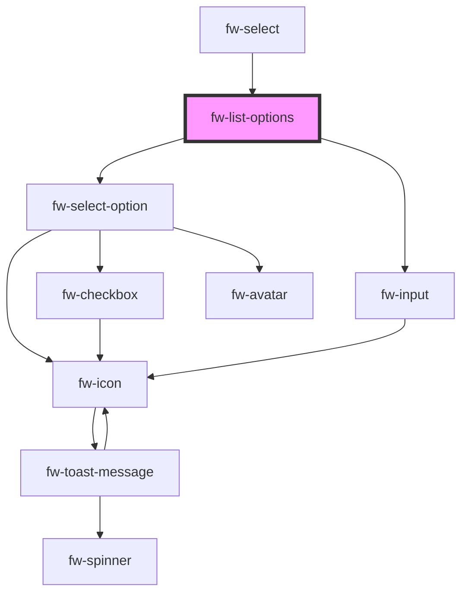

# List Options (fw-list-options)

# Usage

The data-source and the visual variant for the list options can be altered via the props.

```html live
<fw-popover>
  <fw-button slot="popover-trigger">Straw Hats - Click Me!</fw-button>
  <fw-list-options
    id="standardVariant"
    slot="popover-content"
    searchable="true"
    not-found-text="Pirate not found"
    search-text="Search Pirate"
  ></fw-list-options>
</fw-popover>

<br />

<fw-popover same-width="false">
  <fw-button slot="popover-trigger">Click Me!</fw-button>
  <fw-list-options
    variant="icon"
    id="iconVariant"
    slot="popover-content"
  ></fw-list-options>
</fw-popover>

<script type="application/javascript">
  var dataSource = [
    { value: '1', text: 'Luffy' },
    { value: '2', text: 'Zorro' },
    { value: '3', text: 'Sanji' },
  ];
  var standardVariant = document.getElementById('standardVariant');
  standardVariant.options = dataSource;
  standardVariant.value = ['2'];
  standardVariant.multiple = true;

  var iconDataSource = [
    {
      value: '1',
      text: 'Luffy',
      subText: 'Pirate King',
      graphicsProps: { name: 'verified' },
    },
    {
      value: '2',
      text: 'Zorro',
      subText: 'Best Swordsman',
      graphicsProps: { name: 'magic-wand' },
    },
    {
      value: '3',
      text: 'Sanji',
      subText: 'Best Chef',
      graphicsProps: { name: 'ecommerce' },
    },
  ];
  var iconVariant = document.getElementById('iconVariant');
  iconVariant.options = iconDataSource;
</script>
```

<!-- Auto Generated Below -->


## Properties

| Property          | Attribute        | Description                                                                                                                                                                                                                               | Type                                                  | Default                      |
| ----------------- | ---------------- | ----------------------------------------------------------------------------------------------------------------------------------------------------------------------------------------------------------------------------------------- | ----------------------------------------------------- | ---------------------------- |
| `allowDeselect`   | `allow-deselect` | Whether clicking on the already selected option disables it.                                                                                                                                                                              | `boolean`                                             | `true`                       |
| `checkbox`        | `checkbox`       | Place a checkbox.                                                                                                                                                                                                                         | `boolean`                                             | `false`                      |
| `debounceTimer`   | `debounce-timer` | Debounce timer for the search promise function.                                                                                                                                                                                           | `number`                                              | `300`                        |
| `disabled`        | `disabled`       | Disables the component on the interface. If the attribute’s value is undefined, the value is set to false.                                                                                                                                | `boolean`                                             | `false`                      |
| `filterText`      | `filter-text`    | The text to filter the options.                                                                                                                                                                                                           | `any`                                                 | `undefined`                  |
| `max`             | `max`            | Works with `multiple` enabled. Configures the maximum number of options that can be selected with a multi-select component.                                                                                                               | `number`                                              | `Number.MAX_VALUE`           |
| `multiple`        | `multiple`       | Enables selection of multiple options. If the attribute’s value is undefined, the value is set to false.                                                                                                                                  | `boolean`                                             | `false`                      |
| `noDataText`      | `no-data-text`   | Text to be displayed when there is no data available in the select.                                                                                                                                                                       | `string`                                              | `''`                         |
| `notFoundText`    | `not-found-text` | Default option to be shown if the option doesn't match the filterText.                                                                                                                                                                    | `string`                                              | `''`                         |
| `options`         | --               | Value corresponding to the option, that is saved  when the form data is saved.                                                                                                                                                            | `any[]`                                               | `[]`                         |
| `search`          | --               | Filter function which takes in filterText and dataSource and return a Promise. Where filter text is the text to filter the value in dataSource array. The returned promise should contain the array of options to be displayed.           | `(text: string, dataSource: any[]) => Promise<any[]>` | `this.defaultSearchFunction` |
| `searchText`      | `search-text`    | Placeholder to placed on the search text box.                                                                                                                                                                                             | `string`                                              | `''`                         |
| `searchable`      | `searchable`     | Enables the input with in the popup for filtering the options.                                                                                                                                                                            | `boolean`                                             | `false`                      |
| `selectedOptions` | --               | The option that is displayed as the default selection, in the list box. Must be a valid value corresponding to the fw-select-option components used in Select.                                                                            | `any[]`                                               | `[]`                         |
| `value`           | `value`          | Value of the option that is displayed as the default selection, in the list box. Must be a valid value corresponding to the fw-select-option components used in Select.                                                                   | `any`                                                 | `''`                         |
| `variant`         | `variant`        | Standard is the default option without any graphics other options are icon and avatar which places either the icon or avatar at the beginning of the row. The props for the icon or avatar are passed as an object via the graphicsProps. | `"avatar" \| "icon" \| "standard"`                    | `'standard'`                 |


## Events

| Event       | Description                                                                         | Type               |
| ----------- | ----------------------------------------------------------------------------------- | ------------------ |
| `fwChange`  | Triggered when a value is selected or deselected from the list box options.         | `CustomEvent<any>` |
| `fwLoading` | Triggered when the options list is in loading state processing the search function. | `CustomEvent<any>` |


## Methods

### `clearFilter() => Promise<void>`


#### Returns

Type: `Promise<void>`


### `getSelectedOptions() => Promise<any>`


#### Returns

Type: `Promise<any>`


### `scrollToLastSelected() => Promise<void>`


#### Returns

Type: `Promise<void>`


### `setFocus() => Promise<any>`


#### Returns

Type: `Promise<any>`


### `setSelectedOptions(options: any[]) => Promise<any>`


#### Returns

Type: `Promise<any>`


### `setSelectedValues(values: any) => Promise<any>`

Pass an array of string in case of multi-select or string for single-select.

#### Returns

Type: `Promise<any>`


## Dependencies

### Used by

 - [fw-select](../select)

### Depends on

- [fw-select-option](../select-option)
- [fw-input](../input)

### Graph


----------------------------------------------

Built with ❤ at Freshworks
