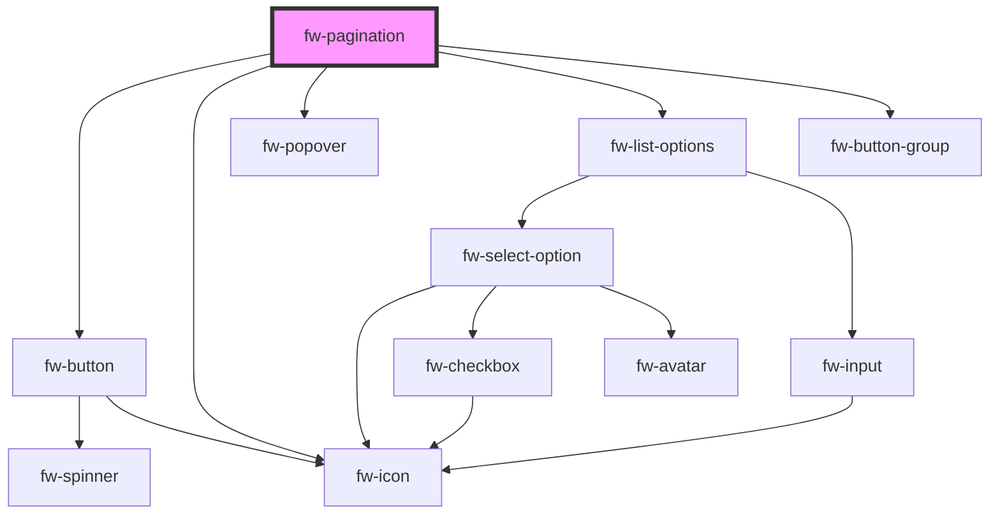

# Pagination (fw-pagination)

fw-pagination displays pagination. The component displays starting and ending record numbers against total number of records. This component has two variants namely, `mini` and `standard`.

## Demo - Mini variant

```html live
<fw-pagination per-page="20" total="50"></fw-pagination><br />
<fw-pagination total="50"></fw-pagination><br />
<fw-pagination page="2" per-page="10" total="50"></fw-pagination>
```

## Usage - Mini variant

<code-group>
<code-block title="HTML">
```html
<fw-pagination per-page="20" total="50"></fw-pagination><br>
<fw-pagination total="50"></fw-pagination><br />
<fw-pagination
  page="2"
  per-page="10"
  total="50"
></fw-pagination>
```
</code-block>

<code-block title="React">
```jsx
import React from "react";
import ReactDOM from "react-dom";
import { FwPagination } from "@freshworks/crayons/react";
function App() {
  return (<div>
    <FwPagination per-page="20" total="50"></FwPagination><br/>
    <FwPagination total="50"></FwPagination>
    <FwPagination page="2"
  per-page="10"
  total="50"></FwPagination>
  </div>)
}
```
</code-block>
</code-group>

## Demo - Standard variant

`hidePageNumbers` property can be used to hide the page numbers in standard variant.

`pageRangeDisplayed` property can be set to the range of pages to be shown in the UI.

`marginPagesDisplayed` property can be set to the number of pages to be shown on either margins.

`perPageOptions` property is used to modify the options provided in the per page dropdown.

`fwChange` event is triggered when a page is changed by clicking previous or next or the desired page buttons.

`fwPerPageChange` event is triggered when per page is changed using the dropdown provided in the UI.

```html live
<fw-label value="Standard Variant" color="blue"></fw-label><br /><br />
<fw-pagination id="pagination1" per-page="10" total="1000" variant="standard"></fw-pagination><br />
<fw-pagination id="pagination2" page="10" per-page="10" total="1000" variant="standard"></fw-pagination><br />
<fw-pagination id="pagination3" page="100" per-page="10" total="1000" variant="standard"></fw-pagination><br />

<fw-label value="Hide Page Numbers" color="blue"></fw-label><br /><br />
<fw-pagination id="pagination4" hide-page-numbers per-page="10" total="1000" variant="standard"></fw-pagination><br />

<fw-label value="Modifying pageRangeDisplayed and marginPagesDisplayed Properties" color="blue"></fw-label><br /><br />
<fw-pagination id="pagination5" total="1000" per-page="20" variant="standard" page-range-displayed="5" margin-pages-displayed="4"></fw-pagination><br />

<fw-label value="Modifying perPageOptions property" color="blue"></fw-label><br /><br />
<fw-pagination id="perPageOptions" total="1000" per-page="60" variant="standard" page-range-displayed="5" margin-pages-displayed="4"></fw-pagination>

<script type="application/javascript">
  var pagination6 = document.getElementById('perPageOptions');
  pagination6.perPageOptions = [20, 40, 60, 80 , 100];
  pagination6.addEventListener('fwChange', (ev) => console.log('page is changed', ev.detail.page));
  pagination6.addEventListener('fwPerPageChange', (ev) => console.log('per page is changed', ev.detail.perPage));
  var pagination1 = document.getElementById('pagination1');
  pagination1.addEventListener('fwChange', (ev) => console.log('page is changed', ev.detail.page));
  var pagination2 = document.getElementById('pagination2');
  pagination2.addEventListener('fwChange', (ev) => console.log('page is changed', ev.detail.page));
  var pagination3 = document.getElementById('pagination3');
  pagination3.addEventListener('fwChange', (ev) => console.log('page is changed', ev.detail.page));
  var pagination4 = document.getElementById('pagination4');
  pagination4.addEventListener('fwChange', (ev) => console.log('page is changed', ev.detail.page));
  var pagination5 = document.getElementById('pagination5');
  pagination5.addEventListener('fwChange', (ev) => console.log('page is changed', ev.detail.page));
</script>

```

## Usage - Standard variant

<code-group>
<code-block title="HTML">
```html
<fw-label value="Standard Variant" color="blue"></fw-label><br /><br />
<fw-pagination id="pagination1" per-page="10" total="1000" variant="standard"></fw-pagination><br />
<fw-pagination id="pagination2" page="10" per-page="10" total="1000" variant="standard"></fw-pagination><br />
<fw-pagination id="pagination3" page="100" per-page="10" total="1000" variant="standard"></fw-pagination><br />

<fw-label value="Hide Page Numbers" color="blue"></fw-label><br /><br />
<fw-pagination id="pagination4" hide-page-numbers per-page="10" total="1000" variant="standard"></fw-pagination><br />

<fw-label value="Modifying pageRangeDisplayed and marginPagesDisplayed Properties" color="blue"></fw-label><br /><br />
<fw-pagination id="pagination5" total="1000" per-page="20" variant="standard" page-range-displayed="5" margin-pages-displayed="4"></fw-pagination><br />

<fw-label value="Modifying perPageOptions property" color="blue"></fw-label><br /><br />
<fw-pagination id="perPageOptions" total="1000" per-page="60" variant="standard" page-range-displayed="5" margin-pages-displayed="4"></fw-pagination>

<script type="application/javascript">
  var pagination6 = document.getElementById('perPageOptions');
  pagination6.perPageOptions = [20, 40, 60, 80 , 100];
  pagination6.addEventListener('fwChange', (ev) => console.log('page is changed', ev.detail.page));
  pagination6.addEventListener('fwPerPageChange', (ev) => console.log('per page is changed', ev.detail.perPage));
  var pagination1 = document.getElementById('pagination1');
  pagination1.addEventListener('fwChange', (ev) => console.log('page is changed', ev.detail.page));
  var pagination2 = document.getElementById('pagination2');
  pagination2.addEventListener('fwChange', (ev) => console.log('page is changed', ev.detail.page));
  var pagination3 = document.getElementById('pagination3');
  pagination3.addEventListener('fwChange', (ev) => console.log('page is changed', ev.detail.page));
  var pagination4 = document.getElementById('pagination4');
  pagination4.addEventListener('fwChange', (ev) => console.log('page is changed', ev.detail.page));
  var pagination5 = document.getElementById('pagination5');
  pagination5.addEventListener('fwChange', (ev) => console.log('page is changed', ev.detail.page));
</script>
```
</code-block>

<code-block title="React">
```jsx
import React from "react";
import ReactDOM from "react-dom";
import { FwPagination } from "@freshworks/crayons/react";
function App() {
  return (<div>
      <FwPagination
        per-page="10"
        total={1000}
        variant="standard"
      ></FwPagination>
      <br />
      <FwPagination
        page={10}
        per-page="10"
        total={1000}
        variant="standard"
      ></FwPagination>
      <br />
      <FwPagination
        page={100}
        per-page="10"
        total={1000}
        variant="standard"
      ></FwPagination>
      // hide page numbers
      <FwPagination
        hidePageNumbers
        per-page="40"
        total={1000}
        variant="standard"
      ></FwPagination>
      // modifying pageRangeDisplayed and marginPagesDisplayed
      <FwPagination
        total={1000}
        per-page="20"
        variant="standard"
        page-range-displayed="5"
        margin-pages-displayed="4"
      ></FwPagination>
      // modifying perPageOptions
      <FwPagination
        total={1000}
        per-page="20"
        variant="standard"
        perPageOptions={[20, 40, 60, 80, 100]}
      ></FwPagination>
  </div>)
}
```
</code-block>
</code-group>

<!-- Auto Generated Below -->


## Properties

| Property               | Attribute                | Description                                                                                                                                                                                                                                                      | Type                   | Default                |
| ---------------------- | ------------------------ | ---------------------------------------------------------------------------------------------------------------------------------------------------------------------------------------------------------------------------------------------------------------- | ---------------------- | ---------------------- |
| `buttonGroupLabel`     | `button-group-label`     | Aria Label to be used for the button group.                                                                                                                                                                                                                      | `string`               | `''`                   |
| `hidePageNumbers`      | `hide-page-numbers`      | hides page numbers in standard pagination variant. Defaults to false. Works only with `standard` variant.                                                                                                                                                        | `boolean`              | `false`                |
| `isLoading`            | `is-loading`             | Indicates if the records in current page are being fetched.                                                                                                                                                                                                      | `boolean`              | `false`                |
| `marginPagesDisplayed` | `margin-pages-displayed` | represents the number of pages to be shown on both the margins. Defaults to 1. Works only with `standard` variant.                                                                                                                                               | `number`               | `1`                    |
| `nextButtonLabel`      | `next-button-label`      | Aria Label to be used for next button.                                                                                                                                                                                                                           | `string`               | `''`                   |
| `page`                 | `page`                   | The current page number.                                                                                                                                                                                                                                         | `number`               | `1`                    |
| `pageRangeDisplayed`   | `page-range-displayed`   | represents the range of pages to be shown. Defaults to 4. Works only with `standard` variant.                                                                                                                                                                    | `number`               | `4`                    |
| `perPage`              | `per-page`               | The number of records to be shown per page. Defaults to 10.                                                                                                                                                                                                      | `number`               | `10`                   |
| `perPageOptions`       | --                       | Specify the perPage options to be shown. Works only with `standard` variant.                                                                                                                                                                                     | `number[]`             | `[10, 20, 30, 40, 50]` |
| `previousButtonLabel`  | `previous-button-label`  | Aria Label to be used for previous button.                                                                                                                                                                                                                       | `string`               | `''`                   |
| `total`                | `total`                  | The total number of records. This is a mandatory parameter.                                                                                                                                                                                                      | `number`               | `undefined`            |
| `variant`              | `variant`                | The variant of pagination to be displayed. Mini variant displays only previous and next buttons along with pagination information. Standard variant displays list of page numbers which can be selected along with previous and next buttons Defaults to 'mini'. | `"mini" \| "standard"` | `'mini'`               |


## Events

| Event             | Description                                                                               | Type               |
| ----------------- | ----------------------------------------------------------------------------------------- | ------------------ |
| `fwChange`        | Triggered when previous, next or page button is clicked.                                  | `CustomEvent<any>` |
| `fwPerPageChange` | Triggered when per page is changed from the dropdown. Works only with `standard` variant. | `CustomEvent<any>` |


## Methods

### `nextPage() => Promise<void>`

Navigates to next set of records if available.

#### Returns

Type: `Promise<void>`


### `previousPage() => Promise<void>`

Navigates to previous set of records if available.

#### Returns

Type: `Promise<void>`


## Dependencies

### Depends on

- [fw-button](../button)
- [fw-icon](../icon)
- [fw-popover](../popover)
- [fw-list-options](../options-list)
- [fw-button-group](../button-group)

### Graph


----------------------------------------------

Built with ❤ at Freshworks
