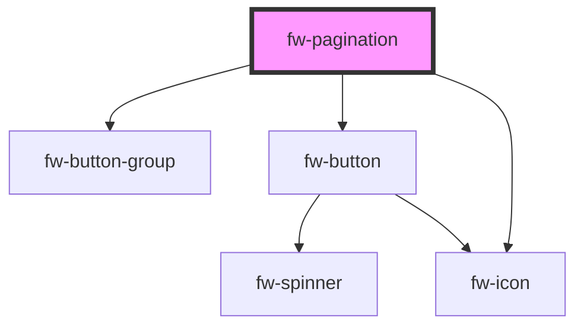

# Pagination (fw-pagination)

fw-pagination displays pagination. The component displays starting and ending record numbers against total number of records. It also calculates the start and end based on the query parameter `page`.

<!-- Auto Generated Below -->

## Properties

| Property         | Attribute          | Description                                                | Type     | Default     |
| ---------------- | ------------------ | ---------------------------------------------------------- | -------- | ----------- |
| `recordsPerPage` | `records-per-page` | The number of records to be shown per page. Defaults to 1. | `number` | `1`         |
| `totalRecords`   | `total-records`    | The total number of records.                               | `number` | `undefined` |

## Events

| Event      | Description                                               | Type               |
| ---------- | --------------------------------------------------------- | ------------------ |
| `fwChange` | Triggered when either previous or next button is clicked. | `CustomEvent<any>` |

## Dependencies

### Depends on

- [fw-button-group](../button-group)
- [fw-button](../button)
- [fw-icon](../icon)

### Graph

---

Built with ❤ at Freshworks
