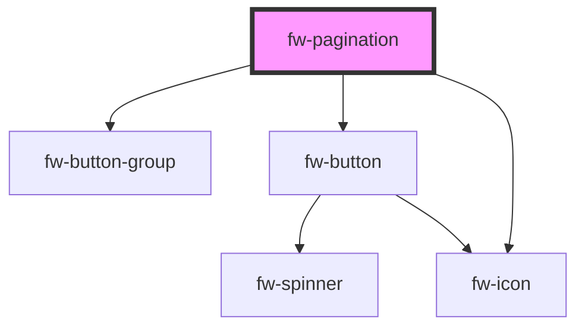

# fw-pagination

<!-- Auto Generated Below -->

## Properties

| Property  | Attribute  | Description                                      | Type     | Default     |
| --------- | ---------- | ------------------------------------------------ | -------- | ----------- |
| `perPage` | `per-page` | The number of records to be shown per page.      | `number` | `undefined` |
| `start`   | `start`    | The starting record number for the current page. | `number` | `undefined` |
| `total`   | `total`    | The total number of records.                     | `number` | `undefined` |

## Dependencies

### Depends on

- [fw-button-group](../button-group)
- [fw-button](../button)
- [fw-icon](../icon)

### Graph

----------------------------------------------

Built with ❤ at Freshworks
