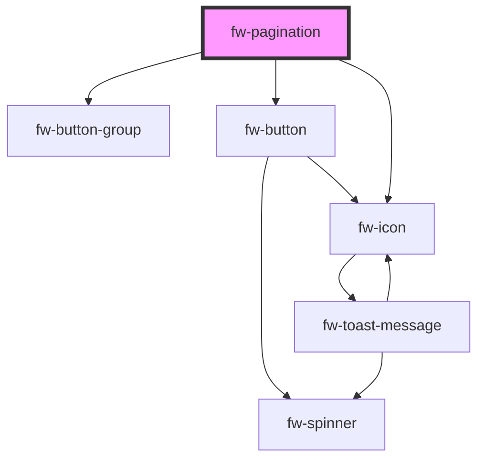

# Pagination (fw-pagination)

fw-pagination displays pagination. The component displays starting and ending record numbers against total number of records.

## Demo

```html live
<fw-pagination per-page="20" total="50"></fw-pagination><br />
<fw-pagination total="50"></fw-pagination><br />
<fw-pagination page="2" per-page="10" total="50"></fw-pagination>
```

## Usage

<code-group>
<code-block title="HTML">
```html
<fw-pagination per-page="20" total="50"></fw-pagination><br>
<fw-pagination total="50"></fw-pagination><br />
<fw-pagination
  page="2"
  per-page="10"
  total="50"
></fw-pagination>
```
</code-block>

<code-block title="React">
```jsx
import React from "react";
import ReactDOM from "react-dom";
import { FwPagination } from "@freshworks/crayons/react";
function App() {
  return (<div>
    <FwPagination per-page="20" total="50"></FwPagination><br/>
    <FwPagination total="50"></FwPagination>
    <FwPagination page="2"
  per-page="10"
  total="50"></FwPagination>
  </div>)
}
```
</code-block>
</code-group>

<!-- Auto Generated Below -->


## Properties

| Property              | Attribute               | Description                                                 | Type      | Default     |
| --------------------- | ----------------------- | ----------------------------------------------------------- | --------- | ----------- |
| `buttonGroupLabel`    | `button-group-label`    | Aria Label to be used for the button group.                 | `string`  | `''`        |
| `isLoading`           | `is-loading`            | Indicates if the records in current page are being fetched. | `boolean` | `false`     |
| `nextButtonLabel`     | `next-button-label`     | Aria Label to be used for next button.                      | `string`  | `''`        |
| `page`                | `page`                  | The current page number.                                    | `number`  | `1`         |
| `perPage`             | `per-page`              | The number of records to be shown per page. Defaults to 10. | `number`  | `10`        |
| `previousButtonLabel` | `previous-button-label` | Aria Label to be used for previous button.                  | `string`  | `''`        |
| `total`               | `total`                 | The total number of records. This is a mandatory parameter. | `number`  | `undefined` |


## Events

| Event      | Description                                               | Type               |
| ---------- | --------------------------------------------------------- | ------------------ |
| `fwChange` | Triggered when either previous or next button is clicked. | `CustomEvent<any>` |


## Methods

### `nextPage() => Promise<void>`

Navigates to next set of records if available.

#### Returns

Type: `Promise<void>`


### `previousPage() => Promise<void>`

Navigates to previous set of records if available.

#### Returns

Type: `Promise<void>`


## Dependencies

### Depends on

- [fw-button-group](../button-group)
- [fw-button](../button)
- [fw-icon](../icon)

### Graph


----------------------------------------------

Built with ❤ at Freshworks
