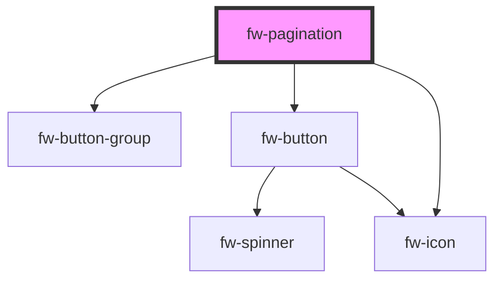

# Pagination (fw-pagination)

fw-pagination displays pagination. The component displays starting and ending record numbers against total number of records.

## Demo

```html live
<fw-pagination records-per-page="10" total-records="50"></fw-pagination><br />
<fw-pagination total-records="50"></fw-pagination><br />
<fw-pagination
  start="11"
  records-per-page="10"
  total-records="50"
></fw-pagination>
```

## Usage

<code-group>
<code-block title="HTML">
```html
<fw-pagination records-per-page="10" total-records="50"></fw-pagination><br>
<fw-pagination total-records="50"></fw-pagination><br />
<fw-pagination
  start="11"
  records-per-page="10"
  total-records="50"
></fw-pagination>
```
</code-block>

<code-block title="React">
```jsx
import React from "react";
import ReactDOM from "react-dom";
import { FwPagination } from "@freshworks/crayons/react";
function App() {
  return (<div>
    <FwPagination records-per-page="10" total-records="50"></FwPagination><br/>
    <FwPagination total-records="50"></FwPagination>
    <FwPagination start="11"
  records-per-page="10"
  total-records="50"></FwPagination>
  </div>)
}
```
</code-block>
</code-group>

<!-- Auto Generated Below -->

## Properties

| Property         | Attribute          | Description                                                 | Type     | Default     |
| ---------------- | ------------------ | ----------------------------------------------------------- | -------- | ----------- |
| `recordsPerPage` | `records-per-page` | The number of records to be shown per page. Defaults to 10. | `number` | `10`        |
| `start`          | `start`            | The starting record number for the current page.            | `number` | `1`         |
| `totalRecords`   | `total-records`    | The total number of records.                                | `number` | `undefined` |

## Events

| Event      | Description                                               | Type               |
| ---------- | --------------------------------------------------------- | ------------------ |
| `fwChange` | Triggered when either previous or next button is clicked. | `CustomEvent<any>` |

## Dependencies

### Depends on

- [fw-button-group](../button-group)
- [fw-button](../button)
- [fw-icon](../icon)

### Graph



---

Built with ❤ at Freshworks
