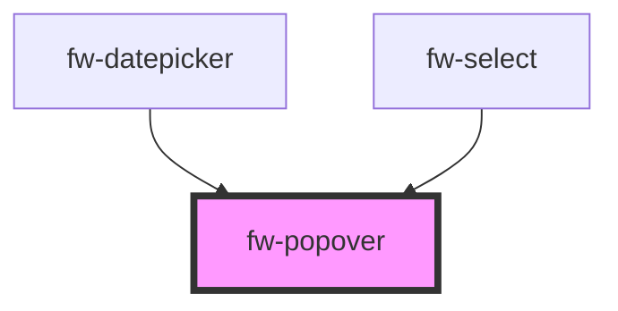

# Popover (fw-popover)

## Usage

Popover need two slots `popover-trigger` and `popover-content`. By default on clicking the trigger the content will be displayed. The props can be used to change the position of the content, width of the component and the distance between the trigger and the content.

```html live
<fw-popover>
  <fw-button slot="popover-trigger">Click Me!</fw-button>
  <fw-list-options slot="popover-content"></fw-list-options>
</fw-popover>

<br /><br /><br /><br />

<fw-popover placement="top">
  <fw-button slot="popover-trigger">Click Me!</fw-button>
  <fw-list-options
    id="placementComponent"
    slot="popover-content"
  ></fw-list-options>
</fw-popover>

<script type="application/javascript">
  var dataSource = [
    { value: '1', text: 'Luffy' },
    { value: '2', text: 'Zorro' },
    { value: '3', text: 'Sanji' },
  ];
  var listOptions = document.querySelector('fw-list-options');
  var placementOptions = document.getElementById('placementComponent');
  listOptions.options = dataSource;
  placementOptions.options = dataSource;
</script>
```

Even a complex dropdown can be created via popover

```html live
<fw-popover same-width="false" placement="bottom-start">
  <fw-button slot="popover-trigger" color="secondary">
    <fw-icon
      id="buttonIcon"
      slot="before-label"
      name="vertical-align-bottom"
    ></fw-icon>
    <span id="buttonContent">Premier Accounts</span>
  </fw-button>
  <div slot="popover-content">
    <div>Sort By</div>
    <fw-list-options id="sortBy" variant="icon"> </fw-list-options>
    <div>Sort Order</div>
    <fw-list-options id="sortOrder" variant="icon"> </fw-list-options>
  </div>
</fw-popover>
<script type="application/javascript">
  var sortByData = [
    {
      value: '1',
      text: 'Premier Accounts',
      graphicsProps: { name: 'verified' },
    },
    {
      value: '2',
      text: 'Expired Accounts',
      graphicsProps: { name: 'alert' },
    },
    {
      value: '3',
      text: 'Freshconect Accounts',
      graphicsProps: { name: 'freshconnect' },
    },
    {
      value: '4',
      text: 'Freshchat Accounts',
      graphicsProps: { name: 'freshchat' },
    },
    {
      value: '5',
      text: 'Verified Accounts',
      graphicsProps: { name: 'ticket-primary' },
    },
  ];
  var sortOrderData = [
    {
      value: '1',
      text: 'Ascending',
      graphicsProps: { name: 'vertical-align-bottom' },
    },
    {
      value: '2',
      text: 'Descending',
      graphicsProps: { name: 'vertical-align-top' },
    },
  ];
  var buttonIcon = document.getElementById('buttonIcon');
  var buttonContent = document.getElementById('buttonContent');
  var sortBy = document.getElementById('sortBy');
  sortBy.value = ['1'];
  sortBy.options = sortByData;
  sortBy.addEventListener('fwChange', (e) => {
    const selectedOptions = e.detail.selectedOptions;
    const text =
      selectedOptions.length > 0
        ? e.detail.selectedOptions[0].text
        : 'Select sort type';
    buttonContent.removeChild(buttonContent.firstChild);
    buttonContent.appendChild(document.createTextNode(text));
  });
  var sortOrder = document.getElementById('sortOrder');
  sortOrder.options = sortOrderData;
  sortOrder.value = ['1'];
  sortOrder.addEventListener('fwChange', (e) => {
    const selectedOptions = e.detail.selectedOptions;
    const iconName =
      selectedOptions.length > 0
        ? e.detail.selectedOptions[0].graphicsProps.name
        : 'vertical-align-bottom';
    buttonIcon.name = iconName;
  });
</script>
```

<!-- Auto Generated Below -->

## Properties

| Property             | Attribute    | Description                                                                                                                                                              | Type                                                                                                                                                                 | Default     |
| -------------------- | ------------ | ------------------------------------------------------------------------------------------------------------------------------------------------------------------------ | -------------------------------------------------------------------------------------------------------------------------------------------------------------------- | ----------- |
| `boundary`           | --           | The area that the popup will be checked for overflow relative to.                                                                                                        | `HTMLElement`                                                                                                                                                        | `undefined` |
| `distance`           | `distance`   | Distance defines the distance between the popover trigger and the popover content along y-axis.                                                                          | `string`                                                                                                                                                             | `'0'`       |
| `fallbackPlacements` | --           | Alternative placement for popover if the default placement is not possible.                                                                                              | `[PopoverPlacementType]`                                                                                                                                             | `['top']`   |
| `placement`          | `placement`  | Placement of the popover content with respect to the popover trigger.                                                                                                    | `"bottom" \| "bottom-end" \| "bottom-start" \| "left" \| "left-end" \| "left-start" \| "right" \| "right-end" \| "right-start" \| "top" \| "top-end" \| "top-start"` | `'bottom'`  |
| `sameWidth`          | `same-width` | Whether the popover-content width to be same as that of the popover-trigger.                                                                                             | `boolean`                                                                                                                                                            | `true`      |
| `skidding`           | `skidding`   | Skidding defines the distance between the popover trigger and the popover content along x-axis.                                                                          | `string`                                                                                                                                                             | `'0'`       |
| `trigger`            | `trigger`    | The trigger event on which the popover-content is displayed. The available options are 'click' \| 'manual' \| 'hover', in case of 'manual' no trigger event will be set. | `"click" \| "hover" \| "manual"`                                                                                                                                     | `'click'`   |
| `variant`            | `variant`    | Variant defines the style of the popover-content.                                                                                                                        | `"date-picker" \| "select"`                                                                                                                                          | `'select'`  |

## Events

| Event    | Description                                                | Type               |
| -------- | ---------------------------------------------------------- | ------------------ |
| `fwHide` | Triggered whenever the popover contents is closed/hidden.  | `CustomEvent<any>` |
| `fwShow` | Triggered whenever the popover contents is open/displayed. | `CustomEvent<any>` |

## Methods

### `hide() => Promise<void>`

#### Returns

Type: `Promise<void>`

### `show() => Promise<void>`

#### Returns

Type: `Promise<void>`

## Dependencies

### Used by

- [fw-datepicker](../datepicker)
- [fw-select](../select)

### Graph



---

Built with ❤ at Freshworks
