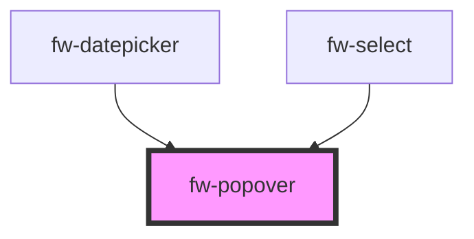

# fw-popover

<!-- Auto Generated Below -->

## Properties

| Property             | Attribute    | Description                                                                                     | Type                                     | Default     |
| -------------------- | ------------ | ----------------------------------------------------------------------------------------------- | ---------------------------------------- | ----------- |
| `boundary`           | --           | The area that the popup will be checked for overflow relative to.                               | `HTMLElement`                            | `undefined` |
| `distance`           | `distance`   | Distance defines the distance between the popover trigger and the popover content along y-axis. | `string`                                 | `'0'`       |
| `fallbackPlacements` | --           | Alternative placement for popover if the default placement is not possible.                     | `[PopoverPlacementType]`                 | `['top']`   |
| `placement`          | `placement`  | Placement of the popover content with respect to the popover trigger.                           | `"bottom" \| "left" \| "right" \| "top"` | `'bottom'`  |
| `sameWidth`          | `same-width` | Whether the popover-content width to be same as that of the popover-trigger.                    | `boolean`                                | `true`      |
| `skidding`           | `skidding`   | Skidding defines the distance between the popover trigger and the popover content along x-axis. | `string`                                 | `'0'`       |
| `variant`            | `variant`    | Variant defines the style of the popover-content.                                               | `"date-picker" \| "select"`              | `'select'`  |

## Methods

### `hide() => Promise<void>`

#### Returns

Type: `Promise<void>`

### `show() => Promise<void>`

#### Returns

Type: `Promise<void>`

## Dependencies

### Used by

 - [fw-datepicker](../datepicker)
 - [fw-select](../select)

### Graph

----------------------------------------------

Built with ❤ at Freshworks
