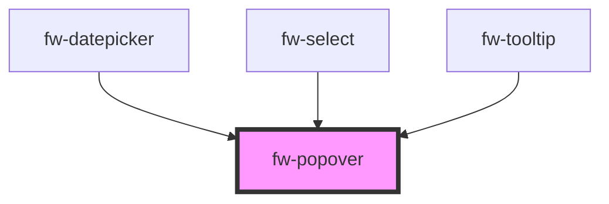

# Popover (fw-popover)

## Usage

Popover need two slots `popover-trigger` and `popover-content`. By default on clicking the trigger the content will be displayed. The props can be used to change the position of the content, width of the component and the distance between the trigger and the content.

```html live
<fw-popover>
  <fw-button slot="popover-trigger">Currency List</fw-button>
  <fw-list-options id="currency" slot="popover-content"></fw-list-options>
</fw-popover>

<script type="application/javascript">
  var rupeeData = [
    { value: '1', text: 'INR' },
    { value: '2', text: 'USD' },
    { value: '3', text: 'AED' },
    { value: '4', text: 'MYR' },
    { value: '5', text: 'KWD' },
    { value: '6', text: 'HKD' },
    { value: '7', text: 'DMK' },
    { value: '8', text: 'EUR' },
  ];
  var currency = document.getElementById('currency');
  currency.options = rupeeData;
</script>
```

### Controlling the width of the popover-content

If we want the content width to be different from the trigger then pass the `sameWidth` prop as false.
Also the width of the content can be modified via the css variables as shown below.

```html live
<fw-popover
  same-width="false"
  style="--fw-popover-min-width: 150px"
  placement="bottom-start"
>
  <fw-button slot="popover-trigger">Units</fw-button>
  <fw-list-options id="units" slot="popover-content"></fw-list-options>
</fw-popover>

<script type="application/javascript">
  var unitsData = [
    { value: '1', text: 'Inch' },
    { value: '2', text: 'Meter' },
    { value: '3', text: 'Centimeter' },
    { value: '4', text: 'Foot' },
    { value: '5', text: 'Yard' },
    { value: '6', text: 'Mile' },
  ];

  var units = document.getElementById('units');
  units.options = unitsData;
</script>
```

### Keyboard navigation

Set the `autoFocusOnContent` prop as true to shift the focus to the content on popover open.

> NOTE: Make sure content or trigger is focusable element, Or use the focus() or the setFocus() method on both to handle focus manually.

```html live
<fw-popover
  same-width="false"
  auto-focus-on-content="true"
  style="--fw-popover-min-width: 150px"
  placement="top-start"
>
  <fw-button slot="popover-trigger">Payment Option</fw-button>
  <fw-list-options id="payment" slot="popover-content"></fw-list-options>
</fw-popover>

<script type="application/javascript">
  var paymentData = [
    { value: '1', text: 'Cash on delivery' },
    { value: '2', text: 'Netbanking' },
    { value: '3', text: 'UPI' },
    { value: '4', text: 'Credit Card' },
    { value: '5', text: 'Debit Card' },
  ];

  var payment = document.getElementById('payment');
  payment.options = paymentData;
</script>
```

The above event can be handled manually via the listeners.

```html live
<fw-popover
  id="status-popover"
  same-width="false"
  style="--fw-popover-min-width: 150px"
  placement="top-start"
>
  <fw-button id="status-icon" size="icon" slot="popover-trigger"
    ><fw-icon name="agent" color="white"></fw-icon>
  </fw-button>
  <fw-list-options id="status-options" slot="popover-content"></fw-list-options>
</fw-popover>

<script type="application/javascript">
  var statusData = [
    { value: '1', text: 'Busy' },
    { value: '2', text: 'InActive' },
    { value: '3', text: 'Active' },
  ];

  //Setting data
  var statusOptions = document.getElementById('status-options');
  statusOptions.options = statusData;

  // Listening to events and setting focus
  var statusPopover = document.getElementById('status-popover');
  var statusIcon = document.getElementById('status-icon');
  statusPopover.addEventListener('fwShow', () => {
    statusOptions.setFocus();
  });
  statusPopover.addEventListener('fwHide', () => {
    statusIcon.setFocus();
  });
</script>
```

<code-group>
<code-block title="HTML">

```html
<fw-popover
  id="status-popover"
  same-width="false"
  style="--fw-popover-min-width: 150px"
  placement="top-start"
>
  <fw-button id="status-icon" size="icon" slot="popover-trigger"
    ><fw-icon name="agent" color="white"></fw-icon>
  </fw-button>
  <fw-list-options id="status-options" slot="popover-content"></fw-list-options>
</fw-popover>

<script type="application/javascript">
  var statusData = [
    { value: '1', text: 'Busy' },
    { value: '2', text: 'InActive' },
    { value: '3', text: 'Active' },
  ];

  //Setting data
  var statusOptions = document.getElementById('status-options');
  statusOptions.options = statusData;

  // Listening to events and setting focus
  var statusPopover = document.getElementById('status-popover');
  var statusIcon = document.getElementById('status-icon');
  statusPopover.addEventListener('fwShow', () => {
    statusOptions.setFocus();
  });
  statusPopover.addEventListener('fwHide', () => {
    statusIcon.setFocus();
  });
</script>
```

</code-block>
<code-block title="React">

```jsx
import React, { useRef } from 'react';
import {
  FwButton,
  FwIcon,
  FwListOptions,
  FwPopover,
} from '@freshworks/crayons/react';

const Popover = () => {
  const statusIcon = useRef();
  const statusOptions = useRef();

  const statusData = [
    { value: '1', text: 'Busy' },
    { value: '2', text: 'InActive' },
    { value: '3', text: 'Active' },
  ];

  return (
    <div>
      <FwPopover
        sameWidth='false'
        style={{ '--fw-popover-min-width': '150px' }}
        placement='top-start'
        onFwShow={() => statusOptions.current.setFocus()}
        onFwHide={() => statusIcon.current.setFocus()}
      >
        <FwButton ref={statusIcon} size='icon' slot='popover-trigger'>
          <FwIcon name='agent' color='white'></FwIcon>
        </FwButton>
        <FwListOptions
          ref={statusOptions}
          options={statusData}
          slot='popover-content'
        ></FwListOptions>
      </FwPopover>
    </div>
  );
};

export default Popover;
```

</code-block>
</code-group>

Even a complex dropdown can be created via popover. Below example contains two different fw-list-options inside a single fw-popover.

```html live
<fw-popover same-width="false" placement="bottom-start">
  <fw-button slot="popover-trigger" color="secondary" show-caret-icon>
    <fw-icon
      id="buttonIcon"
      slot="before-label"
      name="vertical-align-bottom"
    ></fw-icon>
    <span id="buttonContent">Premier Accounts</span>
  </fw-button>
  <div slot="popover-content">
    <span
      style="font-style: italic;"
      class="row fw-flex fw-type-xs fw-p-4 fw-type-semibold"
      >Sort Customers By</span
    >
    <hr style="margin: 0px" />
    <fw-list-options id="sortBy" variant="icon"> </fw-list-options>
    <span
      style="font-style: italic;"
      class="row fw-flex fw-type-xs fw-p-4 fw-type-semibold"
      >Sorting Order</span
    >
    <hr style="margin: 0px" />
    <fw-list-options id="sortOrder" variant="icon"> </fw-list-options>
  </div>
</fw-popover>

<script type="application/javascript">
  var sortByData = [
    {
      value: '1',
      text: 'Premier Accounts',
      graphicsProps: { name: 'verified' },
    },
    {
      value: '2',
      text: 'Expired Accounts',
      graphicsProps: { name: 'alert' },
    },
    {
      value: '3',
      text: 'Freshconect Accounts',
      graphicsProps: { name: 'freshconnect' },
    },
    {
      value: '4',
      text: 'Freshchat Accounts',
      graphicsProps: { name: 'freshchat' },
    },
    {
      value: '5',
      text: 'Verified Accounts',
      graphicsProps: { name: 'ticket-primary' },
    },
  ];
  var sortOrderData = [
    {
      value: '1',
      text: 'Ascending',
      graphicsProps: { name: 'vertical-align-bottom' },
    },
    {
      value: '2',
      text: 'Descending',
      graphicsProps: { name: 'vertical-align-top' },
    },
  ];
  var buttonIcon = document.getElementById('buttonIcon');
  var buttonContent = document.getElementById('buttonContent');
  var sortBy = document.getElementById('sortBy');
  sortBy.value = '1';
  sortBy.options = sortByData;
  sortBy.addEventListener('fwChange', (e) => {
    const selectedOptions = e.detail?.meta?.selectedOptions;
    const text =
      selectedOptions.length > 0
        ? e.detail.selectedOptions[0].text
        : 'Select sort type';
    buttonContent.removeChild(buttonContent.firstChild);
    buttonContent.appendChild(document.createTextNode(text));
  });
  var sortOrder = document.getElementById('sortOrder');
  sortOrder.options = sortOrderData;
  sortOrder.value = '1';
  sortOrder.addEventListener('fwChange', (e) => {
    const selectedOptions = e.detail?.meta?.selectedOptions;
    const iconName =
      selectedOptions.length > 0
        ? e.detail.selectedOptions[0].graphicsProps.name
        : 'vertical-align-bottom';
    buttonIcon.name = iconName;
  });
</script>
```

<code-group>
<code-block title='HTML'>

```html
<fw-popover same-width="false" placement="bottom-start">
  <fw-button slot="popover-trigger" color="secondary" show-caret-icon>
    <fw-icon
      id="buttonIcon"
      slot="before-label"
      name="vertical-align-bottom"
    ></fw-icon>
    <span id="buttonContent">Premier Accounts</span>
  </fw-button>
  <div slot="popover-content">
    <span
      style="font-style: italic;"
      class="row fw-flex fw-type-xs fw-p-4 fw-type-semibold"
      >Sort Customers By</span
    >
    <hr style="margin: 0px" />
    <fw-list-options id="sortBy" variant="icon"> </fw-list-options>
    <span
      style="font-style: italic;"
      class="row fw-flex fw-type-xs fw-p-4 fw-type-semibold"
      >Sorting Order</span
    >
    <hr style="margin: 0px" />
    <fw-list-options id="sortOrder" variant="icon"> </fw-list-options>
  </div>
</fw-popover>

<script type="application/javascript">
  var sortByData = [
    {
      value: '1',
      text: 'Premier Accounts',
      graphicsProps: { name: 'verified' },
    },
    {
      value: '2',
      text: 'Expired Accounts',
      graphicsProps: { name: 'alert' },
    },
    {
      value: '3',
      text: 'Freshconect Accounts',
      graphicsProps: { name: 'freshconnect' },
    },
    {
      value: '4',
      text: 'Freshchat Accounts',
      graphicsProps: { name: 'freshchat' },
    },
    {
      value: '5',
      text: 'Verified Accounts',
      graphicsProps: { name: 'ticket-primary' },
    },
  ];
  var sortOrderData = [
    {
      value: '1',
      text: 'Ascending',
      graphicsProps: { name: 'vertical-align-bottom' },
    },
    {
      value: '2',
      text: 'Descending',
      graphicsProps: { name: 'vertical-align-top' },
    },
  ];
  var buttonIcon = document.getElementById('buttonIcon');
  var buttonContent = document.getElementById('buttonContent');
  var sortBy = document.getElementById('sortBy');
  sortBy.value = '1';
  sortBy.options = sortByData;
  sortBy.addEventListener('fwChange', (e) => {
    const selectedOptions = e.detail?.meta?.selectedOptions;
    const text =
      selectedOptions.length > 0
        ? e.detail.selectedOptions[0].text
        : 'Select sort type';
    buttonContent.removeChild(buttonContent.firstChild);
    buttonContent.appendChild(document.createTextNode(text));
  });
  var sortOrder = document.getElementById('sortOrder');
  sortOrder.options = sortOrderData;
  sortOrder.value = '1';
  sortOrder.addEventListener('fwChange', (e) => {
    const selectedOptions = e.detail?.meta?.selectedOptions;
    const iconName =
      selectedOptions.length > 0
        ? e.detail.selectedOptions[0].graphicsProps.name
        : 'vertical-align-bottom';
    buttonIcon.name = iconName;
  });
</script>
```

</code-block>
<code-block title='React'>

```jsx
import React, { useState } from 'react';
import {
  FwButton,
  FwIcon,
  FwListOptions,
  FwPopover,
} from '@freshworks/crayons/react';

const Popover = () => {
  var sortByData = [
    {
      value: '1',
      text: 'Premier Accounts',
      graphicsProps: { name: 'verified' },
    },
    {
      value: '2',
      text: 'Expired Accounts',
      graphicsProps: { name: 'alert' },
    },
    {
      value: '3',
      text: 'Freshconect Accounts',
      graphicsProps: { name: 'freshconnect' },
    },
    {
      value: '4',
      text: 'Freshchat Accounts',
      graphicsProps: { name: 'freshchat' },
    },
    {
      value: '5',
      text: 'Verified Accounts',
      graphicsProps: { name: 'ticket-primary' },
    },
  ];
  var sortOrderData = [
    {
      value: 'vertical-align-bottom',
      text: 'Ascending',
      graphicsProps: { name: 'vertical-align-bottom' },
    },
    {
      value: 'vertical-align-top',
      text: 'Descending',
      graphicsProps: { name: 'vertical-align-top' },
    },
  ];

  // Setting initial states
  const [sortBy, setSortBy] = useState(sortByData[0]);
  const [sortOrder, setSortOrder] = useState(sortOrderData[0]);

  const onSortChange = (event) => {
    setSortBy(event.detail?.meta?.selectedOptions[0]);
  };

  const onSortOrderChange = (event) => {
    setSortOrder(event.detail?.meta?.selectedOptions[0]);
  };

  return (
    <div>
      <FwPopover sameWidth='false' placement='bottom-start'>
        <FwButton slot='popover-trigger' color='secondary' showCaretIcon>
          <FwIcon slot='before-label' name={sortOrder.value}></FwIcon>
          <span id='buttonContent'>{sortBy.text}</span>
        </FwButton>
        <div slot='popover-content'>
          <span
            style={{ fontStyle: 'italic' }}
            className='row fw-flex fw-type-xs fw-p-4 fw-type-semibold'
          >
            Sort Customers By
          </span>
          <hr style={{ margin: '0px' }} />
          <FwListOptions
            onFwChange={onSortChange}
            selectedOptions={[sortByData[0]]}
            options={sortByData}
            variant='icon'
          ></FwListOptions>

          <span
            style={{ fontStyle: 'italic' }}
            className='row fw-flex fw-type-xs fw-p-4 fw-type-semibold'
          >
            Sort Order
          </span>
          <hr style={{ margin: '0px' }} />
          <FwListOptions
            onFwChange={onSortOrderChange}
            selectedOptions={[sortOrderData[0]]}
            options={sortOrderData}
            variant='icon'
          ></FwListOptions>
        </div>
      </FwPopover>
    </div>
  );
};

export default Popover;
```

</code-block>
</code-group>

A simple dropdown button can be achieved as shown below.

```html live
<fw-popover
  trigger="manual"
  id="sports-dropdown"
  same-width="false"
  placement="bottom-start"
  auto-focus-on-content
>
  <fw-button-group label="Test" slot="popover-trigger">
    <fw-button>Choose the sport</fw-button>
    <fw-button id="icon-btn" size="icon">
      <fw-icon
        id="chevron-icon"
        name="chevron-down"
        slot="after-label"
      ></fw-icon>
    </fw-button>
  </fw-button-group>
  <fw-list-options
    id="sports"
    slot="popover-content"
    searchable
  ></fw-list-options>
</fw-popover>
<script type="application/javascript">
  var dropdown = document.getElementById('sports-dropdown');
  var iconbtn = document.getElementById('icon-btn');
  var chevron = document.getElementById('chevron-icon');
  iconbtn.addEventListener('click', () => {
    if (dropdown.isOpen) {
      dropdown.hide();
    } else {
      dropdown.show();
    }
  });
  dropdown.addEventListener('fwShow', () => {
    chevron.style.cssText = 'transform: rotate(180deg)';
  });
  dropdown.addEventListener('fwHide', () => {
    chevron.style.cssText = '';
  });
  var sports = document.getElementById('sports');
  sports.options = [
    { value: 1, text: 'Football' },
    { value: 2, text: 'Vollyball' },
    { value: 3, text: 'Cricket' },
    { value: 4, text: 'Kabadi' },
  ];
</script>
```

<!-- Auto Generated Below -->


## Properties

| Property             | Attribute               | Description                                                                                                                                                              | Type                                                                                                                                                                 | Default     |
| -------------------- | ----------------------- | ------------------------------------------------------------------------------------------------------------------------------------------------------------------------ | -------------------------------------------------------------------------------------------------------------------------------------------------------------------- | ----------- |
| `autoFocusOnContent` | `auto-focus-on-content` | Whether to focus on the element in popover-content slot on opening the dropdown.                                                                                         | `boolean`                                                                                                                                                            | `false`     |
| `boundary`           | --                      | The area that the popup will be checked for overflow relative to.                                                                                                        | `HTMLElement`                                                                                                                                                        | `undefined` |
| `disableTransition`  | `disable-transition`    | Option to disable the popover animation on hide and show.                                                                                                                | `boolean`                                                                                                                                                            | `false`     |
| `distance`           | `distance`              | Distance defines the distance between the popover trigger and the popover content along y-axis.                                                                          | `string`                                                                                                                                                             | `'0'`       |
| `fallbackPlacements` | --                      | Alternative placement for popover if the default placement is not possible.                                                                                              | `[PopoverPlacementType]`                                                                                                                                             | `['top']`   |
| `hasBorder`          | `has-border`            | Option to determine if popover-content has a border.                                                                                                                     | `boolean`                                                                                                                                                            | `true`      |
| `hideOnTab`          | `hide-on-tab`           | Indicates whether popover contents should be hidden on pressing Tab.                                                                                                     | `boolean`                                                                                                                                                            | `true`      |
| `hoist`              | `hoist`                 | Option to prevent the tooltip from being clipped when the component is placed inside a container with `overflow: auto\|hidden\|scroll`.                                  | `boolean`                                                                                                                                                            | `false`     |
| `placement`          | `placement`             | Placement of the popover content with respect to the popover trigger.                                                                                                    | `"bottom" \| "bottom-end" \| "bottom-start" \| "left" \| "left-end" \| "left-start" \| "right" \| "right-end" \| "right-start" \| "top" \| "top-end" \| "top-start"` | `'bottom'`  |
| `sameWidth`          | `same-width`            | Whether the popover-content width to be same as that of the popover-trigger.                                                                                             | `boolean`                                                                                                                                                            | `true`      |
| `skidding`           | `skidding`              | Skidding defines the distance between the popover trigger and the popover content along x-axis.                                                                          | `string`                                                                                                                                                             | `'0'`       |
| `trigger`            | `trigger`               | The trigger event on which the popover-content is displayed. The available options are 'click' \| 'manual' \| 'hover', in case of 'manual' no trigger event will be set. | `"click" \| "hover" \| "manual"`                                                                                                                                     | `'click'`   |
| `variant`            | `variant`               | Variant defines the style of the popover-content.                                                                                                                        | `"date-picker" \| "select"`                                                                                                                                          | `'select'`  |


## Events

| Event    | Description                                                | Type               |
| -------- | ---------------------------------------------------------- | ------------------ |
| `fwHide` | Triggered whenever the popover contents is closed/hidden.  | `CustomEvent<any>` |
| `fwShow` | Triggered whenever the popover contents is open/displayed. | `CustomEvent<any>` |


## Methods

### `hide() => Promise<void>`


#### Returns

Type: `Promise<void>`


### `show() => Promise<void>`


#### Returns

Type: `Promise<void>`


## CSS Custom Properties

| Name                         | Description                            |
| ---------------------------- | -------------------------------------- |
| `--fw-popover-border-radius` | border radius of the popover content.  |
| `--fw-popover-max-height`    | Maximum height of the popover content. |
| `--fw-popover-max-width`     | Maximum width of the popover content.  |
| `--fw-popover-min-height`    | Minimum height of the popover content. |
| `--fw-popover-min-width`     | Minimum width of the popover content.  |


## Dependencies

### Used by

 - [fw-datepicker](../datepicker)
 - [fw-select](../select)
 - [fw-tooltip](../tooltip)

### Graph


----------------------------------------------

Built with ❤ at Freshworks
