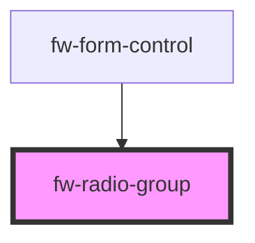

# Radio Group (fw-radio-group)
fw-radio-group displays a group of options with radio buttons and enables selection of one option from the list. 

## Demo

```html live
<fw-radio-group name="Profile" value="au" allow-empty>
  <fw-radio value="au">Auditory</fw-radio>
  <fw-radio value="vi">Visual</fw-radio>
  <fw-radio value="re">Restless</fw-radio>
</fw-radio-group>
```

## Usage

<code-group>
<code-block title="HTML">
```html 
<fw-radio-group name="Profile" value="au" allow-empty>
  <fw-radio value="au">Auditory</fw-radio>
  <fw-radio value="vi">Visual</fw-radio>
  <fw-radio value="re">Restless</fw-radio>
</fw-radio-group>
```
</code-block>

<code-block title="React">
```jsx
import React from "react";
import ReactDOM from "react-dom";
import { FwRadio, FwRadioGroup } from "@freshworks/crayons/react";
function App() {
  return (<div>
        <FwRadioGroup name="Profile" value="au" allowEmpty>
          <FwRadio value="au">Auditory</FwRadio>
          <FwRadio value="vi">Visual</FwRadio>
          <FwRadio value="re">Restless</FwRadio>
        </FwRadioGroup>
    </div>);
}
```
</code-block>
</code-group>

<!-- Auto Generated Below -->


## Properties

| Property      | Attribute     | Description                                                                                                                                                                                 | Type                | Default     |
| ------------- | ------------- | ------------------------------------------------------------------------------------------------------------------------------------------------------------------------------------------- | ------------------- | ----------- |
| `allowEmpty`  | `allow-empty` | If true, a radio group can be saved without selecting any option. If an option is selected, the selection can be cleared. If the attribute’s value is undefined, the value is set to false. | `boolean`           | `false`     |
| `label`       | `label`       | Label for the component, that can be used by screen readers.                                                                                                                                | `string`            | `''`        |
| `name`        | `name`        | Name of the component, saved as part of form data.                                                                                                                                          | `string`            | `''`        |
| `orientation` | `orientation` | Indicates the direction of the radio buttons alignment, defaults to vertical alignment.                                                                                                     | `"column" \| "row"` | `'column'`  |
| `required`    | `required`    | Specifies the input radio group as a mandatory field and displays an asterisk next to the label. If the attribute’s value is undefined, the value is set to false.                          | `boolean`           | `false`     |
| `value`       | `value`       | Default option that is selected when the radio group is displayed on the interface. Must be a valid value corresponding to the fw-radio components used in the Radio Group.                 | `any`               | `undefined` |


## Events

| Event      | Description                                                            | Type               |
| ---------- | ---------------------------------------------------------------------- | ------------------ |
| `fwChange` | Triggered when an option in the Radio Group is selected or deselected. | `CustomEvent<any>` |


## Dependencies

### Used by

 - [fw-form-control](../form-control)

### Graph


----------------------------------------------

Built with ❤ at Freshworks
