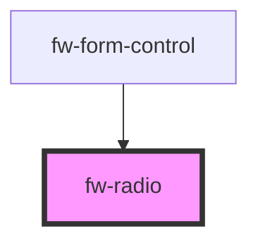

# Radio (fw-radio)

fw-radio displays a radio button on the user interface and enables assigning a state (selected or deselected) to it. In the selected state, the button displayed is highlighted. fw-radio provides child elements for fw-radio-group, to populate the Radio Group component’s list. 

## Demo

```html live
<fw-radio checked description="Select to agree">Agree or Disagree</fw-radio><br><br>
<fw-radio checked disabled value="dr">Disabled radio</fw-radio>
```


## Usage

<code-group>
<code-block title="HTML">
```html 
<fw-radio checked description="Select to agree">Agree or Disagree</fw-radio><br><br>
<fw-radio checked disabled value="dr">Disabled radio</fw-radio>
```
</code-block>

<code-block title="React">
```jsx
import React from "react";
import ReactDOM from "react-dom";
import { FwRadio } from "@freshworks/crayons/react";
function App() {
  return (<div>
        <FwRadio checked description="Select to agree">Agree or Disagree</FwRadio><br/><br/>
        <FwRadio checked disabled value="dr">Disabled radio</FwRadio>
    </div>);
}
```
</code-block>
</code-group>

<!-- Auto Generated Below -->


## Properties

| Property      | Attribute     | Description                                                                                                                               | Type                  | Default    |
| ------------- | ------------- | ----------------------------------------------------------------------------------------------------------------------------------------- | --------------------- | ---------- |
| `checked`     | `checked`     | Sets the state to selected. If the attribute’s value is undefined, the value is set to false.                                             | `boolean`             | `false`    |
| `description` | `description` | Description to be displayed for the checkbox.                                                                                             | `string`              | `''`       |
| `disabled`    | `disabled`    | Disables the component on the interface. If the attribute’s value is undefined, the value is set to false.                                | `boolean`             | `false`    |
| `label`       | `label`       | <span style="color:red">**[DEPRECATED]**</span> Use `description` instead. Label displayed on the interface, for the check box.<br/><br/> | `string`              | `''`       |
| `name`        | `name`        | Name of the component, saved as part of form data.                                                                                        | `string`              | `''`       |
| `state`       | `state`       | Theme based on which the radio button is styled.                                                                                          | `"error" \| "normal"` | `'normal'` |
| `value`       | `value`       | Identifier corresponding to the component, that is saved when the form data is saved.                                                     | `string`              | `''`       |


## Events

| Event        | Description                                                 | Type                |
| ------------ | ----------------------------------------------------------- | ------------------- |
| `fwBlur`     | Triggered when the radio button loses focus.                | `CustomEvent<any>`  |
| `fwChange`   | Triggered when the radio button is toggled.                 | `CustomEvent<any>`  |
| `fwDeselect` | Triggered when the radio button in focus is cleared.        | `CustomEvent<any>`  |
| `fwFocus`    | Triggered when the radio button comes into focus.           | `CustomEvent<void>` |
| `fwSelect`   | /**   Triggered when the radio button in focus is selected. | `CustomEvent<any>`  |


## Methods

### `setFocus() => Promise<void>`

Sets focus on a specific `fw-radio`.

#### Returns

Type: `Promise<void>`


## Dependencies

### Used by

 - [fw-form-control](../form-control)

### Graph


----------------------------------------------

Built with ❤ at Freshworks
