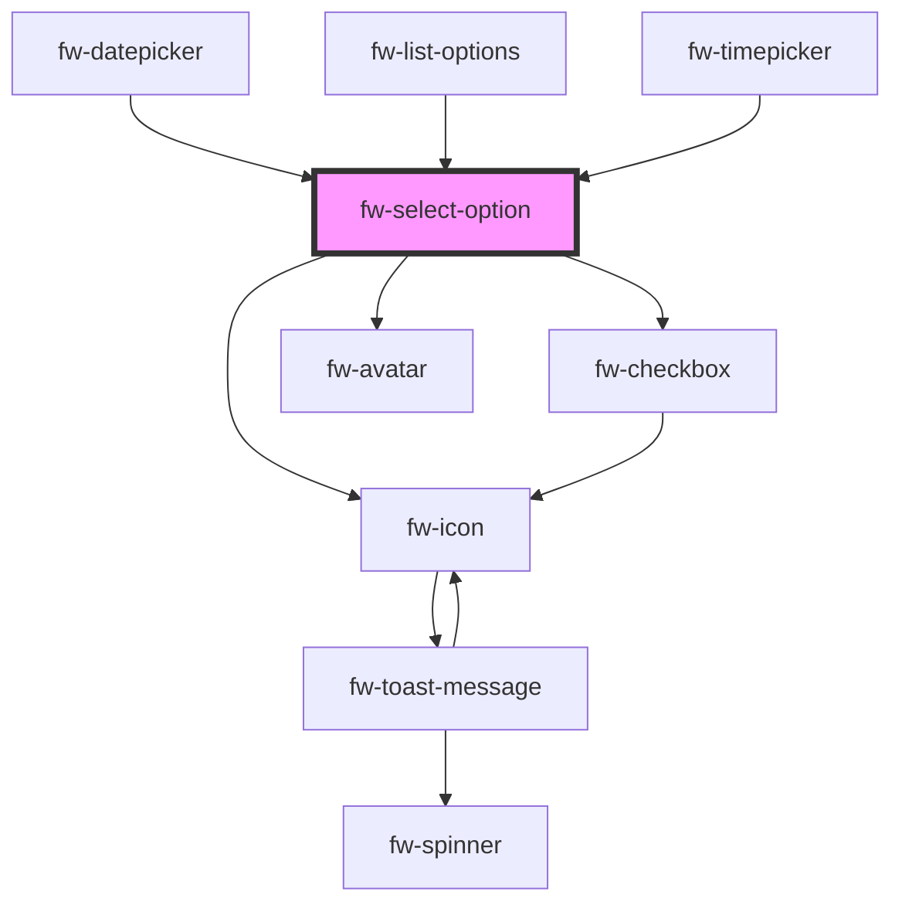

# Select Option (fw-select-option)

fw-select-option provides child elements for fw-select, to populate the Select component’s list or drop-down box with values. If fw-select-option is used without the value attribute, when the form data is saved, the value of fw-select is the selected option’s text.

## Demo

```html live
<fw-select-option selected="true">I am the chosen one</fw-select-option>
<fw-select-option html html-content="<b>Me, nein</b>"></fw-select-option>
<fw-select-option>I am another option</fw-select-option>
```

## Usage

<code-group>
<code-block title="HTML">
```html 
<fw-select-option selected="true">I am the chosen one</fw-select-option>
<fw-select-option html html-content="<b>Me, nein</b>"></fw-select-option>
<fw-select-option>I am another option</fw-select-option>
```
</code-block>

<code-block title="React">
```jsx
import React from "react";
import ReactDOM from "react-dom";
import { FwSelectOption } from "@freshworks/crayons/react";
function App() {
  return (<div>
        <FwSelectOption selected>I am the chosen one</FwSelectOption>
        <FwSelectOption html htmlContent="<b>Me, nein</b>"></FwSelectOption>
        <FwSelectOption>I am another option</FwSelectOption>
    </div>);
}
```
</code-block>
</code-group>

#### Demo - Variants

```html live
<fw-select-option text="Standard Variant"></fw-select-option>
<fw-select-option
  text="Standard Variant"
  sub-text="This is multiline element"
></fw-select-option>
<fw-select-option
  checkbox
  text="Checkbox Variant"
  sub-text="This is multiline checkbox element"
></fw-select-option>
```

#### Usage - Variants

<code-group>
<code-block title="HTML">
```html 
<fw-select-option text="Standard Variant"></fw-select-option>
<fw-select-option
  text="Standard Variant"
  sub-text="This is multiline element"
></fw-select-option>
<fw-select-option
  checkbox
  text="Checkbox Variant"
  sub-text="This is multiline checkbox element"
></fw-select-option>
```
</code-block>

<code-block title="React">
```jsx
import React from "react";
import ReactDOM from "react-dom";
import { FwSelectOption } from "@freshworks/crayons/react";
function App() {
  return (<div>
        <FwSelectOption text="Standard Variant"></FwSelectOption>
        <FwSelectOption
          text="Standard Variant"
          subText="This is multiline element"
        ></FwSelectOption>
        <FwSelectOption
          checkbox
          text="Checkbox Variant"
          subText="This is multiline checkbox element"
        ></FwSelectOption>
    </div>);
}
```
</code-block>
</code-group>

<!-- Auto Generated Below -->


## Properties

| Property        | Attribute        | Description                                                                                                                                                                                                                               | Type                               | Default      |
| --------------- | ---------------- | ----------------------------------------------------------------------------------------------------------------------------------------------------------------------------------------------------------------------------------------- | ---------------------------------- | ------------ |
| `allowDeselect` | `allow-deselect` | Whether clicking on the already selected option disables it.                                                                                                                                                                              | `boolean`                          | `true`       |
| `checkbox`      | `checkbox`       | Place a checkbox.                                                                                                                                                                                                                         | `boolean`                          | `false`      |
| `disabled`      | `disabled`       | Sets the state of the option to disabled. The selected option is disabled and greyed out. If the attribute’s value is undefined, the value is set to false.                                                                               | `boolean`                          | `false`      |
| `graphicsProps` | `graphics-props` | The props for the graphics variant. ex., icon props in case of graphicsType = 'icon'                                                                                                                                                      | `any`                              | `undefined`  |
| `groupName`     | `group-name`     | Used in grouped list, provides the group in which the option belongs                                                                                                                                                                      | `string`                           | `undefined`  |
| `html`          | `html`           | States that the option is an HTML value. If the attribute's value is undefined, the value is set to true.                                                                                                                                 | `boolean`                          | `false`      |
| `htmlContent`   | `html-content`   | HTML content that is displayed as the option.                                                                                                                                                                                             | `string`                           | `undefined`  |
| `optionText`    | `option-text`    | Alternate text displayed on the interface, in place of the actual HTML content.                                                                                                                                                           | `string`                           | `undefined`  |
| `selected`      | `selected`       | Sets the state of the option to selected. The selected option is highlighted and a check mark is displayed next to it. If the attribute’s value is undefined, the value is set to false.                                                  | `boolean`                          | `false`      |
| `subText`       | `sub-text`       | Second line text can be description etc.                                                                                                                                                                                                  | `string`                           | `undefined`  |
| `text`          | `text`           | The text to be displayed in the option.                                                                                                                                                                                                   | `string`                           | `undefined`  |
| `value`         | `value`          | Value corresponding to the option, that is saved  when the form data is saved.                                                                                                                                                            | `number \| string`                 | `undefined`  |
| `variant`       | `variant`        | Standard is the default option without any graphics other options are icon and avatar which places either the icon or avatar at the beginning of the row. The props for the icon or avatar are passed as an object via the graphicsProps. | `"avatar" \| "icon" \| "standard"` | `'standard'` |


## Events

| Event        | Description                           | Type               |
| ------------ | ------------------------------------- | ------------------ |
| `fwBlur`     | Triggered when an option loses focus. | `CustomEvent<any>` |
| `fwFocus`    | Triggered when an option is focused.  | `CustomEvent<any>` |
| `fwSelected` | Triggered when an option is selected. | `CustomEvent<any>` |


## Methods

### `setFocus() => Promise<any>`


#### Returns

Type: `Promise<any>`


## Dependencies

### Used by

 - [fw-datepicker](../datepicker)
 - [fw-list-options](../options-list)
 - [fw-timepicker](../timepicker)

### Depends on

- [fw-icon](../icon)
- [fw-checkbox](../checkbox)
- [fw-avatar](../avatar)

### Graph


----------------------------------------------

Built with ❤ at Freshworks
