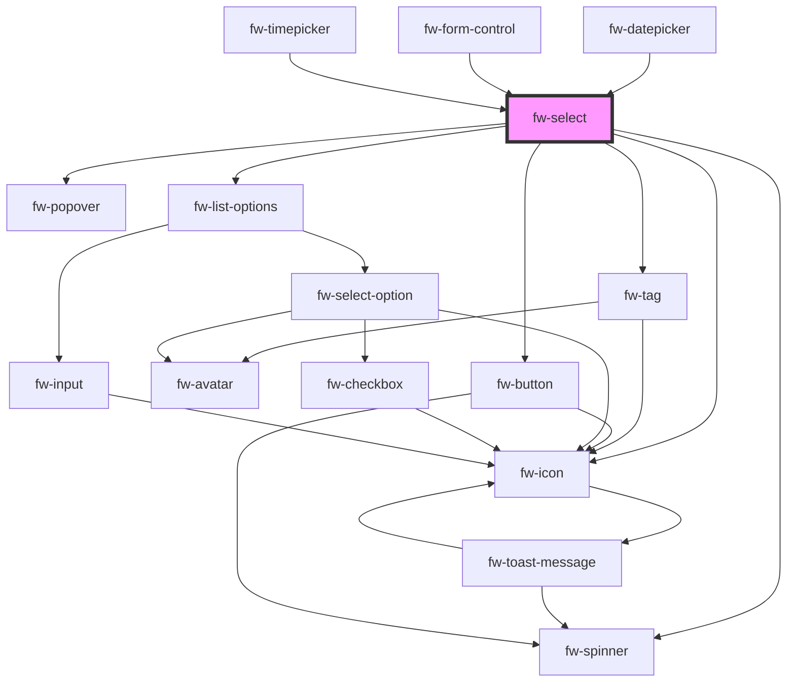

# Select (fw-select)

fw-select displays a list or drop-down box that enables selection of an option or multiple options from an available list of values.

## Demo

The data for the select can either be passed as a child or via a datasource which follows the fw-select-option schema.

```html live
<fw-select
  label="House Name"
  required="true"
  value="1"
  placeholder="Your choice"
  hint-text="Select singluar option"
>
  <fw-select-option value="1">Starks</fw-select-option>
  <fw-select-option value="2">Lannisters</fw-select-option>
</fw-select>
<fw-select
  label="Names"
  placeholder="Your choices"
  hint-text="Select multiple options"
  multiple
>
  <fw-select-option value="1" selected>Starks</fw-select-option>
  <fw-select-option value="2">Lannisters</fw-select-option>
  <fw-select-option value="3">Sand</fw-select-option>
  <fw-select-option value="4">Greyjoys</fw-select-option>
  <fw-select-option value="5">Tyrell</fw-select-option>
</fw-select>

<fw-select
  label="House Name"
  required="true"
  value="1"
  placeholder="Your choice"
  error-text="Select singluar option"
  state="error"
>
  <fw-select-option value="1">Starks</fw-select-option>
  <fw-select-option value="2">Lannisters</fw-select-option>
</fw-select>
<h3>`hint-text`, `warning-text`, `error-text` can be passed as slots</h3>
<fw-select
  label="House Name"
  required="true"
  value="1"
  placeholder="Your choice"
  state="error"
>
<div slot="error-text">Select singluar option</div>
  <fw-select-option value="1">Starks</fw-select-option>
  <fw-select-option value="2">Lannisters</fw-select-option>
</fw-select>
```

## Usage

<code-group>
<code-block title="HTML">

```html
<fw-select
  label="House Name"
  required="true"
  value="1"
  placeholder="Your choice"
  hint-text="Select singluar option"
>
  <fw-select-option value="1">Starks</fw-select-option>
  <fw-select-option value="2">Lannisters</fw-select-option>
</fw-select>
<fw-select
  label="Names"
  placeholder="Your choices"
  hint-text="Select multiple options"
  multiple
>
  <fw-select-option value="1" selected>Starks</fw-select-option>
  <fw-select-option value="2">Lannisters</fw-select-option>
  <fw-select-option value="3">Sand</fw-select-option>
  <fw-select-option value="4">Greyjoys</fw-select-option>
  <fw-select-option value="5">Tyrell</fw-select-option>
</fw-select>
<fw-select
  label="House Name"
  required="true"
  value="1"
  placeholder="Your choice"
  error-text="Select singluar option"
  state="error"
>
  <fw-select-option value="1">Starks</fw-select-option>
  <fw-select-option value="2">Lannisters</fw-select-option>
</fw-select>
<h3>`hint-text`, `warning-text`, `error-text` can be passed as slots</h3>
<fw-select
  label="House Name"
  required="true"
  value="1"
  placeholder="Your choice"
  state="error"
>
<div slot="error-text">Select singluar option</div>
  <fw-select-option value="1">Starks</fw-select-option>
  <fw-select-option value="2">Lannisters</fw-select-option>
</fw-select>
```

</code-block>

<code-block title="React">

```jsx
import React from 'react';
import ReactDOM from 'react-dom';
import { FwSelect, FwSelectOption } from '@freshworks/crayons/react';
function App() {
  return (
    <div>
      <FwSelect
        label='House Name'
        required
        value='1'
        placeholder='Your choice'
        hintText='Select singluar option'
      >
        <FwSelectOption value='1'>Starks</FwSelectOption>
        <FwSelectOption value='2'>Lannisters</FwSelectOption>
      </FwSelect>

      <FwSelect
        label='Names'
        placeholder='Your choices'
        hintText='Select multiple options'
        multiple
      >
        <FwSelectOption value='1' selected>
          Starks
        </FwSelectOption>
        <FwSelectOption value='2'>Lannisters</FwSelectOption>
        <FwSelectOption value='3'>Sand</FwSelectOption>
        <FwSelectOption value='4'>Greyjoys</FwSelectOption>
        <FwSelectOption value='5'>Tyrell</FwSelectOption>
      </FwSelect>


      <FwSelect
        label="House Name"
        required="true"
        value="1"
        placeholder="Your choice"
        errorText="Select singluar option"
        state="error"
      >
        <FwSelectOption value="1">Starks</FwSelectOption>
        <FwSelectOption value="2">Lannisters</FwSelectOption>
      </FwSelect>
      <h3>`hint-text`, `warning-text`, `error-text` can be passed as slots</h3>
      <FwSelect
        label="House Name"
        required="true"
        value="1"
        placeholder="Your choice"
        state="error"
      >
      <div slot="error-text">Select singluar option</div>
        <FwSelectOption value="1">Starks</FwSelectOption>
        <FwSelectOption value="2">Lannisters</FwSelectOption>
      </FwSelect>
    </div>
  );
}
```

</code-block>
</code-group>

### Demo with datasource

```html live
<fw-select
  label="Names"
  placeholder="Your choices"
  hint-text="Select multiple options"
  multiple
>
  <fw-select-option value="1" selected>Starks</fw-select-option>
  <fw-select-option value="2">Lannisters</fw-select-option>
  <fw-select-option value="3">Sand</fw-select-option>
  <fw-select-option value="4">Greyjoys</fw-select-option>
  <fw-select-option value="5">Tyrell</fw-select-option>
</fw-select>

<fw-select
  id="complexSelect"
  label="Strawhat Pirates"
  placeholder="Your choices"
  hint-text="Select multiple options"
  multiple
>
</fw-select>

<script type="application/javascript">
  var iconDataSource = [
    {
      value: '1',
      text: 'Luffy',
      subText: 'Pirate King',
      graphicsProps: { name: 'verified' },
    },
    {
      value: '2',
      text: 'Zorro',
      subText: 'Best Swordsman',
      graphicsProps: { name: 'magic-wand' },
    },
    {
      value: '3',
      text: 'Sanji',
      subText: 'Best Chef',
      graphicsProps: { name: 'ecommerce' },
    },
  ];
  var iconVariant = document.getElementById('complexSelect');
  iconVariant.options = iconDataSource;
</script>
```

### Usage with datasource

<code-group>
<code-block title="HTML">

```html
<fw-select
  label="Names"
  placeholder="Your choices"
  hint-text="Select multiple options"
  multiple
>
  <fw-select-option value="1" selected>Starks</fw-select-option>
  <fw-select-option value="2">Lannisters</fw-select-option>
  <fw-select-option value="3">Sand</fw-select-option>
  <fw-select-option value="4">Greyjoys</fw-select-option>
  <fw-select-option value="5">Tyrell</fw-select-option>
</fw-select>

<fw-select
  id="complexSelect"
  label="Strawhat Pirates"
  placeholder="Your choices"
  hint-text="Select multiple options"
  options-variant="icon"
  multiple
>
</fw-select>

<script type="application/javascript">
  var iconDataSource = [
    {
      value: '1',
      text: 'Luffy',
      subText: 'Pirate King',
      graphicsProps: { name: 'verified' },
    },
    {
      value: '2',
      text: 'Zorro',
      subText: 'Best Swordsman',
      graphicsProps: { name: 'magic-wand' },
    },
    {
      value: '3',
      text: 'Sanji',
      subText: 'Best Chef',
      graphicsProps: { name: 'ecommerce' },
    },
  ];
  var iconVariant = document.getElementById('complexSelect');
  iconVariant.options = iconDataSource;
</script>
```

</code-block>

<code-block title="React">

```jsx
import React from 'react';
import ReactDOM from 'react-dom';
import { FwSelect } from '@freshworks/crayons/react';
function App() {
  var iconDataSource = [
    {
      value: '1',
      text: 'Luffy',
      subText: 'Pirate King',
      graphicsProps: { name: 'verified' },
    },
    {
      value: '2',
      text: 'Zorro',
      subText: 'Best Swordsman',
      graphicsProps: { name: 'magic-wand' },
    },
    {
      value: '3',
      text: 'Sanji',
      subText: 'Best Chef',
      graphicsProps: { name: 'ecommerce' },
    },
  ];

  return (
    <div>
      <FwSelect
        label='Names'
        placeholder='Your choices'
        hintText='Select multiple options'
        multiple
      >
        <FwSelectOption value='1' selected>
          Starks
        </FwSelectOption>
        <FwSelectOption value='2'>Lannisters</FwSelectOption>
        <FwSelectOption value='3'>Sand</FwSelectOption>
        <FwSelectOption value='4'>Greyjoys</FwSelectOption>
        <FwSelectOption value='5'>Tyrell</FwSelectOption>
      </FwSelect>

      <FwSelect
        label='Strawhat Pirates'
        placeholder='Your choices'
        hintText='Select multiple options'
        multiple
        options={iconDataSource}
      ></FwSelect>
    </div>
  );
}
```

</code-block>
</code-group>

### Demo for setting/getting selected options

To set the default selected value following methods can be used set `setSelectedOptions` or `setSelectedValues` or by directly modifying the `value` prop.

> NOTE: The value will be of type `string` for single select and `string[]` for multi-select. The params for the function `setSelectedValues` will be of type `string` for single select and `string[]` for multi-select.

To get the selected values the consuming app can listen to `fwChange` event for `detail` attribute or by calling the method `getSelectedItem` which can be resolved to get the selected value.

```html live
<fw-select
  label="Pick one character"
  placeholder="Your choices"
  hint-text="Select Single options"
  value="5"
>
  <fw-select-option value="1">Starks</fw-select-option>
  <fw-select-option value="2">Lannisters</fw-select-option>
  <fw-select-option value="3">Sand</fw-select-option>
  <fw-select-option value="4">Greyjoys</fw-select-option>
  <fw-select-option value="5">Tyrell</fw-select-option>
</fw-select>

<fw-select
  label="Pick favorite characters"
  placeholder="Your choices"
  hint-text="Select multiple options"
  id="multiSelect"
  multiple
>
  <fw-select-option value="1">Starks</fw-select-option>
  <fw-select-option value="2">Lannisters</fw-select-option>
  <fw-select-option value="3">Sand</fw-select-option>
  <fw-select-option value="4">Greyjoys</fw-select-option>
  <fw-select-option value="5">Tyrell</fw-select-option>
</fw-select>

<fw-select
  label="Names"
  placeholder="Your choices"
  hint-text="Select multiple options"
  id="methodSelect"
  multiple
>
  <fw-select-option value="1">Starks</fw-select-option>
  <fw-select-option value="2">Lannisters</fw-select-option>
  <fw-select-option value="3">Sand</fw-select-option>
  <fw-select-option value="4">Greyjoys</fw-select-option>
  <fw-select-option value="5">Tyrell</fw-select-option>
</fw-select>

<fw-select
  id="methodOptionSelect"
  label="Strawhat Pirates"
  placeholder="Your choices"
  hint-text="Select single option"
  options-variant="icon"
>
</fw-select>

<script type="application/javascript">
  var multiSelect = document.getElementById('multiSelect');
  multiSelect.value = ['2', '3'];

  var methodSelect = document.getElementById('methodSelect');
  methodSelect.setSelectedValues(['1', '5']);

  var iconDataSource = [
    {
      value: '1',
      text: 'Luffy',
      subText: 'Pirate King',
      graphicsProps: { name: 'verified' },
    },
    {
      value: '2',
      text: 'Zorro',
      subText: 'Best Swordsman',
      graphicsProps: { name: 'magic-wand' },
    },
    {
      value: '3',
      text: 'Sanji',
      subText: 'Best Chef',
      graphicsProps: { name: 'ecommerce' },
    },
  ];
  var methodOptionSelect = document.getElementById('methodOptionSelect');
  methodOptionSelect.options = iconDataSource;
  methodOptionSelect.setSelectedOptions([
    {
      value: '2',
      text: 'Zorro',
      subText: 'Best Swordsman',
      graphicsProps: { name: 'magic-wand' },
    },
  ]);
  methodOptionSelect.addEventListener('fwChange', (e) => {
    console.log(e.detail);
  });
</script>
```

### Usage for setting/getting selected options

<code-group>
<code-block title="HTML">

```html
<fw-select
  label="Pick one character"
  placeholder="Your choices"
  hint-text="Select Single options"
  value="5"
>
  <fw-select-option value="1">Starks</fw-select-option>
  <fw-select-option value="2">Lannisters</fw-select-option>
  <fw-select-option value="3">Sand</fw-select-option>
  <fw-select-option value="4">Greyjoys</fw-select-option>
  <fw-select-option value="5">Tyrell</fw-select-option>
</fw-select>

<fw-select
  label="Pick favorite characters"
  placeholder="Your choices"
  hint-text="Select multiple options"
  id="multiSelect"
  multiple
>
  <fw-select-option value="1">Starks</fw-select-option>
  <fw-select-option value="2">Lannisters</fw-select-option>
  <fw-select-option value="3">Sand</fw-select-option>
  <fw-select-option value="4">Greyjoys</fw-select-option>
  <fw-select-option value="5">Tyrell</fw-select-option>
</fw-select>

<fw-select
  label="Names"
  placeholder="Your choices"
  hint-text="Select multiple options"
  id="methodSelect"
  multiple
>
  <fw-select-option value="1">Starks</fw-select-option>
  <fw-select-option value="2">Lannisters</fw-select-option>
  <fw-select-option value="3">Sand</fw-select-option>
  <fw-select-option value="4">Greyjoys</fw-select-option>
  <fw-select-option value="5">Tyrell</fw-select-option>
</fw-select>

<fw-select
  id="methodOptionSelect"
  label="Strawhat Pirates"
  placeholder="Your choices"
  hint-text="Select single option"
  options-variant="icon"
>
</fw-select>

<script type="application/javascript">
  var multiSelect = document.getElementById('multiSelect');
  multiSelect.value = ['2', '3'];

  var methodSelect = document.getElementById('methodSelect');
  methodSelect.setSelectedValues(['1', '5']);

  var iconDataSource = [
    {
      value: '1',
      text: 'Luffy',
      subText: 'Pirate King',
      graphicsProps: { name: 'verified' },
    },
    {
      value: '2',
      text: 'Zorro',
      subText: 'Best Swordsman',
      graphicsProps: { name: 'magic-wand' },
    },
    {
      value: '3',
      text: 'Sanji',
      subText: 'Best Chef',
      graphicsProps: { name: 'ecommerce' },
    },
  ];
  var methodOptionSelect = document.getElementById('methodOptionSelect');
  methodOptionSelect.options = iconDataSource;
  methodOptionSelect.setSelectedOptions([
    {
      value: '2',
      text: 'Zorro',
      subText: 'Best Swordsman',
      graphicsProps: { name: 'magic-wand' },
    },
  ]);
  methodOptionSelect.addEventListener('fwChange', (e) => {
    console.log(e.detail);
  });
</script>
```

</code-block>

<code-block title="React">

```jsx
import React, { useEffect, useRef } from 'react';
import { FwSelect, FwSelectOption } from '@freshworks/crayons/react';

function App() {
  const methodSelect = useRef();

  const iconDataSource = [
    {
      value: '1',
      text: 'Luffy',
      subText: 'Pirate King',
      graphicsProps: { name: 'verified' },
    },
    {
      value: '2',
      text: 'Zorro',
      subText: 'Best Swordsman',
      graphicsProps: { name: 'magic-wand' },
    },
    {
      value: '3',
      text: 'Sanji',
      subText: 'Best Chef',
      graphicsProps: { name: 'ecommerce' },
    },
  ];

  const onSelectChange = (e) => {
    console.log(e.detail);
  };

  useEffect(() => {
    methodSelect.current.setSelectedValues(['1', '5']);
  }, []);

  return (
    <div>
      <FwSelect
        label='Pick one character'
        placeholder='Your choices'
        hintText='Select Single options'
        value='5'
      >
        <FwSelectOption value='1'>Starks</FwSelectOption>
        <FwSelectOption value='2'>Lannisters</FwSelectOption>
        <FwSelectOption value='3'>Sand</FwSelectOption>
        <FwSelectOption value='4'>Greyjoys</FwSelectOption>
        <FwSelectOption value='5'>Tyrell</FwSelectOption>
      </FwSelect>

      <FwSelect
        label='Pick favorite characters'
        placeholder='Your choices'
        hintText='Select multiple options'
        id='multiSelect'
        multiple
        value={['2', '3']}
      >
        <FwSelectOption value='1'>Starks </FwSelectOption>
        <FwSelectOption value='2'>Lannisters </FwSelectOption>
        <FwSelectOption value='3'>Sand </FwSelectOption>
        <FwSelectOption value='4'>Greyjoys </FwSelectOption>
        <FwSelectOption value='5'>Tyrell </FwSelectOption>
      </FwSelect>

      <FwSelect
        label='Names'
        placeholder='Your choices'
        hintText='Select multiple options'
        id='methodSelect'
        ref={methodSelect}
        multiple
      >
        <FwSelectOption value='1'>Starks</FwSelectOption>
        <FwSelectOption value='2'>Lannisters</FwSelectOption>
        <FwSelectOption value='3'>Sand</FwSelectOption>
        <FwSelectOption value='4'>Greyjoys</FwSelectOption>
        <FwSelectOption value='5'>Tyrell</FwSelectOption>
      </FwSelect>

      <FwSelect
        id='methodOptionSelect'
        onFwChange={onSelectChange}
        label='Strawhat Pirates'
        placeholder='Your choices'
        hintText='Select single option'
        options={iconDataSource}
        optionsVariant='icon'
      ></FwSelect>
    </div>
  );
}
export default App;
```

</code-block>
</code-group>

### Demo with dynamic filter option

```html live
<fw-select
  id="dynamicSelect"
  label="Rick & Morty Characters"
  no-data-text="Type to search.."
  not-found-text="Not available in this universe"
  placeholder="Your choices"
  hint-text="Select multiple options"
  options-variant="avatar"
  tag-variant="avatar"
  multiple
>
</fw-select>

<script type="application/javascript">
  var dynamicSelect = document.getElementById('dynamicSelect');
  baseURL = 'https://api.sampleapis.com/rickandmorty/characters';
  dynamicSelect.selectedOptions = [
    {
      text: 'Rick Sanchez',
      subText: 'Human',
      value: '1',
      graphicsProps: {
        image: 'https://rickandmortyapi.com/api/character/avatar/1.jpeg',
      },
    },
  ];
  dynamicSelect.search = (value, source) => {
    // Sample function to mimic the dynamic filter over network
    return fetch(baseURL)
      .then((resp) => resp.json())
      .then((data) => {
        const result = data.filter((x) =>
          x.name.toLowerCase().includes(value.toLowerCase())
        );
        return result.map((x) => {
          return {
            text: x.name,
            subText: x.type,
            value: x.id.toString(),
            graphicsProps: { image: x.image },
          };
        });
      });
  };
</script>
```

### Usage of dynamic filter option

<code-group>
<code-block title="HTML">

```html
<fw-select
  id="dynamicSelect"
  label="Rick & Morty Characters"
  no-data-text="Type to search.."
  not-found-text="Not available in this universe"
  placeholder="Your choices"
  hint-text="Select multiple options"
  options-variant="avatar"
  tag-variant="avatar"
  multiple
>
</fw-select>

<script type="application/javascript">
  var dynamicSelect = document.getElementById('dynamicSelect');
  baseURL = 'https://api.sampleapis.com/rickandmorty/characters';
  dynamicSelect.selectedOptions = [
    {
      text: 'Rick Sanchez',
      subText: 'Human',
      value: '1',
      graphicsProps: {
        image: 'https://rickandmortyapi.com/api/character/avatar/1.jpeg',
      },
    },
  ];
  dynamicSelect.search = (value, source) => {
    // Sample function to mimic the dynamic filter over network
    return fetch(baseURL)
      .then((resp) => resp.json())
      .then((data) => {
        const result = data.filter((x) =>
          x.name.toLowerCase().includes(value.toLowerCase())
        );
        return result.map((x) => {
          return {
            text: x.name,
            subText: x.type,
            value: x.id.toString(),
            graphicsProps: { image: x.image },
          };
        });
      });
  };
</script>
```

</code-block>
<code-block title="React">

```jsx
function Select() {
  var baseURL = 'https://api.sampleapis.com/rickandmorty/characters';
  const searchFn = (value, source) => {
    // Sample function to mimic the dynamic filter over network
    return fetch(baseURL)
      .then((resp) => resp.json())
      .then((data) => {
        const result = data.filter((x) =>
          x.name.toLowerCase().includes(value.toLowerCase())
        );
        return result.map((x) => {
          return {
            text: x.name,
            subText: x.type,
            value: x.id.toString(),
            graphicsProps: { image: x.image },
          };
        });
      });
  };
  return (
    <FwSelect
      id='dynamicSelect'
      label={'Rick & Morty Characters'}
      noDataText='Type to search..'
      notFoundText='Not available in this universe'
      placeholder='Your choices'
      hintText='Select multiple options'
      optionsVariant='avatar'
      tagVariant='avatar'
      search={searchFn}
      multiple
      selectedOptions={[
        {
          text: 'Rick Sanchez',
          subText: 'Human',
          value: '1',
          graphicsProps: {
            image: 'https://rickandmortyapi.com/api/character/avatar/1.jpeg',
          },
        },
      ]}
    ></FwSelect>
  );
}
export default Select;
```

</code-block>
</code-group>

### Demo with select variants

```html live
<fw-label value="Mail Variant" color="blue"></fw-label>
<fw-select
  id="mailVariant"
  variant="mail"
  label="Mail to"
  placeholder="Recipients"
  options-variant="avatar"
  tag-variant="avatar"
>
</fw-select>

<script type="application/javascript">
  var mailVariant = document.getElementById('mailVariant');
  baseURL = 'https://api.sampleapis.com/rickandmorty/characters';
  mailVariant.search = (value, source) => {
    // Sample function to mimic the dynamic filter over network
    return fetch(baseURL)
      .then((resp) => resp.json())
      .then((data) => {
        const result = data.filter((x) =>
          x.name.toLowerCase().includes(value.toLowerCase())
        );
        return result.map((x) => {
          return {
            text: x.name,
            subText: x.type,
            value: x.id.toString(),
            graphicsProps: { image: x.image },
          };
        });
      });
  };
</script>
```

### Usage for select variants

<code-group>
<code-block title="HTML">

```html
<fw-label value="Mail Variant" color="blue"></fw-label>
<fw-select
  id="mailVariant"
  variant="mail"
  label="Mail to"
  placeholder="Recipients"
  options-variant="avatar"
  tag-variant="avatar"
>
</fw-select>

<script type="application/javascript">
  var mailVariant = document.getElementById('mailVariant');
  baseURL = 'https://api.sampleapis.com/rickandmorty/characters';
  mailVariant.search = (value, source) => {
    // Sample function to mimic the dynamic filter over network
    return fetch(baseURL)
      .then((resp) => resp.json())
      .then((data) => {
        const result = data.filter((x) =>
          x.name.toLowerCase().includes(value.toLowerCase())
        );
        return result.map((x) => {
          return {
            text: x.name,
            subText: x.type,
            value: x.id.toString(),
            graphicsProps: { image: x.image },
          };
        });
      });
  };
</script>
```

</code-block>
<code-block title="React">

```jsx
import React from 'react';
import { FwSelect } from '@freshworks/crayons/react';

function Select() {
  const baseURL = 'https://api.sampleapis.com/rickandmorty/characters';
  const searchFn = (value, source) => {
    return fetch(baseURL)
      .then((resp) => resp.json())
      .then((data) => {
        const result = data.filter((x) =>
          x.name.toLowerCase().includes(value.toLowerCase())
        );
        return result.map((x) => {
          return {
            text: x.name,
            subText: x.type,
            value: x.id.toString(),
            graphicsProps: { image: x.image },
          };
        });
      });
  };
  return (
    <FwSelect
      id='dynamicSelect'
      variant='mail'
      label='Mail to'
      placeholder='Recipients'
      optionsVariant='avatar'
      tagVariant='avatar'
      search={searchFn}
    ></FwSelect>
  );
}
export default Select;
```

</code-block>
</code-group>

### Navigation Demo with large option

```html live
<fw-select
  label="Pick one year"
  placeholder="Your choices"
  id="longSelect"
></fw-select>
<fw-select
  label="Pick Multiple years"
  placeholder="Your choices"
  id="longSelectMulti"
  multiple
></fw-select>
<script type="application/javascript">
  var yearsData = Array.from({ length: 101 }, (_, i) => i + 1980).map((x) => {
    return { value: x.toString(), text: x.toString() };
  });

  var longSelect = document.getElementById('longSelect');
  longSelect.options = yearsData;
  longSelect.value = '2021';

  var longSelectMulti = document.getElementById('longSelectMulti');
  longSelectMulti.options = yearsData;
</script>
```

## Styling

Refer the css variables in fw-popover to control the height and width of the select popup.
Refer the [css variables](#css-custom-properties) for modifying the appearance of the the fw-select.

<!-- Auto Generated Below -->


## Properties

| Property           | Attribute           | Description                                                                                                                                                                                                                               | Type                                                                                                                                                                 | Default            |
| ------------------ | ------------------- | ----------------------------------------------------------------------------------------------------------------------------------------------------------------------------------------------------------------------------------------- | -------------------------------------------------------------------------------------------------------------------------------------------------------------------- | ------------------ |
| `allowDeselect`    | `allow-deselect`    | Whether clicking on the already selected option disables it.                                                                                                                                                                              | `boolean`                                                                                                                                                            | `true`             |
| `caret`            | `caret`             | Whether the arrow/caret should be shown in the select.                                                                                                                                                                                    | `boolean`                                                                                                                                                            | `true`             |
| `checkbox`         | `checkbox`          | Place a checkbox.                                                                                                                                                                                                                         | `boolean`                                                                                                                                                            | `false`            |
| `debounceTimer`    | `debounce-timer`    | Debounce timer for the search promise function.                                                                                                                                                                                           | `number`                                                                                                                                                             | `300`              |
| `disabled`         | `disabled`          | Disables the component on the interface. If the attribute’s value is undefined, the value is set to false.                                                                                                                                | `boolean`                                                                                                                                                            | `false`            |
| `errorText`        | `error-text`        | Error text displayed below the text box.                                                                                                                                                                                                  | `string`                                                                                                                                                             | `''`               |
| `forceSelect`      | `force-select`      | If true, the user must select a value. The default value is not displayed.                                                                                                                                                                | `boolean`                                                                                                                                                            | `true`             |
| `hintText`         | `hint-text`         | Hint text displayed below the text box.                                                                                                                                                                                                   | `string`                                                                                                                                                             | `''`               |
| `label`            | `label`             | Label displayed on the interface, for the component.                                                                                                                                                                                      | `string`                                                                                                                                                             | `''`               |
| `labelledBy`       | `labelled-by`       | If the default label prop is not used, then use this prop to pass the id of the label.                                                                                                                                                    | `string`                                                                                                                                                             | `''`               |
| `max`              | `max`               | Works with `multiple` enabled. Configures the maximum number of options that can be selected with a multi-select component.                                                                                                               | `number`                                                                                                                                                             | `Number.MAX_VALUE` |
| `multiple`         | `multiple`          | Enables selection of multiple options. If the attribute’s value is undefined, the value is set to false.                                                                                                                                  | `boolean`                                                                                                                                                            | `false`            |
| `name`             | `name`              | Name of the component, saved as part of form data.                                                                                                                                                                                        | `string`                                                                                                                                                             | `''`               |
| `noDataText`       | `no-data-text`      | Text to be displayed when there is no data available in the select.                                                                                                                                                                       | `string`                                                                                                                                                             | `''`               |
| `notFoundText`     | `not-found-text`    | Default option to be shown if the option doesn't match the filterText.                                                                                                                                                                    | `string`                                                                                                                                                             | `''`               |
| `options`          | `options`           | The data for the select component, the options will be of type array of fw-select-options.                                                                                                                                                | `any`                                                                                                                                                                | `undefined`        |
| `optionsPlacement` | `options-placement` | Placement of the options list with respect to select.                                                                                                                                                                                     | `"bottom" \| "bottom-end" \| "bottom-start" \| "left" \| "left-end" \| "left-start" \| "right" \| "right-end" \| "right-start" \| "top" \| "top-end" \| "top-start"` | `'bottom'`         |
| `optionsVariant`   | `options-variant`   | Standard is the default option without any graphics other options are icon and avatar which places either the icon or avatar at the beginning of the row. The props for the icon or avatar are passed as an object via the graphicsProps. | `"avatar" \| "icon" \| "standard"`                                                                                                                                   | `'standard'`       |
| `placeholder`      | `placeholder`       | Text displayed in the list box before an option is selected.                                                                                                                                                                              | `string`                                                                                                                                                             | `undefined`        |
| `readonly`         | `readonly`          | If true, the user cannot modify the default value selected. If the attribute's value is undefined, the value is set to true.                                                                                                              | `boolean`                                                                                                                                                            | `false`            |
| `required`         | `required`          | Specifies the select field as a mandatory field and displays an asterisk next to the label. If the attribute’s value is undefined, the value is set to false.                                                                             | `boolean`                                                                                                                                                            | `false`            |
| `sameWidth`        | `same-width`        | Whether the select width to be same as that of the options.                                                                                                                                                                               | `boolean`                                                                                                                                                            | `true`             |
| `search`           | `search`            | Filter function which takes in filterText and dataSource and return a Promise. Where filter text is the text to filter the value in dataSource array. The returned promise should contain the array of options to be displayed.           | `any`                                                                                                                                                                | `undefined`        |
| `searchable`       | `searchable`        | Allow to search for value. Default is true.                                                                                                                                                                                               | `boolean`                                                                                                                                                            | `true`             |
| `selectedOptions`  | --                  | Array of the options that is displayed as the default selection, in the list box. Must be a valid option corresponding to the fw-select-option components used in Select.                                                                 | `any[]`                                                                                                                                                              | `[]`               |
| `state`            | `state`             | Theme based on which the list box is styled.                                                                                                                                                                                              | `"error" \| "normal" \| "warning"`                                                                                                                                   | `'normal'`         |
| `tagVariant`       | `tag-variant`       | The variant of tag to be used.                                                                                                                                                                                                            | `"avatar" \| "standard"`                                                                                                                                             | `'standard'`       |
| `type`             | `type`              | Type of option accepted as the input value. If a user tries to enter an option other than the specified type, the list is not populated.                                                                                                  | `"number" \| "text"`                                                                                                                                                 | `'text'`           |
| `value`            | `value`             | Value of the option that is displayed as the default selection, in the list box. Must be a valid value corresponding to the fw-select-option components used in Select.                                                                   | `any`                                                                                                                                                                | `undefined`        |
| `variant`          | `variant`           | The UI variant of the select to be used.                                                                                                                                                                                                  | `"button" \| "mail" \| "standard"`                                                                                                                                   | `'standard'`       |
| `warningText`      | `warning-text`      | Warning text displayed below the text box.                                                                                                                                                                                                | `string`                                                                                                                                                             | `''`               |


## Events

| Event      | Description                                                                 | Type               |
| ---------- | --------------------------------------------------------------------------- | ------------------ |
| `fwBlur`   | Triggered when the list box loses focus.                                    | `CustomEvent<any>` |
| `fwChange` | Triggered when a value is selected or deselected from the list box options. | `CustomEvent<any>` |
| `fwFocus`  | Triggered when the list box comes into focus.                               | `CustomEvent<any>` |


## Methods

### `getSelectedItem() => Promise<any>`


#### Returns

Type: `Promise<any>`


### `setFocus() => Promise<any>`


#### Returns

Type: `Promise<any>`


### `setSelectedOptions(options: any[]) => Promise<any>`


#### Returns

Type: `Promise<any>`


### `setSelectedValues(values: string | string[]) => Promise<any>`


#### Returns

Type: `Promise<any>`


## CSS Custom Properties

| Name                        | Description                           |
| --------------------------- | ------------------------------------- |
| `--fw-error-color`          | Color of the error text.              |
| `--fw-hint-color`           | Color of the hint text.               |
| `--fw-select-border`        | Border of the select component        |
| `--fw-select-border-radius` | Border radius of the select component |
| `--fw-select-margin-bottom` | Bottom margin of the select component |
| `--fw-warning-color`        | Color of the warning text.            |


## Dependencies

### Used by

 - [fw-datepicker](../datepicker)
 - [fw-form-control](../form-control)
 - [fw-timepicker](../timepicker)

### Depends on

- [fw-tag](../tag)
- [fw-popover](../popover)
- [fw-button](../button)
- [fw-spinner](../spinner)
- [fw-icon](../icon)
- [fw-list-options](../options-list)

### Graph


----------------------------------------------

Built with ❤ at Freshworks
