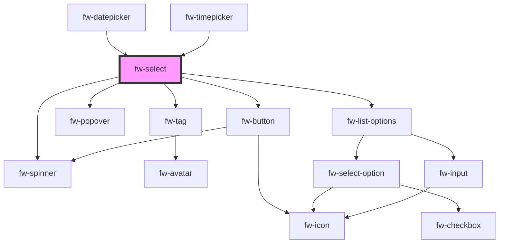

# Select (fw-select)

fw-select displays a list or drop-down box that enables selection of an option or multiple options from an available list of values.

## Demo

The data for the select can either be passed as a child or via a datasource which follows the fw-select-option schema.

```html live
<fw-select
  label="House Name"
  required="true"
  value="1"
  placeholder="Your choice"
  state-text="Select singluar option"
>
  <fw-select-option value="1">Starks</fw-select-option>
  <fw-select-option value="2">Lannisters</fw-select-option>
</fw-select>
<fw-select
  label="Names"
  value="1"
  placeholder="Your choices"
  state-text="Select multiple options"
  multiple
>
  <fw-select-option value="1" selected>Starks</fw-select-option>
  <fw-select-option value="2">Lannisters</fw-select-option>
  <fw-select-option value="3">Sand</fw-select-option>
  <fw-select-option value="4">Greyjoys</fw-select-option>
  <fw-select-option value="5">Tyrell</fw-select-option>
</fw-select>
```

## Usage

<code-group>
<code-block title="HTML">
```html 
<fw-select label="House Name" required="true" value="1" placeholder="Your choice" state-text="Select singluar option">
  <fw-select-option value="1">Starks</fw-select-option>
  <fw-select-option value="2">Lannisters</fw-select-option>
</fw-select>
<fw-select label="Names" value="1" placeholder="Your choices" state-text="Select multiple options" multiple>
  <fw-select-option value="1" selected>Starks</fw-select-option>
  <fw-select-option value="2" >Lannisters</fw-select-option>
  <fw-select-option value="3">Sand</fw-select-option>
  <fw-select-option value="4">Greyjoys</fw-select-option>
  <fw-select-option value="5">Tyrell</fw-select-option>
</fw-select>
```
</code-block>

<code-block title="React">
```jsx
import React from "react";
import ReactDOM from "react-dom";
import { FwSelect, FwSelectOption } from "@freshworks/crayons/react";
function App() {
  return (<div>
        <FwSelect label="House Name" required value="1" placeholder="Your choice" stateText="Select singluar option">
          <FwSelectOption value="1">Starks</FwSelectOption>
          <FwSelectOption value="2">Lannisters</FwSelectOption>
        </FwSelect>

        <FwSelect label="Names" value="1" placeholder="Your choices" stateText="Select multiple options" multiple>
          <FwSelectOption value="1" selected>Starks</FwSelectOption>
          <FwSelectOption value="2" >Lannisters</FwSelectOption>
          <FwSelectOption value="3">Sand</FwSelectOption>
          <FwSelectOption value="4">Greyjoys</FwSelectOption>
          <FwSelectOption value="5">Tyrell</FwSelectOption>
        </FwSelect>
    </div>);

}

````
</code-block>
</code-group>


### Demo with datasource option

```html live
<fw-select id="simpleSelect" label="Football Teams" value="1" placeholder="Your choices" state-text="Select multiple options" multiple>
</fw-select>

<fw-select id="complexSelect" label="Strawhat Pirates" value="1" placeholder="Your choices" state-text="Select multiple options" multiple>
</fw-select>

<script type="application/javascript">
  var dataSource = [
    { value: '1', text: 'Liverpool' },
    { value: '2', text: 'Borussia Dortmund' },
    { value: '3', text: 'Roma' },
    { value: '4', text: 'Marseille' },
  ];
  var standardVariant = document.getElementById('simpleSelect');
  standardVariant.options = dataSource;
  standardVariant.value = ['2'];

  var iconDataSource = [
    {
      value: '1',
      text: 'Luffy',
      subText: 'Pirate King',
      graphicsProps: { name: 'verified' },
    },
    {
      value: '2',
      text: 'Zorro',
      subText: 'Best Swordsman',
      graphicsProps: { name: 'magic-wand' },
    },
    {
      value: '3',
      text: 'Sanji',
      subText: 'Best Chef',
      graphicsProps: { name: 'ecommerce' },
    },
  ];
  var iconVariant = document.getElementById('complexSelect');
  iconVariant.options = iconDataSource;
</script>
````

### Usage with datasource options

<code-group>
<code-block title="HTML">
```html 
<fw-select id="simpleSelect" label="Football Teams" value="1" placeholder="Your choices" state-text="Select multiple options" multiple>
</fw-select>

<fw-select id="complexSelect" label="Strawhat Pirates" value="1" placeholder="Your choices" state-text="Select multiple options" multiple>
</fw-select>

<script type="application/javascript">
  var dataSource = [
    { value: '1', text: 'Liverpool' },
    { value: '2', text: 'Borussia Dortmund' },
    { value: '3', text: 'Roma' },
    { value: '4', text: 'Marseille' },
  ];
  var standardVariant = document.getElementById('simpleSelect');
  standardVariant.options = dataSource;
  standardVariant.value = ['2'];

  var iconDataSource = [
    {
      value: '1',
      text: 'Luffy',
      subText: 'Pirate King',
      graphicsProps: { name: 'verified' },
    },
    {
      value: '2',
      text: 'Zorro',
      subText: 'Best Swordsman',
      graphicsProps: { name: 'magic-wand' },
    },
    {
      value: '3',
      text: 'Sanji',
      subText: 'Best Chef',
      graphicsProps: { name: 'ecommerce' },
    },
  ];
  var iconVariant = document.getElementById('complexSelect');
  iconVariant.options = iconDataSource;
</script>

````
</code-block>

<code-block title="React">
```jsx
import React from "react";
import ReactDOM from "react-dom";
import { FwSelect } from "@freshworks/crayons/react";
function App() {

   var dataSource = [
    { value: '1', text: 'Liverpool' },
    { value: '2', text: 'Borussia Dortmund' },
    { value: '3', text: 'Roma' },
    { value: '4', text: 'Marseille' },
  ];

  var iconDataSource = [
    {
      value: '1',
      text: 'Luffy',
      subText: 'Pirate King',
      graphicsProps: { name: 'verified' },
    },
    {
      value: '2',
      text: 'Zorro',
      subText: 'Best Swordsman',
      graphicsProps: { name: 'magic-wand' },
    },
    {
      value: '3',
      text: 'Sanji',
      subText: 'Best Chef',
      graphicsProps: { name: 'ecommerce' },
    },
  ];

  return (<div>
        <FwSelect id="simpleSelect" label="Football Teams" placeholder="Your choices" state-text="Select multiple options" multiple options={dataSource} value={["2"]}>
        </FwSelect>

        <FwSelect id="complexSelect" label="Strawhat Pirates" value="1" placeholder="Your choices" state-text="Select multiple options" multiple options={iconDataSource}>
        </FwSelect>
    </div>);
}
````

</code-block>
</code-group>

### Demo with dynamic filter option

```html live
<fw-select
  id="dynamicSelect"
  label="Rick & Morty Characters"
  placeholder="Your choices"
  state-text="Select multiple options"
  multiple
>
</fw-select>

<script type="application/javascript">
  var dynamicSelect = document.getElementById('dynamicSelect');
  const baseURL = 'https://api.sampleapis.com/rickandmorty/characters';
  dynamicSelect.selectedOptions = [
    {
      text: 'Rick Sanchez',
      subText: 'Human',
      value: '1',
    },
  ];
  dynamicSelect.search = (value, source) => {
    return fetch(baseURL)
      .then((resp) => resp.json())
      .then((data) => {
        const result = data.filter((x) =>
          x.name.toLowerCase().includes(value.toLowerCase())
        );
        return result.map((x) => {
          return {
            text: x.name,
            subText: x.type,
            value: x.id.toString(),
          };
        });
      });
  };
</script>
```

<!-- Auto Generated Below -->


## Properties

| Property           | Attribute           | Description                                                                                                                                                                                                                               | Type                                                                                                                                                                 | Default               |
| ------------------ | ------------------- | ----------------------------------------------------------------------------------------------------------------------------------------------------------------------------------------------------------------------------------------- | -------------------------------------------------------------------------------------------------------------------------------------------------------------------- | --------------------- |
| `debounceTimer`    | `debounce-timer`    | Debounce timer for the search promise function.                                                                                                                                                                                           | `number`                                                                                                                                                             | `300`                 |
| `disabled`         | `disabled`          | Disables the component on the interface. If the attribute’s value is undefined, the value is set to false.                                                                                                                                | `boolean`                                                                                                                                                            | `false`               |
| `dropdownVariant`  | `dropdown-variant`  | Standard is the default option without any graphics other options are icon and avatar which places either the icon or avatar at the beginning of the row. The props for the icon or avatar are passed as an object via the graphicsProps. | `"avatar" \| "icon" \| "standard"`                                                                                                                                   | `'standard'`          |
| `forceSelect`      | `force-select`      | If true, the user must select a value. The default value is not displayed.                                                                                                                                                                | `boolean`                                                                                                                                                            | `true`                |
| `isCheckbox`       | `is-checkbox`       | Place a checkbox.                                                                                                                                                                                                                         | `boolean`                                                                                                                                                            | `false`               |
| `label`            | `label`             | Label displayed on the interface, for the component.                                                                                                                                                                                      | `string`                                                                                                                                                             | `''`                  |
| `max`              | `max`               | Works with `multiple` enabled. Configures the maximum number of options that can be selected with a multi-select component.                                                                                                               | `number`                                                                                                                                                             | `Number.MAX_VALUE`    |
| `multiple`         | `multiple`          | Enables selection of multiple options. If the attribute’s value is undefined, the value is set to false.                                                                                                                                  | `boolean`                                                                                                                                                            | `false`               |
| `name`             | `name`              | Name of the component, saved as part of form data.                                                                                                                                                                                        | `string`                                                                                                                                                             | `''`                  |
| `noDataText`       | `no-data-text`      | Text to be displayed when there is no data available in the select.                                                                                                                                                                       | `string`                                                                                                                                                             | `'No Data available'` |
| `notFoundText`     | `not-found-text`    | Default option to be shown if the option doesn't match the filterText.                                                                                                                                                                    | `string`                                                                                                                                                             | `'No items Found'`    |
| `options`          | `options`           | Allow to search for value. Default is true.                                                                                                                                                                                               | `any`                                                                                                                                                                | `undefined`           |
| `optionsPlacement` | `options-placement` | Placement of the options list with respect to select.                                                                                                                                                                                     | `"bottom" \| "bottom-end" \| "bottom-start" \| "left" \| "left-end" \| "left-start" \| "right" \| "right-end" \| "right-start" \| "top" \| "top-end" \| "top-start"` | `'bottom'`            |
| `placeholder`      | `placeholder`       | Text displayed in the list box before an option is selected.                                                                                                                                                                              | `string`                                                                                                                                                             | `undefined`           |
| `readonly`         | `readonly`          | If true, the user cannot modify the default value selected. If the attribute's value is undefined, the value is set to true.                                                                                                              | `boolean`                                                                                                                                                            | `false`               |
| `required`         | `required`          | Specifies the select field as a mandatory field and displays an asterisk next to the label. If the attribute’s value is undefined, the value is set to false.                                                                             | `boolean`                                                                                                                                                            | `false`               |
| `sameWidth`        | `same-width`        | Whether the select width to be same as that of the options.                                                                                                                                                                               | `boolean`                                                                                                                                                            | `true`                |
| `search`           | `search`            | Filter function which takes in filterText and dataSource and return a Promise. Where filter text is the text to filter the value in dataSource array. The returned promise should contain the array of options to be displayed.           | `any`                                                                                                                                                                | `undefined`           |
| `searchable`       | `searchable`        | Allow to search for value. Default is true.                                                                                                                                                                                               | `boolean`                                                                                                                                                            | `true`                |
| `selectedOptions`  | --                  | Array of the options that is displayed as the default selection, in the list box. Must be a valid option corresponding to the fw-select-option components used in Select.                                                                 | `any[]`                                                                                                                                                              | `[]`                  |
| `state`            | `state`             | Theme based on which the list box is styled.                                                                                                                                                                                              | `"error" \| "normal" \| "warning"`                                                                                                                                   | `'normal'`            |
| `stateText`        | `state-text`        | Descriptive or instructional text displayed below the list box.                                                                                                                                                                           | `string`                                                                                                                                                             | `''`                  |
| `type`             | `type`              | Type of option accepted as the input value. If a user tries to enter an option other than the specified type, the list is not populated.                                                                                                  | `"number" \| "text"`                                                                                                                                                 | `'text'`              |
| `value`            | `value`             | Value of the option that is displayed as the default selection, in the list box. Must be a valid value corresponding to the fw-select-option components used in Select.                                                                   | `any`                                                                                                                                                                | `undefined`           |
| `variant`          | `variant`           | The variant of the select button to be displayed. Defaults to input type.                                                                                                                                                                 | `"button" \| "input"`                                                                                                                                                | `'input'`             |


## Events

| Event      | Description                                                                 | Type               |
| ---------- | --------------------------------------------------------------------------- | ------------------ |
| `fwBlur`   | Triggered when the list box loses focus.                                    | `CustomEvent<any>` |
| `fwChange` | Triggered when a value is selected or deselected from the list box options. | `CustomEvent<any>` |
| `fwFocus`  | Triggered when the list box comes into focus.                               | `CustomEvent<any>` |


## Methods

### `getSelectedItem() => Promise<any>`


#### Returns

Type: `Promise<any>`


### `setSelectedOptions(options: any[]) => Promise<any>`


#### Returns

Type: `Promise<any>`


### `setSelectedValues(values: string[]) => Promise<any>`


#### Returns

Type: `Promise<any>`


## CSS Custom Properties

| Name           | Description                            |
| -------------- | -------------------------------------- |
| `--max-height` | Maximum height of the select component |
| `--min-height` | Minimum height of the select component |


## Dependencies

### Used by

 - [fw-datepicker](../datepicker)
 - [fw-timepicker](../timepicker)

### Depends on

- [fw-tag](../tag)
- [fw-popover](../popover)
- [fw-button](../button)
- [fw-spinner](../spinner)
- [fw-list-options](../options-list)

### Graph


----------------------------------------------

Built with ❤ at Freshworks
