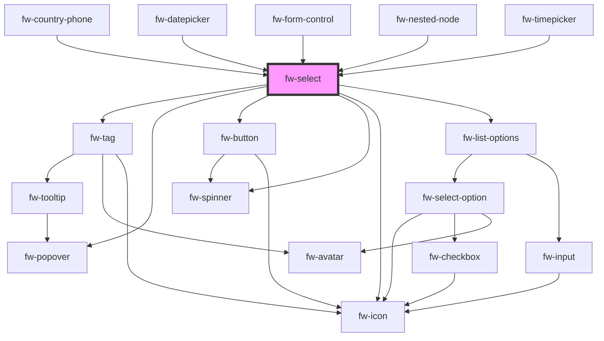

# Select (fw-select)

fw-select displays a list or drop-down box that enables selection of an option or multiple options from an available list of values.

## Demo

The data for the select can either be passed as a child/slot* or via a datasource which follows the fw-select-option schema.

***Please note that we do not support dynamic updation of options when passed as a child/slot. Kindly utilise the options prop provided for dynamic updation of options.**

```html live
<fw-select
  label="House Name"
  required="true"
  value="1"
  placeholder="Your choice"
  hint-text="Select singluar option"
>
  <fw-select-option value="1">Starks</fw-select-option>
  <fw-select-option value="2">Lannisters</fw-select-option>
</fw-select>
<fw-select
  label="Names"
  placeholder="Your choices"
  hint-text="Select multiple options"
  multiple
>
  <fw-select-option value="1" selected>Starks</fw-select-option>
  <fw-select-option value="2">Lannisters</fw-select-option>
  <fw-select-option value="3">Sand</fw-select-option>
  <fw-select-option value="4">Greyjoys</fw-select-option>
  <fw-select-option value="5">Tyrell</fw-select-option>
</fw-select>

<fw-select
  label="House Name"
  required="true"
  value="1"
  placeholder="Your choice"
  error-text="Select singluar option"
  state="error"
>
  <fw-select-option value="1">Starks</fw-select-option>
  <fw-select-option value="2">Lannisters</fw-select-option>
</fw-select>
<h3>`hint-text`, `warning-text`, `error-text` can be passed as slots</h3>
<fw-select
  label="House Name"
  required="true"
  value="1"
  placeholder="Your choice"
  state="error"
>
<div slot="error-text">Select singluar option</div>
  <fw-select-option value="1">Starks</fw-select-option>
  <fw-select-option value="2">Lannisters</fw-select-option>
</fw-select>
```

## Usage

<code-group>
<code-block title="HTML">

```html
<fw-select
  label="House Name"
  required="true"
  value="1"
  placeholder="Your choice"
  hint-text="Select singluar option"
>
  <fw-select-option value="1">Starks</fw-select-option>
  <fw-select-option value="2">Lannisters</fw-select-option>
</fw-select>
<fw-select
  label="Names"
  placeholder="Your choices"
  hint-text="Select multiple options"
  multiple
>
  <fw-select-option value="1" selected>Starks</fw-select-option>
  <fw-select-option value="2">Lannisters</fw-select-option>
  <fw-select-option value="3">Sand</fw-select-option>
  <fw-select-option value="4">Greyjoys</fw-select-option>
  <fw-select-option value="5">Tyrell</fw-select-option>
</fw-select>
<fw-select
  label="House Name"
  required="true"
  value="1"
  placeholder="Your choice"
  error-text="Select singluar option"
  state="error"
>
  <fw-select-option value="1">Starks</fw-select-option>
  <fw-select-option value="2">Lannisters</fw-select-option>
</fw-select>
<h3>`hint-text`, `warning-text`, `error-text` can be passed as slots</h3>
<fw-select
  label="House Name"
  required="true"
  value="1"
  placeholder="Your choice"
  state="error"
>
<div slot="error-text">Select singluar option</div>
  <fw-select-option value="1">Starks</fw-select-option>
  <fw-select-option value="2">Lannisters</fw-select-option>
</fw-select>
```

</code-block>

<code-block title="React">

```jsx
import React from 'react';
import ReactDOM from 'react-dom';
import { FwSelect, FwSelectOption } from '@freshworks/crayons/react';
function App() {
  return (
    <div>
      <FwSelect
        label='House Name'
        required
        value='1'
        placeholder='Your choice'
        hintText='Select singluar option'
      >
        <FwSelectOption value='1'>Starks</FwSelectOption>
        <FwSelectOption value='2'>Lannisters</FwSelectOption>
      </FwSelect>

      <FwSelect
        label='Names'
        placeholder='Your choices'
        hintText='Select multiple options'
        multiple
      >
        <FwSelectOption value='1' selected>
          Starks
        </FwSelectOption>
        <FwSelectOption value='2'>Lannisters</FwSelectOption>
        <FwSelectOption value='3'>Sand</FwSelectOption>
        <FwSelectOption value='4'>Greyjoys</FwSelectOption>
        <FwSelectOption value='5'>Tyrell</FwSelectOption>
      </FwSelect>

      <FwSelect
        label="House Name"
        required="true"
        value="1"
        placeholder="Your choice"
        errorText="Select singluar option"
        state="error"
      >
        <FwSelectOption value="1">Starks</FwSelectOption>
        <FwSelectOption value="2">Lannisters</FwSelectOption>
      </FwSelect>
      <h3>`hint-text`, `warning-text`, `error-text` can be passed as slots</h3>
      <FwSelect
        label="House Name"
        required="true"
        value="1"
        placeholder="Your choice"
        state="error"
      >
      <div slot="error-text">Select singluar option</div>
        <FwSelectOption value="1">Starks</FwSelectOption>
        <FwSelectOption value="2">Lannisters</FwSelectOption>
      </FwSelect>
    </div>
  );
}
```

</code-block>
</code-group>

### Demo with datasource

```html live
<fw-select
  label="Names"
  placeholder="Your choices"
  hint-text="Select multiple options"
  multiple
>
  <fw-select-option value="1" selected>Starks</fw-select-option>
  <fw-select-option value="2">Lannisters</fw-select-option>
  <fw-select-option value="3">Sand</fw-select-option>
  <fw-select-option value="4">Greyjoys</fw-select-option>
  <fw-select-option value="5">Tyrell</fw-select-option>
</fw-select>

<fw-select
  id="complexSelect"
  label="Strawhat Pirates"
  placeholder="Your choices"
  hint-text="Select multiple options"
  multiple
>
</fw-select>

<script type="application/javascript">
  var iconDataSource = [
    {
      value: '1',
      text: 'Luffy',
      subText: 'Pirate King',
      graphicsProps: { name: 'verified' },
    },
    {
      value: '2',
      text: 'Zorro',
      subText: 'Best Swordsman',
      graphicsProps: { name: 'magic-wand' },
    },
    {
      value: '3',
      text: 'Sanji',
      subText: 'Best Chef',
      graphicsProps: { name: 'ecommerce' },
    },
  ];
  var iconVariant = document.getElementById('complexSelect');
  iconVariant.options = iconDataSource;
</script>
```

### Usage with datasource

<code-group>
<code-block title="HTML">

```html
<fw-select
  label="Names"
  placeholder="Your choices"
  hint-text="Select multiple options"
  multiple
>
  <fw-select-option value="1" selected>Starks</fw-select-option>
  <fw-select-option value="2">Lannisters</fw-select-option>
  <fw-select-option value="3">Sand</fw-select-option>
  <fw-select-option value="4">Greyjoys</fw-select-option>
  <fw-select-option value="5">Tyrell</fw-select-option>
</fw-select>

<fw-select
  id="complexSelect"
  label="Strawhat Pirates"
  placeholder="Your choices"
  hint-text="Select multiple options"
  options-variant="icon"
  multiple
>
</fw-select>

<script type="application/javascript">
  var iconDataSource = [
    {
      value: '1',
      text: 'Luffy',
      subText: 'Pirate King',
      graphicsProps: { name: 'verified' },
    },
    {
      value: '2',
      text: 'Zorro',
      subText: 'Best Swordsman',
      graphicsProps: { name: 'magic-wand' },
    },
    {
      value: '3',
      text: 'Sanji',
      subText: 'Best Chef',
      graphicsProps: { name: 'ecommerce' },
    },
  ];
  var iconVariant = document.getElementById('complexSelect');
  iconVariant.options = iconDataSource;
</script>
```

</code-block>

<code-block title="React">

```jsx
import React from 'react';
import ReactDOM from 'react-dom';
import { FwSelect } from '@freshworks/crayons/react';
function App() {
  var iconDataSource = [
    {
      value: '1',
      text: 'Luffy',
      subText: 'Pirate King',
      graphicsProps: { name: 'verified' },
    },
    {
      value: '2',
      text: 'Zorro',
      subText: 'Best Swordsman',
      graphicsProps: { name: 'magic-wand' },
    },
    {
      value: '3',
      text: 'Sanji',
      subText: 'Best Chef',
      graphicsProps: { name: 'ecommerce' },
    },
  ];

  return (
    <div>
      <FwSelect
        label='Names'
        placeholder='Your choices'
        hintText='Select multiple options'
        multiple
      >
        <FwSelectOption value='1' selected>
          Starks
        </FwSelectOption>
        <FwSelectOption value='2'>Lannisters</FwSelectOption>
        <FwSelectOption value='3'>Sand</FwSelectOption>
        <FwSelectOption value='4'>Greyjoys</FwSelectOption>
        <FwSelectOption value='5'>Tyrell</FwSelectOption>
      </FwSelect>

      <FwSelect
        label='Strawhat Pirates'
        placeholder='Your choices'
        hintText='Select multiple options'
        multiple
        options={iconDataSource}
      ></FwSelect>
    </div>
  );
}
```

</code-block>
</code-group>

### Demo for setting/getting selected options

To set the default selected value following methods can be used set `setSelectedOptions` or `setSelectedValues` or by directly modifying the `value` prop.

> NOTE: The value will be of type `string` for single select and `string[]` for multi-select. The params for the function `setSelectedValues` will be of type `string` for single select and `string[]` for multi-select.

To get the selected values the consuming app can listen to `fwChange` event for `detail` attribute or by calling the method `getSelectedItem` which can be resolved to get the selected value.

```html live
<fw-select
  label="Pick one character"
  placeholder="Your choices"
  hint-text="Select Single options"
  value="5"
>
  <fw-select-option value="1">Starks</fw-select-option>
  <fw-select-option value="2">Lannisters</fw-select-option>
  <fw-select-option value="3">Sand</fw-select-option>
  <fw-select-option value="4">Greyjoys</fw-select-option>
  <fw-select-option value="5">Tyrell</fw-select-option>
</fw-select>

<fw-select
  label="Pick favorite characters"
  placeholder="Your choices"
  hint-text="Select multiple options"
  id="multiSelect"
  multiple
>
  <fw-select-option value="1">Starks</fw-select-option>
  <fw-select-option value="2">Lannisters</fw-select-option>
  <fw-select-option value="3">Sand</fw-select-option>
  <fw-select-option value="4">Greyjoys</fw-select-option>
  <fw-select-option value="5">Tyrell</fw-select-option>
</fw-select>

<fw-select
  label="Names"
  placeholder="Your choices"
  hint-text="Select multiple options"
  id="methodSelect"
  multiple
>
  <fw-select-option value="1">Starks</fw-select-option>
  <fw-select-option value="2">Lannisters</fw-select-option>
  <fw-select-option value="3">Sand</fw-select-option>
  <fw-select-option value="4">Greyjoys</fw-select-option>
  <fw-select-option value="5">Tyrell</fw-select-option>
</fw-select>

<fw-select
  id="methodOptionSelect"
  label="Strawhat Pirates"
  placeholder="Your choices"
  hint-text="Select single option"
  options-variant="icon"
>
</fw-select>

<script type="application/javascript">
  var multiSelect = document.getElementById('multiSelect');
  multiSelect.value = ['2', '3'];

  var methodSelect = document.getElementById('methodSelect');
  methodSelect.setSelectedValues(['1', '5']);

  var iconDataSource = [
    {
      value: '1',
      text: 'Luffy',
      subText: 'Pirate King',
      graphicsProps: { name: 'verified' },
    },
    {
      value: '2',
      text: 'Zorro',
      subText: 'Best Swordsman',
      graphicsProps: { name: 'magic-wand' },
    },
    {
      value: '3',
      text: 'Sanji',
      subText: 'Best Chef',
      graphicsProps: { name: 'ecommerce' },
    },
  ];
  var methodOptionSelect = document.getElementById('methodOptionSelect');
  methodOptionSelect.options = iconDataSource;
  methodOptionSelect.setSelectedOptions([
    {
      value: '2',
      text: 'Zorro',
      subText: 'Best Swordsman',
      graphicsProps: { name: 'magic-wand' },
    },
  ]);
  methodOptionSelect.addEventListener('fwChange', (e) => {
    console.log(e.detail);
  });
</script>
```

### Usage for setting/getting selected options

<code-group>
<code-block title="HTML">

```html
<fw-select
  label="Pick one character"
  placeholder="Your choices"
  hint-text="Select Single options"
  value="5"
>
  <fw-select-option value="1">Starks</fw-select-option>
  <fw-select-option value="2">Lannisters</fw-select-option>
  <fw-select-option value="3">Sand</fw-select-option>
  <fw-select-option value="4">Greyjoys</fw-select-option>
  <fw-select-option value="5">Tyrell</fw-select-option>
</fw-select>

<fw-select
  label="Pick favorite characters"
  placeholder="Your choices"
  hint-text="Select multiple options"
  id="multiSelect"
  multiple
>
  <fw-select-option value="1">Starks</fw-select-option>
  <fw-select-option value="2">Lannisters</fw-select-option>
  <fw-select-option value="3">Sand</fw-select-option>
  <fw-select-option value="4">Greyjoys</fw-select-option>
  <fw-select-option value="5">Tyrell</fw-select-option>
</fw-select>

<fw-select
  label="Names"
  placeholder="Your choices"
  hint-text="Select multiple options"
  id="methodSelect"
  multiple
>
  <fw-select-option value="1">Starks</fw-select-option>
  <fw-select-option value="2">Lannisters</fw-select-option>
  <fw-select-option value="3">Sand</fw-select-option>
  <fw-select-option value="4">Greyjoys</fw-select-option>
  <fw-select-option value="5">Tyrell</fw-select-option>
</fw-select>

<fw-select
  id="methodOptionSelect"
  label="Strawhat Pirates"
  placeholder="Your choices"
  hint-text="Select single option"
  options-variant="icon"
>
</fw-select>

<script type="application/javascript">
  var multiSelect = document.getElementById('multiSelect');
  multiSelect.value = ['2', '3'];

  var methodSelect = document.getElementById('methodSelect');
  methodSelect.setSelectedValues(['1', '5']);

  var iconDataSource = [
    {
      value: '1',
      text: 'Luffy',
      subText: 'Pirate King',
      graphicsProps: { name: 'verified' },
    },
    {
      value: '2',
      text: 'Zorro',
      subText: 'Best Swordsman',
      graphicsProps: { name: 'magic-wand' },
    },
    {
      value: '3',
      text: 'Sanji',
      subText: 'Best Chef',
      graphicsProps: { name: 'ecommerce' },
    },
  ];
  var methodOptionSelect = document.getElementById('methodOptionSelect');
  methodOptionSelect.options = iconDataSource;
  methodOptionSelect.setSelectedOptions([
    {
      value: '2',
      text: 'Zorro',
      subText: 'Best Swordsman',
      graphicsProps: { name: 'magic-wand' },
    },
  ]);
  methodOptionSelect.addEventListener('fwChange', (e) => {
    console.log(e.detail);
  });
</script>
```

</code-block>

<code-block title="React">

```jsx
import React, { useEffect, useRef } from 'react';
import { FwSelect, FwSelectOption } from '@freshworks/crayons/react';

function App() {
  const methodSelect = useRef();

  const iconDataSource = [
    {
      value: '1',
      text: 'Luffy',
      subText: 'Pirate King',
      graphicsProps: { name: 'verified' },
    },
    {
      value: '2',
      text: 'Zorro',
      subText: 'Best Swordsman',
      graphicsProps: { name: 'magic-wand' },
    },
    {
      value: '3',
      text: 'Sanji',
      subText: 'Best Chef',
      graphicsProps: { name: 'ecommerce' },
    },
  ];

  const onSelectChange = (e) => {
    console.log(e.detail);
  };

  useEffect(() => {
    methodSelect.current.setSelectedValues(['1', '5']);
  }, []);

  return (
    <div>
      <FwSelect
        label='Pick one character'
        placeholder='Your choices'
        hintText='Select Single options'
        value='5'
      >
        <FwSelectOption value='1'>Starks</FwSelectOption>
        <FwSelectOption value='2'>Lannisters</FwSelectOption>
        <FwSelectOption value='3'>Sand</FwSelectOption>
        <FwSelectOption value='4'>Greyjoys</FwSelectOption>
        <FwSelectOption value='5'>Tyrell</FwSelectOption>
      </FwSelect>

      <FwSelect
        label='Pick favorite characters'
        placeholder='Your choices'
        hintText='Select multiple options'
        id='multiSelect'
        multiple
        value={['2', '3']}
      >
        <FwSelectOption value='1'>Starks </FwSelectOption>
        <FwSelectOption value='2'>Lannisters </FwSelectOption>
        <FwSelectOption value='3'>Sand </FwSelectOption>
        <FwSelectOption value='4'>Greyjoys </FwSelectOption>
        <FwSelectOption value='5'>Tyrell </FwSelectOption>
      </FwSelect>

      <FwSelect
        label='Names'
        placeholder='Your choices'
        hintText='Select multiple options'
        id='methodSelect'
        ref={methodSelect}
        multiple
      >
        <FwSelectOption value='1'>Starks</FwSelectOption>
        <FwSelectOption value='2'>Lannisters</FwSelectOption>
        <FwSelectOption value='3'>Sand</FwSelectOption>
        <FwSelectOption value='4'>Greyjoys</FwSelectOption>
        <FwSelectOption value='5'>Tyrell</FwSelectOption>
      </FwSelect>

      <FwSelect
        id='methodOptionSelect'
        onFwChange={onSelectChange}
        label='Strawhat Pirates'
        placeholder='Your choices'
        hintText='Select single option'
        options={iconDataSource}
        optionsVariant='icon'
      ></FwSelect>
    </div>
  );
}
export default App;
```

</code-block>
</code-group>

### Demo with dynamic filter option

```html live
<fw-select
  id="dynamicSelect"
  label="Rick & Morty Characters"
  no-data-text="Type to search.."
  not-found-text="Not available in this universe"
  placeholder="Your choices"
  hint-text="Select multiple options"
  options-variant="avatar"
  tag-variant="avatar"
  multiple
>
</fw-select>

<script type="application/javascript">
  var dynamicSelect = document.getElementById('dynamicSelect');
  baseURL = 'https://api.sampleapis.com/rickandmorty/characters';
  dynamicSelect.selectedOptions = [
    {
      text: 'Rick Sanchez',
      subText: 'Human',
      value: '1',
      graphicsProps: {
        image: 'https://rickandmortyapi.com/api/character/avatar/1.jpeg',
      },
    },
  ];
  dynamicSelect.search = (value, source) => {
    // Sample function to mimic the dynamic filter over network
    return fetch(baseURL)
      .then((resp) => resp.json())
      .then((data) => {
        const result = data.filter((x) =>
          x.name.toLowerCase().includes(value.toLowerCase())
        );
        return result.map((x) => {
          return {
            text: x.name,
            subText: x.type,
            value: x.id.toString(),
            graphicsProps: { image: x.image },
          };
        });
      });
  };
</script>
```

### Usage of dynamic filter option

<code-group>
<code-block title="HTML">

```html
<fw-select
  id="dynamicSelect"
  label="Rick & Morty Characters"
  no-data-text="Type to search.."
  not-found-text="Not available in this universe"
  placeholder="Your choices"
  hint-text="Select multiple options"
  options-variant="avatar"
  tag-variant="avatar"
  multiple
>
</fw-select>

<script type="application/javascript">
  var dynamicSelect = document.getElementById('dynamicSelect');
  baseURL = 'https://api.sampleapis.com/rickandmorty/characters';
  dynamicSelect.selectedOptions = [
    {
      text: 'Rick Sanchez',
      subText: 'Human',
      value: '1',
      graphicsProps: {
        image: 'https://rickandmortyapi.com/api/character/avatar/1.jpeg',
      },
    },
  ];
  dynamicSelect.search = (value, source) => {
    // Sample function to mimic the dynamic filter over network
    return fetch(baseURL)
      .then((resp) => resp.json())
      .then((data) => {
        const result = data.filter((x) =>
          x.name.toLowerCase().includes(value.toLowerCase())
        );
        return result.map((x) => {
          return {
            text: x.name,
            subText: x.type,
            value: x.id.toString(),
            graphicsProps: { image: x.image },
          };
        });
      });
  };
</script>
```

</code-block>
<code-block title="React">

```jsx
function Select() {
  var baseURL = 'https://api.sampleapis.com/rickandmorty/characters';
  const searchFn = (value, source) => {
    // Sample function to mimic the dynamic filter over network
    return fetch(baseURL)
      .then((resp) => resp.json())
      .then((data) => {
        const result = data.filter((x) =>
          x.name.toLowerCase().includes(value.toLowerCase())
        );
        return result.map((x) => {
          return {
            text: x.name,
            subText: x.type,
            value: x.id.toString(),
            graphicsProps: { image: x.image },
          };
        });
      });
  };
  return (
    <FwSelect
      id='dynamicSelect'
      label={'Rick & Morty Characters'}
      noDataText='Type to search..'
      notFoundText='Not available in this universe'
      placeholder='Your choices'
      hintText='Select multiple options'
      optionsVariant='avatar'
      tagVariant='avatar'
      search={searchFn}
      multiple
      selectedOptions={[
        {
          text: 'Rick Sanchez',
          subText: 'Human',
          value: '1',
          graphicsProps: {
            image: 'https://rickandmortyapi.com/api/character/avatar/1.jpeg',
          },
        },
      ]}
    ></FwSelect>
  );
}
export default Select;
```

</code-block>
</code-group>

### Demo with select variants

```html live
<fw-label value="Mail Variant" color="blue"></fw-label>
<fw-select
  id="mailVariant"
  variant="mail"
  label="Mail to"
  placeholder="Recipients"
  options-variant="avatar"
  tag-variant="avatar"
>
</fw-select>

<script type="application/javascript">
  var mailVariant = document.getElementById('mailVariant');
  baseURL = 'https://api.sampleapis.com/rickandmorty/characters';
  mailVariant.search = (value, source) => {
    // Sample function to mimic the dynamic filter over network
    return fetch(baseURL)
      .then((resp) => resp.json())
      .then((data) => {
        const result = data.filter((x) =>
          x.name.toLowerCase().includes(value.toLowerCase())
        );
        return result.map((x) => {
          return {
            text: x.name,
            subText: x.type,
            value: x.name,
            graphicsProps: { image: x.image },
          };
        });
      });
  };
</script>
```

### Usage for select variants

<code-group>
<code-block title="HTML">

```html
<fw-label value="Mail Variant" color="blue"></fw-label>
<fw-select
  id="mailVariant"
  variant="mail"
  label="Mail to"
  placeholder="Recipients"
  options-variant="avatar"
  tag-variant="avatar"
>
</fw-select>

<script type="application/javascript">
  var mailVariant = document.getElementById('mailVariant');
  baseURL = 'https://api.sampleapis.com/rickandmorty/characters';
  mailVariant.search = (value, source) => {
    // Sample function to mimic the dynamic filter over network
    return fetch(baseURL)
      .then((resp) => resp.json())
      .then((data) => {
        const result = data.filter((x) =>
          x.name.toLowerCase().includes(value.toLowerCase())
        );
        return result.map((x) => {
          return {
            text: x.name,
            subText: x.type,
            value: x.name,
            graphicsProps: { image: x.image },
          };
        });
      });
  };
</script>
```

</code-block>
<code-block title="React">

```jsx
import React from 'react';
import { FwSelect } from '@freshworks/crayons/react';

function Select() {
  const baseURL = 'https://api.sampleapis.com/rickandmorty/characters';
  const searchFn = (value, source) => {
    return fetch(baseURL)
      .then((resp) => resp.json())
      .then((data) => {
        const result = data.filter((x) =>
          x.name.toLowerCase().includes(value.toLowerCase())
        );
        return result.map((x) => {
          return {
            text: x.name,
            subText: x.type,
            value: x.name,
            graphicsProps: { image: x.image },
          };
        });
      });
  };
  return (
    <FwSelect
      id='dynamicSelect'
      variant='mail'
      label='Mail to'
      placeholder='Recipients'
      optionsVariant='avatar'
      tagVariant='avatar'
      search={searchFn}
    ></FwSelect>
  );
}
export default Select;
```

</code-block>
</code-group>

### Demo with creatable select

```html live
<fw-label value="Creatable Mail Variant" color="blue"></fw-label>
<fw-select
  id="creatableVariant"
  variant="mail"
  label="Mail to"
  placeholder="Recipients"
  options-variant="avatar"
  tag-variant="avatar"
>
</fw-select>

<script type="application/javascript">
  var creatableVariant = document.getElementById('creatableVariant');
  const options = [
    {
      text: 'Angela Smith',
      subText: 'angela.smith@gmail.com',
      value: 'angela.smith@gmail.com',
      graphicsProps: {
        image:
          'https://images.unsplash.com/photo-1529778873920-4da4926a72c2?ixlib=rb-1.2.1&auto=format&fit=crop&w=300&q=80',
      },
    },
    {
      text: 'Freshdesk support from India and Berlin',
      subText: 'support.india@freshdesk.com',
      value: 'support.india@freshdesk.com',
      graphicsProps: {
        image:
          'https://images.unsplash.com/photo-1529778873920-4da4926a72c2?ixlib=rb-1.2.1&auto=format&fit=crop&w=300&q=80',
      },
    },
    {
      text: 'Angela from Freshdesk',
      subText: 'angela@freshdesk.in',
      value: 'angela@freshdesk.in',
      graphicsProps: {
        image:
          'https://images.unsplash.com/photo-1529778873920-4da4926a72c2?ixlib=rb-1.2.1&auto=format&fit=crop&w=300&q=80',
      },
    },
  ];
  const validateEmail = (email) =>
    String(email)
      .toLowerCase()
      .match(
        /^(([^<>()[\]\\.,;:\s@"]+(\.[^<>()[\]\\.,;:\s@"]+)*)|(".+"))@((\[[0-9]{1,3}\.[0-9]{1,3}\.[0-9]{1,3}\.[0-9]{1,3}\])|(([a-zA-Z\-0-9]+\.)+[a-zA-Z]{2,}))$/
      );
  creatableVariant.creatableProps = {
    isCreatable: true,
    formatCreateLabel: (label) => `Add "${label}" as a recipient`,
    validateNewOption: (email) => validateEmail(email),
  };
  creatableVariant.search = (filterText, source) => {
    // Sample function to mimic the dynamic filter
    return new Promise((resolve) => {
      setTimeout(() => {
        resolve(
          options.filter(
            (option) =>
              option.text.toLowerCase().includes(filterText.toLowerCase()) ||
              option.subText.toLowerCase().includes(filterText.toLowerCase())
          )
        );
      }, 1000);
    });
  };
</script>
```

### Usage for select variants

<code-group>
<code-block title="HTML">

```html
<fw-label value="Creatable Mail Variant" color="blue"></fw-label>
<fw-select
  id="creatableVariant"
  variant="mail"
  label="Mail to"
  placeholder="Recipients"
  options-variant="avatar"
  tag-variant="avatar"
>
</fw-select>

<script type="application/javascript">
  var creatableVariant = document.getElementById('creatableVariant');
  const options = [
    {
      text: 'Angela Smith',
      subText: 'angela.smith@gmail.com',
      value: 'angela.smith@gmail.com',
      graphicsProps: {
        image:
          'https://images.unsplash.com/photo-1529778873920-4da4926a72c2?ixlib=rb-1.2.1&auto=format&fit=crop&w=300&q=80',
      },
    },
    {
      text: 'Freshdesk support from India and Berlin',
      subText: 'support.india@freshdesk.com',
      value: 'support.india@freshdesk.com',
      graphicsProps: {
        image:
          'https://images.unsplash.com/photo-1529778873920-4da4926a72c2?ixlib=rb-1.2.1&auto=format&fit=crop&w=300&q=80',
      },
    },
    {
      text: 'Angela from Freshdesk',
      subText: 'angela@freshdesk.in',
      value: 'angela@freshdesk.in',
      graphicsProps: {
        image:
          'https://images.unsplash.com/photo-1529778873920-4da4926a72c2?ixlib=rb-1.2.1&auto=format&fit=crop&w=300&q=80',
      },
    },
  ];
  const validateEmail = (email) =>
    String(email)
      .toLowerCase()
      .match(
        /^(([^<>()[\]\\.,;:\s@"]+(\.[^<>()[\]\\.,;:\s@"]+)*)|(".+"))@((\[[0-9]{1,3}\.[0-9]{1,3}\.[0-9]{1,3}\.[0-9]{1,3}\])|(([a-zA-Z\-0-9]+\.)+[a-zA-Z]{2,}))$/
      );
  creatableVariant.creatableProps = {
    isCreatable: true,
    formatCreateLabel: (label) => `Add "${label}" as a recipient`,
    validateNewOption: (email) => validateEmail(email),
  };
  creatableVariant.search = (filterText, source) => {
    // Sample function to mimic the dynamic filter
    return new Promise((resolve) => {
      setTimeout(() => {
        resolve(
          options.filter(
            (option) =>
              option.text.toLowerCase().includes(filterText.toLowerCase()) ||
              option.subText.toLowerCase().includes(filterText.toLowerCase())
          )
        );
      }, 1000);
    });
  };
</script>
```

</code-block>
<code-block title="React">

```jsx
import React from 'react';
import { FwSelect } from '@freshworks/crayons/react';

function Select() {
  const options = [
    {
      text: 'Angela Smith',
      subText: 'angela.smith@gmail.com',
      value: 'angela.smith@gmail.com',
      graphicsProps: {
        image:
          'https://images.unsplash.com/photo-1529778873920-4da4926a72c2?ixlib=rb-1.2.1&auto=format&fit=crop&w=300&q=80',
      },
    },
    {
      text: 'Freshdesk support from India and Berlin',
      subText: 'support.india@freshdesk.com',
      value: 'support.india@freshdesk.com',
      graphicsProps: {
        image:
          'https://images.unsplash.com/photo-1529778873920-4da4926a72c2?ixlib=rb-1.2.1&auto=format&fit=crop&w=300&q=80',
      },
    },
    {
      text: 'Angela from Freshdesk',
      subText: 'angela@freshdesk.in',
      value: 'angela@freshdesk.in',
      graphicsProps: {
        image:
          'https://images.unsplash.com/photo-1529778873920-4da4926a72c2?ixlib=rb-1.2.1&auto=format&fit=crop&w=300&q=80',
      },
    },
  ];
  const searchFn = (filterText, source) => {
    return new Promise((resolve) => {
      setTimeout(() => {
        resolve(
          options.filter(
            (option) =>
              option.text.toLowerCase().includes(filterText.toLowerCase()) ||
              option.subText.toLowerCase().includes(filterText.toLowerCase())
          )
        );
      }, 1000);
    });
  };
  const validateEmail = (email) =>
    String(email)
      .toLowerCase()
      .match(
        /^(([^<>()[\]\\.,;:\s@"]+(\.[^<>()[\]\\.,;:\s@"]+)*)|(".+"))@((\[[0-9]{1,3}\.[0-9]{1,3}\.[0-9]{1,3}\.[0-9]{1,3}\])|(([a-zA-Z\-0-9]+\.)+[a-zA-Z]{2,}))$/
      );
  return (
    <FwSelect
      id='creatableVariant'
      variant='mail'
      label='Mail to'
      placeholder='Recipients'
      optionsVariant='avatar'
      tagVariant='avatar'
      search={searchFn}
      creatableProps={{
        isCreatable: true,
        formatCreateLabel: (label) => `Add "${label}" as a recipient`,
        validateNewOption: (email) => validateEmail(email),
      }}
    ></FwSelect>
  );
}
export default Select;
```

</code-block>
</code-group>

### Navigation Demo with large option

```html live
<fw-select
  label="Pick one year"
  placeholder="Your choices"
  id="longSelect"
></fw-select>
<fw-select
  label="Pick Multiple years"
  placeholder="Your choices"
  id="longSelectMulti"
  multiple
></fw-select>
<script type="application/javascript">
  var yearsData = Array.from({ length: 101 }, (_, i) => i + 1980).map((x) => {
    return { value: x.toString(), text: x.toString() };
  });

  var longSelect = document.getElementById('longSelect');
  longSelect.options = yearsData;
  longSelect.value = '2021';

  var longSelectMulti = document.getElementById('longSelectMulti');
  longSelectMulti.options = yearsData;
</script>
```

### Demo with option-label-path and option-value-path

```html live
<fw-label value="With predefined options" color="blue"></fw-label>
<fw-select
  id="predefinedOptionsSelect"
  label="Strawhat Pirates"
  placeholder="Your choices"
  hint-text="Select single option"
  options-variant="icon"
  option-label-path="name"
  option-value-path="id"
>
</fw-select>

<fw-label value="With search" color="blue"></fw-label>
<fw-select
  id="searchVariant"
  label="Rick & Morty Characters"
  no-data-text="Type to search.."
  not-found-text="Not available in this universe"
  placeholder="Your choices"
  hint-text="Select multiple options"
  options-variant="avatar"
  tag-variant="avatar"
  multiple
  option-label-path="label"
  option-value-path="id"
>
</fw-select>

<script type="application/javascript">
  var iconDataSource = [
    {
      id: '1',
      name: 'Luffy',
      subText: 'Pirate King',
      graphicsProps: { name: 'verified' },
    },
    {
      id: '2',
      name: 'Zorro',
      subText: 'Best Swordsman',
      graphicsProps: { name: 'magic-wand' },
    },
    {
      id: '3',
      name: 'Sanji',
      subText: 'Best Chef',
      graphicsProps: { name: 'ecommerce' },
    },
  ];
  var predefinedOptionsSelect = document.getElementById('predefinedOptionsSelect');
  predefinedOptionsSelect.options = iconDataSource;
  predefinedOptionsSelect.setSelectedOptions([
    {
      id: '2',
      name: 'Zorro',
      subText: 'Best Swordsman',
      graphicsProps: { name: 'magic-wand' },
    },
  ]);
  predefinedOptionsSelect.addEventListener('fwChange', (e) => {
    console.log(e.detail);
  });

  var searchVariant = document.getElementById('searchVariant');
  baseURL = 'https://api.sampleapis.com/rickandmorty/characters';
  searchVariant.selectedOptions = [
    {
      label: 'Rick Sanchez',
      subText: 'Human',
      id: '1',
      graphicsProps: {
        image: 'https://rickandmortyapi.com/api/character/avatar/1.jpeg',
      },
    },
  ];
  searchVariant.search = (value, source) => {
    // Sample function to mimic the dynamic filter over network
    return fetch(baseURL)
      .then((resp) => resp.json())
      .then((data) => {
        const result = data.filter((x) =>
          x.name.toLowerCase().includes(value.toLowerCase())
        );
        return result.map((x) => {
          return {
            label: x.name,
            subText: x.type,
            id: x.id.toString(),
            graphicsProps: { image: x.image },
          };
        });
      });
  };
</script>
```

### Usage for option-label-path and option-value-path

<code-group>
<code-block title="HTML">

```html
<fw-label value="With predefined options" color="blue"></fw-label>
<fw-select
  id="predefinedOptionsSelect"
  label="Strawhat Pirates"
  placeholder="Your choices"
  hint-text="Select single option"
  options-variant="icon"
  option-label-path="name"
  option-value-path="id"
>
</fw-select>

<fw-label value="With search" color="blue"></fw-label>
<fw-select
  id="searchVariant"
  label="Rick & Morty Characters"
  no-data-text="Type to search.."
  not-found-text="Not available in this universe"
  placeholder="Your choices"
  hint-text="Select multiple options"
  options-variant="avatar"
  tag-variant="avatar"
  multiple
  option-label-path="label"
  option-value-path="id"
>
</fw-select>

<script type="application/javascript">
  var iconDataSource = [
    {
      id: '1',
      name: 'Luffy',
      subText: 'Pirate King',
      graphicsProps: { name: 'verified' },
    },
    {
      id: '2',
      name: 'Zorro',
      subText: 'Best Swordsman',
      graphicsProps: { name: 'magic-wand' },
    },
    {
      id: '3',
      name: 'Sanji',
      subText: 'Best Chef',
      graphicsProps: { name: 'ecommerce' },
    },
  ];
  var predefinedOptionsSelect = document.getElementById('predefinedOptionsSelect');
  predefinedOptionsSelect.options = iconDataSource;
  predefinedOptionsSelect.setSelectedOptions([
    {
      id: '2',
      name: 'Zorro',
      subText: 'Best Swordsman',
      graphicsProps: { name: 'magic-wand' },
    },
  ]);
  predefinedOptionsSelect.addEventListener('fwChange', (e) => {
    console.log(e.detail);
  });

  var searchVariant = document.getElementById('searchVariant');
  baseURL = 'https://api.sampleapis.com/rickandmorty/characters';
  searchVariant.selectedOptions = [
    {
      label: 'Rick Sanchez',
      subText: 'Human',
      id: '1',
      graphicsProps: {
        image: 'https://rickandmortyapi.com/api/character/avatar/1.jpeg',
      },
    },
  ];
  searchVariant.search = (value, source) => {
    // Sample function to mimic the dynamic filter over network
    return fetch(baseURL)
      .then((resp) => resp.json())
      .then((data) => {
        const result = data.filter((x) =>
          x.name.toLowerCase().includes(value.toLowerCase())
        );
        return result.map((x) => {
          return {
            label: x.name,
            subText: x.type,
            id: x.id.toString(),
            graphicsProps: { image: x.image },
          };
        });
      });
  };
</script>
```

</code-block>
</code-group>

### Using maxHeight property

`maxHeight` property can be used to set the maximum height of select when there are multiple choices selected. If the content overflows the specified height, it adds a scroll bar.

```html live
<fw-select
  id="maxHeightSelect"
  multiple
  max-height='100px'
>
</fw-select>

<script type="application/javascript">
  var selectedOptions = Array.from(Array(50), (_,i) => ({
    text: `Item ${i + 1}`,
    value: i
  }));
  var maxHeightSelect = document.getElementById('maxHeightSelect');
  maxHeightSelect.selectedOptions = selectedOptions;
  maxHeightSelect.creatableProps = {
    isCreatable: true,
  };
  maxHeightSelect.addEventListener('fwChange', (e) => {
    console.log(e.detail);
  });
</script>
```

### Usage for max-height property

<code-group>
<code-block title="HTML">

```html
<fw-select
  id="maxHeightSelect"
  multiple
  max-height='100px'
>
</fw-select>

<script type="application/javascript">
  var selectedOptions = Array.from(Array(50), (_,i) => ({
    text: `Item ${i + 1}`,
    value: i
  }));
  var maxHeightSelect = document.getElementById('maxHeightSelect');
  maxHeightSelect.selectedOptions = selectedOptions;
  maxHeightSelect.creatableProps = {
    isCreatable: true,
  };
  maxHeightSelect.addEventListener('fwChange', (e) => {
    console.log(e.detail);
  });
</script>
```

</code-block>

<code-block title="React">

```jsx
import React from 'react';
import ReactDOM from 'react-dom';
import { FwSelect } from '@freshworks/crayons/react';
function App() {
  var selectedOptions = Array.from(Array(50), (_,i) => ({
    text: `Item ${i + 1}`,
    value: i
  }));

  return (
    <div>
      <FwSelect
        id="maxHeightSelect"
        multiple
        selectedOptions={selectedOptions}
        maxHeight='100px'
      ></FwSelect>
    </div>
  );
}
```

</code-block>
</code-group>

### Using showDropdown and hideDropdown methods

The dropdown panel can be manually shown using `showDropdown` method and can be manually hidden using `hideDropdown` method

```html live
<div>
  <fw-button id="show-dropdown">Show Dropdown</fw-button>
  <fw-button id="hide-dropdown">Hide Dropdown</fw-button>
  <br />
  <br />
  <fw-select
    id="manualSelect"
    label="House Name"
    required="true"
    value="1"
    placeholder="Your choice"
    hint-text="Select singluar option"
  >
    <fw-select-option value="1">Starks</fw-select-option>
    <fw-select-option value="2">Lannisters</fw-select-option>
  </fw-select>
</div>

<script type="application/javascript">
  var manualSelect = document.getElementById('manualSelect');
  var showBtn = document.getElementById('show-dropdown');
  var hideBtn = document.getElementById('hide-dropdown');
  showBtn.addEventListener('fwClick', () => {
    manualSelect.showDropdown();
  });
  hideBtn.addEventListener('fwClick', () => {
    manualSelect.hideDropdown();
  });
</script>
```

### Usage for showDropdown and hideDropdown methods

<code-group>
<code-block title="HTML">

```html
<div>
  <fw-button id="show-dropdown">Show Dropdown</fw-button>
  <fw-button id="hide-dropdown">Hide Dropdown</fw-button>
  <br />
  <br />
  <fw-select
    id="manualSelect"
    label="House Name"
    required="true"
    value="1"
    placeholder="Your choice"
    hint-text="Select singluar option"
  >
    <fw-select-option value="1">Starks</fw-select-option>
    <fw-select-option value="2">Lannisters</fw-select-option>
  </fw-select>
</div>

<script type="application/javascript">
  var manualSelect = document.getElementById('manualSelect');
  var showBtn = document.getElementById('show-dropdown');
  var hideBtn = document.getElementById('hide-dropdown');
  showBtn.addEventListener('fwClick', () => {
    manualSelect.showDropdown();
  });
  hideBtn.addEventListener('fwClick', () => {
    manualSelect.hideDropdown();
  });
</script>
```

</code-block>

<code-block title="React">

```jsx
import React from 'react';
import ReactDOM from 'react-dom';
import { FwButton, FwSelect, FwSelectOption } from '@freshworks/crayons/react';

function App() {

  const selectRef = React.useRef();

  const handleShow = () => {
    selectRef.current.showDropdown();
  };

  const handleHide = () => {
    selectRef.current.hideDropdown();
  };

  return (
    <div>
      <FwButton onFwClick={handleShow}>Show Dropdown</FwButton>
      <FwButton onFwClick={handleHide}>Hide Dropdown</FwButton>
      <FwSelect
        ref={selectRef}
        label='House Name'
        required
        value='1'
        placeholder='Your choice'
        hintText='Select singluar option'
      >
        <FwSelectOption value='1'>Starks</FwSelectOption>
        <FwSelectOption value='2'>Lannisters</FwSelectOption>
      </FwSelect>
    </div>
  );
}
```

</code-block>
</code-group>

### Using tagProps property

`tagProps` property can be used to set the properties of fw-tag component when there are multiple choices selected.

```html live
<fw-select
  id="tagPropsSelect"
  multiple
  max-height='100px'
>
</fw-select>

<script type="application/javascript">
  var selectedOptions = Array.from(Array(50), (_,i) => ({
    text: `Selected Item No: ${i + 1}`,
    value: i
  }));
  var maxHeightSelect = document.getElementById('tagPropsSelect');
  maxHeightSelect.selectedOptions = selectedOptions;
  maxHeightSelect.creatableProps = {
    isCreatable: true,
  };
  maxHeightSelect.tagProps={
    showEllipsisOnOverflow: true,
    closable: false
  };
  maxHeightSelect.addEventListener('fwChange', (e) => {
    console.log(e.detail);
  });
</script>
```

### Usage for tagProps property

<code-group>
<code-block title="HTML">

```html
<fw-select
  id="tagPropsSelect"
  multiple
  max-height='100px'
>
</fw-select>

<script type="application/javascript">
  var selectedOptions = Array.from(Array(50), (_,i) => ({
    text: `Selected Item No: ${i + 1}`,
    value: i
  }));
  var maxHeightSelect = document.getElementById('tagPropsSelect');
  maxHeightSelect.selectedOptions = selectedOptions;
  maxHeightSelect.creatableProps = {
    isCreatable: true,
  };
  maxHeightSelect.tagProps={
    showEllipsisOnOverflow: true,
    closable: false
  };
  maxHeightSelect.addEventListener('fwChange', (e) => {
    console.log(e.detail);
  });
</script>
```

</code-block>

<code-block title="React">

```jsx
import React from 'react';
import ReactDOM from 'react-dom';
import { FwSelect } from '@freshworks/crayons/react';
function App() {
  var selectedOptions = Array.from(Array(50), (_,i) => ({
    text: `Selcted Item No: ${i + 1}`,
    value: i
  }));

  return (
    <div>
      <FwSelect
        id="maxHeightSelect"
        multiple
        selectedOptions={selectedOptions}
        maxHeight='100px'
        tagProps={{
          showEllipsisOnOverflow: true,
          closable: false
        }}
      ></FwSelect>
    </div>
  );
}
```

</code-block>
</code-group>

### Demo with search variant

```html live
<fw-select
  id="search"
  label="Rick & Morty Characters"
  no-data-text="Type to search.."
  not-found-text="Not available in this universe"
  placeholder="Your choices"
  hint-text="Select multiple options"
  options-variant="avatar"
  tag-variant="avatar"
  multiple
  caret="false"
  variant="search"
>
</fw-select>

<script type="application/javascript">
  var searchVariant = document.getElementById('search');
  baseURL = 'https://api.sampleapis.com/rickandmorty/characters';
  searchVariant.selectedOptions = [
    {
      text: 'Rick Sanchez',
      subText: 'Human',
      value: '1',
      graphicsProps: {
        image: 'https://rickandmortyapi.com/api/character/avatar/1.jpeg',
      },
    },
  ];
  searchVariant.search = (value, source) => {
    // Sample function to mimic the dynamic filter over network
    return fetch(baseURL)
      .then((resp) => resp.json())
      .then((data) => {
        const result = data.filter((x) =>
          x.name.toLowerCase().includes(value.toLowerCase())
        );
        return result.map((x) => {
          return {
            text: x.name,
            subText: x.type,
            value: x.id.toString(),
            graphicsProps: { image: x.image },
          };
        });
      });
  };
</script>
```

### Usage of search variant

<code-group>
<code-block title="HTML">

```html
<fw-select
  id="search"
  label="Rick & Morty Characters"
  no-data-text="Type to search.."
  not-found-text="Not available in this universe"
  placeholder="Your choices"
  hint-text="Select multiple options"
  options-variant="avatar"
  tag-variant="avatar"
  multiple
  caret="false"
  variant="search"
>
</fw-select>

<script type="application/javascript">
  var searchVariant = document.getElementById('search');
  baseURL = 'https://api.sampleapis.com/rickandmorty/characters';
  searchVariant.selectedOptions = [
    {
      text: 'Rick Sanchez',
      subText: 'Human',
      value: '1',
      graphicsProps: {
        image: 'https://rickandmortyapi.com/api/character/avatar/1.jpeg',
      },
    },
  ];
  searchVariant.search = (value, source) => {
    // Sample function to mimic the dynamic filter over network
    return fetch(baseURL)
      .then((resp) => resp.json())
      .then((data) => {
        const result = data.filter((x) =>
          x.name.toLowerCase().includes(value.toLowerCase())
        );
        return result.map((x) => {
          return {
            text: x.name,
            subText: x.type,
            value: x.id.toString(),
            graphicsProps: { image: x.image },
          };
        });
      });
  };
</script>
```

### Demo with conversation variant

```html live
<fw-select
  id="conversationOptionsSelect"
  label="Select Conversations"
  placeholder="Your choices"
  options-variant="conversation"
  option-label-path="name"
  option-value-path="id"
>
</fw-select>

<script type="application/javascript">
  var conversationDataSource = [
      {
        id: '1',
        name: 'When can I access my account?',
        subText: 'When will i get my refund? prioritise it.',
        author: {
          name: 'User 1',
        },
        graphicsProps: { name: 'verified', size: '18px' },
      },
      {
        id: '2',
        name: 'When is my refund?',
        subText:
          'No Confirmation When will i get my.When will i get my refund? ...',
        author: {
          phone: '1234567890',
          email: 'user@test.com',
        },
        graphicsProps: { name: 'magic-wand', size: '18px' },
      },
      {
        id: '3',
        name: 'Fix it now.',
        subText: 'No Booking Confirmation',
        author: {
          name: 'User2',
          phone: '1234567890',
        },
        graphicsProps: { name: 'instagram', size: '18px' },
      },
    ];
    var conversationOptionsSelect = document.getElementById(
      'conversationOptionsSelect'
    );
    conversationOptionsSelect.options = conversationDataSource;
    conversationOptionsSelect.setSelectedOptions([
      {
        id: '2',
        name: 'When will i get my.When will i get my refund? ...',
        subText:
          'No Confirmation When will i get my.When will i get my refund? ...',
        author: {
          phone: '1234567890',
          email: 'harshith@test.com',
        },
        graphicsProps: { name: 'magic-wand', size: '18px' },
      },
    ]);
    conversationOptionsSelect.addEventListener('fwChange', (e) => {
      console.log(e.detail);
    });
</script>
```

</code-block>
<code-block title="React">

```jsx
function Select() {
  var baseURL = 'https://api.sampleapis.com/rickandmorty/characters';
  const searchFn = (value, source) => {
    // Sample function to mimic the dynamic filter over network
    return fetch(baseURL)
      .then((resp) => resp.json())
      .then((data) => {
        const result = data.filter((x) =>
          x.name.toLowerCase().includes(value.toLowerCase())
        );
        return result.map((x) => {
          return {
            text: x.name,
            subText: x.type,
            value: x.id.toString(),
            graphicsProps: { image: x.image },
          };
        });
      });
  };
  return (
    <FwSelect
      id='search'
      label={'Rick & Morty Characters'}
      notFoundText='Not available in this universe'
      placeholder='Your choices'
      hintText='Select multiple options'
      optionsVariant='avatar'
      tagVariant='avatar'
      search={searchFn}
      multiple
      selectedOptions={[
        {
          text: 'Rick Sanchez',
          subText: 'Human',
          value: '1',
          graphicsProps: {
            image: 'https://rickandmortyapi.com/api/character/avatar/1.jpeg',
          },
        },
      ]}
      variant="search"
      caret={false}
    ></FwSelect>
  );
}
export default Select;
```

</code-block>
</code-group>

### Demo with virtual scroll

**This feature is experimental, it needs to be explicitly activated using the `enableVirtualScroll` feature flag.**

`enableVirtualScroll` property can be used to enable virtualisation of long list of options.
`estimatedSize` property is used to set estimated size of items in the list box to ensure smooth-scrolling.

```html live
<fw-label value="With Virtual Scroll" color="blue"></fw-label><br /><br />
  <fw-select
    id="longList"
    estimated-size="40"
    enable-virtual-scroll="true"
  ></fw-select>

<script type="application/javascript">
  var longList = document.getElementById('longList');
  const longListOptions = Array.from(Array(50000), (_,i) => ({
    text: `Item No: ${i + 1}`,
    value: i
  }));
  longList.options = longListOptions;
  longList.addEventListener('fwChange', (e) => {
    console.log(e.detail);
  });
</script>
```

### Usage of Virtual scroll

<code-group>
<code-block title="HTML">

```html
<fw-label value="With Virtual Scroll" color="blue"></fw-label><br /><br />
  <fw-select
    id="longList"
    estimated-size="40"
    enable-virtual-scroll="true"
  ></fw-select>

<script type="application/javascript">
  var longList = document.getElementById('longList');
  const longListOptions = Array.from(Array(50000), (_,i) => ({
    text: `Item No: ${i + 1}`,
    value: i
  }));
  longList.options = longListOptions;
  longList.addEventListener('fwChange', (e) => {
    console.log(e.detail);
  });
</script>
```
</code-block>

<code-block title="React">

```jsx
function Select() {
  const longListOptions = Array.from(Array(50000), (_,i) => ({
    text: `Item No: ${i + 1}`,
    value: i
  }));
  return (
    <FwSelect
      id='longList'
      options={longListOptions}
      enableVirtualScroll
      estimatedSize={90}
    ></FwSelect>
  );
}
export default Select;
```

</code-block>
</code-group>

## Styling

Refer the css variables in fw-popover to control the height and width of the select popup.
Refer the [css variables](#css-custom-properties) for modifying the appearance of the the fw-select.

<!-- Auto Generated Below -->


## Properties

| Property              | Attribute               | Description                                                                                                                                                                                                                                                                                                                                                                                                                                                                                                                                                                                                         | Type                                                                                                                                                                 | Default                                                                                                                            |
| --------------------- | ----------------------- | ------------------------------------------------------------------------------------------------------------------------------------------------------------------------------------------------------------------------------------------------------------------------------------------------------------------------------------------------------------------------------------------------------------------------------------------------------------------------------------------------------------------------------------------------------------------------------------------------------------------- | -------------------------------------------------------------------------------------------------------------------------------------------------------------------- | ---------------------------------------------------------------------------------------------------------------------------------- |
| `allowDeselect`       | `allow-deselect`        | Whether clicking on the already selected option disables it.                                                                                                                                                                                                                                                                                                                                                                                                                                                                                                                                                        | `boolean`                                                                                                                                                            | `true`                                                                                                                             |
| `boundary`            | --                      | Describes the select's boundary HTMLElement                                                                                                                                                                                                                                                                                                                                                                                                                                                                                                                                                                         | `HTMLElement`                                                                                                                                                        | `undefined`                                                                                                                        |
| `caret`               | `caret`                 | Whether the arrow/caret should be shown in the select.                                                                                                                                                                                                                                                                                                                                                                                                                                                                                                                                                              | `boolean`                                                                                                                                                            | `true`                                                                                                                             |
| `checkbox`            | `checkbox`              | Place a checkbox.                                                                                                                                                                                                                                                                                                                                                                                                                                                                                                                                                                                                   | `boolean`                                                                                                                                                            | `false`                                                                                                                            |
| `creatableProps`      | --                      | Props to be passed for creatable select isCreatable: boolean - If true, select accepts user input that are not present as options and add them as options validateNewOption: (value) => boolean - If passed, this function will determine the error state for every new option entered. If return value is true, error state of the newly created option will be false and if return value is false, then the error state of the newly created option will be true. formatCreateLabel: (label) => string - Gets the label for the "create new ..." option in the menu. Current input value is provided as argument. | `{ isCreatable: boolean; validateNewOption: (_value: any) => boolean; formatCreateLabel: (label: any) => string; }`                                                  | `{     isCreatable: false,     validateNewOption: (_value): boolean => true,     formatCreateLabel: (label): string => label,   }` |
| `debounceTimer`       | `debounce-timer`        | Debounce timer for the search promise function.                                                                                                                                                                                                                                                                                                                                                                                                                                                                                                                                                                     | `number`                                                                                                                                                             | `300`                                                                                                                              |
| `disabled`            | `disabled`              | Disables the component on the interface. If the attributes value is undefined, the value is set to false.                                                                                                                                                                                                                                                                                                                                                                                                                                                                                                          | `boolean`                                                                                                                                                            | `false`                                                                                                                            |
| `enableVirtualScroll` | `enable-virtual-scroll` | Virtualize long list of elements in list options *Experimental*                                                                                                                                                                                                                                                                                                                                                                                                                                                                                                                                                     | `boolean`                                                                                                                                                            | `false`                                                                                                                            |
| `errorText`           | `error-text`            | Error text displayed below the text box.                                                                                                                                                                                                                                                                                                                                                                                                                                                                                                                                                                            | `string`                                                                                                                                                             | `''`                                                                                                                               |
| `estimatedSize`       | `estimated-size`        | Works only when 'enableVirtualScroll' is true. Estimated size of each item in the list box to ensure smooth-scrolling.                                                                                                                                                                                                                                                                                                                                                                                                                                                                                              | `number`                                                                                                                                                             | `35`                                                                                                                               |
| `fallbackPlacements`  | --                      | Alternative placement for popover if the default placement is not possible.                                                                                                                                                                                                                                                                                                                                                                                                                                                                                                                                         | `[PopoverPlacementType]`                                                                                                                                             | `['top']`                                                                                                                          |
| `forceSelect`         | `force-select`          | If true, the user must select a value. The default value is not displayed.                                                                                                                                                                                                                                                                                                                                                                                                                                                                                                                                          | `boolean`                                                                                                                                                            | `true`                                                                                                                             |
| `hintText`            | `hint-text`             | Hint text displayed below the text box.                                                                                                                                                                                                                                                                                                                                                                                                                                                                                                                                                                             | `string`                                                                                                                                                             | `''`                                                                                                                               |
| `hoist`               | `hoist`                 | Option to prevent the select options from being clipped when the component is placed inside a container with `overflow: auto\|hidden\|scroll`.                                                                                                                                                                                                                                                                                                                                                                                                                                                                      | `boolean`                                                                                                                                                            | `false`                                                                                                                            |
| `label`               | `label`                 | Label displayed on the interface, for the component.                                                                                                                                                                                                                                                                                                                                                                                                                                                                                                                                                                | `string`                                                                                                                                                             | `''`                                                                                                                               |
| `labelledBy`          | `labelled-by`           | If the default label prop is not used, then use this prop to pass the id of the label.                                                                                                                                                                                                                                                                                                                                                                                                                                                                                                                              | `string`                                                                                                                                                             | `''`                                                                                                                               |
| `max`                 | `max`                   | Works with `multiple` enabled. Configures the maximum number of options that can be selected with a multi-select component.                                                                                                                                                                                                                                                                                                                                                                                                                                                                                         | `number`                                                                                                                                                             | `Number.MAX_VALUE`                                                                                                                 |
| `maxHeight`           | `max-height`            | Sets the max height of select with multiple options selected and displays a scroll when maxHeight value is exceeded                                                                                                                                                                                                                                                                                                                                                                                                                                                                                                 | `string`                                                                                                                                                             | `'none'`                                                                                                                           |
| `multiple`            | `multiple`              | Enables selection of multiple options. If the attributes value is undefined, the value is set to false.                                                                                                                                                                                                                                                                                                                                                                                                                                                                                                            | `boolean`                                                                                                                                                            | `false`                                                                                                                            |
| `name`                | `name`                  | Name of the component, saved as part of form data.                                                                                                                                                                                                                                                                                                                                                                                                                                                                                                                                                                  | `string`                                                                                                                                                             | `''`                                                                                                                               |
| `noDataText`          | `no-data-text`          | Text to be displayed when there is no data available in the select.                                                                                                                                                                                                                                                                                                                                                                                                                                                                                                                                                 | `string`                                                                                                                                                             | `''`                                                                                                                               |
| `notFoundText`        | `not-found-text`        | Default option to be shown if the option doesn't match the filterText.                                                                                                                                                                                                                                                                                                                                                                                                                                                                                                                                              | `string`                                                                                                                                                             | `''`                                                                                                                               |
| `optionLabelPath`     | `option-label-path`     | Key for determining the label for a given option                                                                                                                                                                                                                                                                                                                                                                                                                                                                                                                                                                    | `string`                                                                                                                                                             | `'text'`                                                                                                                           |
| `optionValuePath`     | `option-value-path`     | Key for determining the value for a given option                                                                                                                                                                                                                                                                                                                                                                                                                                                                                                                                                                    | `string`                                                                                                                                                             | `'value'`                                                                                                                          |
| `options`             | `options`               | The data for the select component, the options will be of type array of fw-select-options.                                                                                                                                                                                                                                                                                                                                                                                                                                                                                                                          | `any`                                                                                                                                                                | `undefined`                                                                                                                        |
| `optionsPlacement`    | `options-placement`     | Placement of the options list with respect to select.                                                                                                                                                                                                                                                                                                                                                                                                                                                                                                                                                               | `"bottom" \| "bottom-end" \| "bottom-start" \| "left" \| "left-end" \| "left-start" \| "right" \| "right-end" \| "right-start" \| "top" \| "top-end" \| "top-start"` | `'bottom'`                                                                                                                         |
| `optionsVariant`      | `options-variant`       | Standard is the default option without any graphics other options are icon and avatar which places either the icon or avatar at the beginning of the row. The props for the icon or avatar are passed as an object via the graphicsProps.                                                                                                                                                                                                                                                                                                                                                                           | `"avatar" \| "conversation" \| "icon" \| "standard"`                                                                                                                 | `'standard'`                                                                                                                       |
| `placeholder`         | `placeholder`           | Text displayed in the list box before an option is selected.                                                                                                                                                                                                                                                                                                                                                                                                                                                                                                                                                        | `string`                                                                                                                                                             | `undefined`                                                                                                                        |
| `readonly`            | `readonly`              | If true, the user cannot modify the default value selected. If the attribute's value is undefined, the value is set to true.                                                                                                                                                                                                                                                                                                                                                                                                                                                                                        | `boolean`                                                                                                                                                            | `false`                                                                                                                            |
| `required`            | `required`              | Specifies the select field as a mandatory field and displays an asterisk next to the label. If the attributes value is undefined, the value is set to false.                                                                                                                                                                                                                                                                                                                                                                                                                                                       | `boolean`                                                                                                                                                            | `false`                                                                                                                            |
| `sameWidth`           | `same-width`            | Whether the select width to be same as that of the options.                                                                                                                                                                                                                                                                                                                                                                                                                                                                                                                                                         | `boolean`                                                                                                                                                            | `true`                                                                                                                             |
| `search`              | `search`                | Filter function which takes in filterText and dataSource and return a Promise. Where filter text is the text to filter the value in dataSource array. The returned promise should contain the array of options to be displayed.                                                                                                                                                                                                                                                                                                                                                                                     | `any`                                                                                                                                                                | `undefined`                                                                                                                        |
| `searchable`          | `searchable`            | Allow to search for value. Default is true.                                                                                                                                                                                                                                                                                                                                                                                                                                                                                                                                                                         | `boolean`                                                                                                                                                            | `true`                                                                                                                             |
| `selectedOptions`     | --                      | Array of the options that is displayed as the default selection, in the list box. Must be a valid option corresponding to the fw-select-option components used in Select.                                                                                                                                                                                                                                                                                                                                                                                                                                           | `any[]`                                                                                                                                                              | `[]`                                                                                                                               |
| `state`               | `state`                 | Theme based on which the list box is styled.                                                                                                                                                                                                                                                                                                                                                                                                                                                                                                                                                                        | `"error" \| "normal" \| "warning"`                                                                                                                                   | `'normal'`                                                                                                                         |
| `tagProps`            | --                      | Props to be passed for fw-tag components displayed in multi-select.                                                                                                                                                                                                                                                                                                                                                                                                                                                                                                                                                 | `{}`                                                                                                                                                                 | `{}`                                                                                                                               |
| `tagVariant`          | `tag-variant`           | The variant of tag to be used.                                                                                                                                                                                                                                                                                                                                                                                                                                                                                                                                                                                      | `"avatar" \| "standard"`                                                                                                                                             | `'standard'`                                                                                                                       |
| `type`                | `type`                  | Type of option accepted as the input value. If a user tries to enter an option other than the specified type, the list is not populated.                                                                                                                                                                                                                                                                                                                                                                                                                                                                            | `"number" \| "text"`                                                                                                                                                 | `'text'`                                                                                                                           |
| `value`               | `value`                 | Value of the option that is displayed as the default selection, in the list box. Must be a valid value corresponding to the fw-select-option components used in Select.                                                                                                                                                                                                                                                                                                                                                                                                                                             | `any`                                                                                                                                                                | `undefined`                                                                                                                        |
| `variant`             | `variant`               | The UI variant of the select to be used.                                                                                                                                                                                                                                                                                                                                                                                                                                                                                                                                                                            | `"button" \| "mail" \| "search" \| "standard"`                                                                                                                       | `'standard'`                                                                                                                       |
| `warningText`         | `warning-text`          | Warning text displayed below the text box.                                                                                                                                                                                                                                                                                                                                                                                                                                                                                                                                                                          | `string`                                                                                                                                                             | `''`                                                                                                                               |


## Events

| Event      | Description                                                                 | Type               |
| ---------- | --------------------------------------------------------------------------- | ------------------ |
| `fwBlur`   | Triggered when the list box loses focus.                                    | `CustomEvent<any>` |
| `fwChange` | Triggered when a value is selected or deselected from the list box options. | `CustomEvent<any>` |
| `fwFocus`  | Triggered when the list box comes into focus.                               | `CustomEvent<any>` |


## Methods

### `getSelectedItem() => Promise<any>`


#### Returns

Type: `Promise<any>`


### `hideDropdown() => Promise<any>`

Hides the dropdown panel

#### Returns

Type: `Promise<any>`


### `setFocus() => Promise<any>`


#### Returns

Type: `Promise<any>`


### `setSelectedOptions(options: any[]) => Promise<any>`


#### Returns

Type: `Promise<any>`


### `setSelectedValues(values: string | string[]) => Promise<any>`


#### Returns

Type: `Promise<any>`


### `showDropdown() => Promise<any>`

Shows the dropdown panel

#### Returns

Type: `Promise<any>`


## Shadow Parts

| Part                          | Description |
| ----------------------------- | ----------- |
| `"fw-select-input-container"` |             |


## CSS Custom Properties

| Name                        | Description                           |
| --------------------------- | ------------------------------------- |
| `--fw-error-color`          | Color of the error text.              |
| `--fw-hint-color`           | Color of the hint text.               |
| `--fw-select-border`        | Border of the select component        |
| `--fw-select-border-radius` | Border radius of the select component |
| `--fw-select-margin-bottom` | Bottom margin of the select component |
| `--fw-warning-color`        | Color of the warning text.            |


## Dependencies

### Used by

 - [fw-country-phone](../country-phone)
 - [fw-datepicker](../datepicker)
 - [fw-form-control](../form-control)
 - [fw-nested-node](../nested-select)
 - [fw-timepicker](../timepicker)

### Depends on

- [fw-tag](../tag)
- [fw-popover](../popover)
- [fw-button](../button)
- [fw-spinner](../spinner)
- [fw-icon](../icon)
- [fw-list-options](../options-list)

### Graph


----------------------------------------------

Built with  at Freshworks
