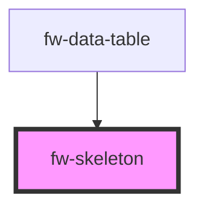

# Skeleton (fw-skeleton)

fw-skeleton provides a way to render placeholder content until the original content is available. Provides a good UX when dealing with progessive loading of contents.

## Demo

Skeleton with multiple variants

```html live
<label>Default text variant</label> <fw-skeleton></fw-skeleton> <br />
<label>Circle variant</label>
<fw-skeleton variant="circle"></fw-skeleton> <br />
<label>Rectangle variant with custom height</label>
<fw-skeleton variant="rect" height="200px"></fw-skeleton> <br />
<label>Pass count to repeat the item</label>
<fw-skeleton variant="rect" height="30px" count="3"></fw-skeleton> <br />

<label>Pass Custom styles as props</label>
<fw-skeleton id="custom-skeleton"></fw-skeleton>

<script type="application/javascript">
  const el = document.querySelector('#custom-skeleton');
  el.customStyles = {
    'display': 'inline-block',
    'box-shadow': '0 2px 4px #ccc',
    'background-color': '#1b2b34de',
    'width': '33%',
  };
  el.count = 2;
</script>
```

Skeleton with different effects

```html live
<label>Default Pulse Effect</label> <fw-skeleton></fw-skeleton> <br />
<label>Sheen Effect</label>
<fw-skeleton effect="sheen"></fw-skeleton> <br />
<label>No Effect</label>
<fw-skeleton effect="none"></fw-skeleton> <br />
```

Skeleton with custom properties

```html live
<label>Pass Custom Css Properties</label>
<fw-skeleton
  style="--fw-skeleton-background:red; --fw-skeleton-height:20px; --fw-skeleton-width:500px"
></fw-skeleton>
<br />
```

Card Layout

```html live
<div class="card">
  <div class="card-header" style="display: flex;align-items:center;">
    <fw-skeleton variant="circle" height="64px" width="64px"></fw-skeleton>
    <fw-skeleton style="  flex: 0 0 auto;width: 40%;margin-left:1em">
    </fw-skeleton>
  </div>

  <fw-skeleton
    variant="rect"
    height="180px"
    custom-styles='"margin-top": "10px",
    "box-shadow": "0px 1px 2px rgba(0,0,0,0.1)"'
  ></fw-skeleton>
  <fw-skeleton count="2"> </fw-skeleton>
</div>
```

Multi Para Layout

```html live
<div class="multi-para">
  <fw-skeleton> </fw-skeleton>
  <fw-skeleton width="95%"> </fw-skeleton>
  <fw-skeleton> </fw-skeleton>
  <fw-skeleton width="55%"> </fw-skeleton>
</div>
```

## Usage

<code-group>
<code-block title="HTML">
```html

<label>Default text variant</label>
<fw-skeleton></fw-skeleton> <br/>
<label>Circle variant</label>
<fw-skeleton variant="circle"></fw-skeleton> <br/>
<label>Rectangle variant</label>
<fw-skeleton variant="rect"></fw-skeleton> <br/>
<label>Pass count to repeat the item</label>
<fw-skeleton variant="rect" height="30px" count=3></fw-skeleton> <br/>

<label>Pass Custom styles as props</label>
<fw-skeleton id="custom-skeleton"></fw-skeleton>

<script type="application/javascript">
  const el = document.querySelector('#custom-skeleton');
     el.customStyles = {
       display: 'inline-block',
       'box-shadow': '0 2px 4px #ccc',
       'background-color': '#1b2b34de',
       'width':"33%"
     };
     el.count = 2;
</script>

````
</code-block>

<code-block title="React">
```jsx
import React, {useRef, useEffect} from "react";
import ReactDOM from "react-dom";
import { FwSkeleton } from "@freshworks/crayons/react";
function App() {

    const skeletonCustomRef = useRef(null);
    const skeletonCardRef = useRef(null);
    useEffect(() => {
        skeletonCustomRef.current.customStyles = {
            margin: 0,
            "box-shadow": "0px 1px 2px rgba(0,0,0,0.5)"
        };
        skeletonCardRef.current.customStyles = {
            marginTop: "10px",
            boxShadow: "0px 1px 2px rgba(0,0,0,0.1)"
        }
    }, []);


  return (<div>
            <label>Default text variant</label>
            <FwSkeleton></FwSkeleton> <br/>
            <label>Circle variant</label>
            <FwSkeleton variant="circle"></FwSkeleton> <br/>
            <label>Rectangle variant</label>
            <FwSkeleton variant="rect"></FwSkeleton> <br/>
            <label>Pass count to repeat the item</label>
            <FwSkeleton variant="rect" height="30px" count={3}></FwSkeleton> <br/>
            <label>Sheen Effect</label>
            <FwSkeleton effect="sheen"></FwSkeleton> <br/>
            <label>Default Pulse Effect</label>
            <FwSkeleton></FwSkeleton> <br/>
            <label>No Effect</label>
            <FwSkeleton effect="none"></FwSkeleton> <br/>

            <label>Pass Custom styles as props</label>
            <FwSkeleton id="custom-skeleton" ref={skeletonCustomRef}></FwSkeleton>

            <label>Multi Para Layout</label>
            <div className="multi-para">
              <FwSkeleton> </FwSkeleton>
              <FwSkeleton width="95%"> </FwSkeleton>
              <FwSkeleton> </FwSkeleton>
              <FwSkeleton width="55%"> </FwSkeleton>
            </div>

          <label>Card Layout </label>
          <div className="card">
            <div className="card-header" style={{display: "flex",alignItems:'center'
            }}>
              <FwSkeleton
                variant="circle"
                height="64px"
                width="64px"
              ></FwSkeleton>
              <FwSkeleton style={{flex: "0 0 auto",width: "40%",marginLeft:"1em"}}> </FwSkeleton>
            </div>

            <FwSkeleton
              variant="rect"
              height="180px"
              ref={skeletonCardRef}
            ></FwSkeleton>
            <FwSkeleton count={2}> </FwSkeleton>
          </div>

    </div>);
}
````

</code-block>
</code-group>

<!-- Auto Generated Below -->


## Properties

| Property       | Attribute       | Description                                              | Type                                   | Default   |
| -------------- | --------------- | -------------------------------------------------------- | -------------------------------------- | --------- |
| `count`        | `count`         | Number of rows of current skeleton type                  | `number`                               | `1`       |
| `customStyles` | `custom-styles` | Custom css styles (background/margins/width/height etc.) | `string \| { [key: string]: string; }` | `{}`      |
| `effect`       | `effect`        | Effect the skeleton will use.                            | `"none" \| "pulse" \| "sheen"`         | `'pulse'` |
| `height`       | `height`        | Height of the skeleton ex. 100px, 100%, auto etc.        | `string`                               | `null`    |
| `marginBottom` | `margin-bottom` | MarginBottom of the skeleton ex. 10px, 0 etc.            | `string`                               | `null`    |
| `variant`      | `variant`       | Variant of the skeleton - circle or rectangle or text    | `"circle" \| "rect" \| "text"`         | `'text'`  |
| `width`        | `width`         | Width of the skeleton ex. 100px, 100%, auto etc.         | `string`                               | `null`    |


## Shadow Parts

| Part     | Description |
| -------- | ----------- |
| `"base"` |             |


## CSS Custom Properties

| Name                          | Description                                                                               |
| ----------------------------- | ----------------------------------------------------------------------------------------- |
| `--fw-skeleton-background`    | Skeleton background: Default: #cfd7df                                                     |
| `--fw-skeleton-border-radius` | Skeleton border-radius: Default: 999px for the text, 50% for the circle, 0px for the rect |
| `--fw-skeleton-height`        | Skeleton height: Default: 16px for the text and rect, 32px for the circle                 |
| `--fw-skeleton-margin-bottom` | Skeleton margin-bottom: Default: 8px/0px(when count is 1)                                 |
| `--fw-skeleton-sheen-color`   | Skeleton Sheen effect color: Default: #b1bdc8                                             |
| `--fw-skeleton-width`         | Skeleton width: Default: 100% for the text and rect, 32px for the circle                  |


## Dependencies

### Used by

 - [fw-data-table](../data-table)

### Graph


----------------------------------------------

Built with ❤ at Freshworks
