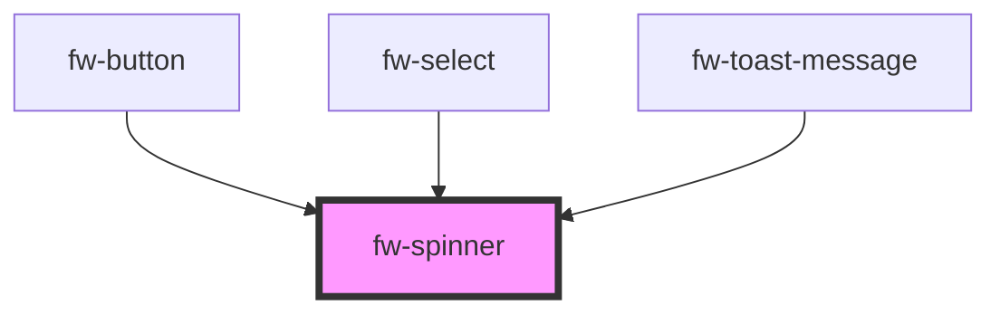

# Spinner (fw-spinner)
fw-spinner displays a continuous loader on the user interface, to indicate that a system is processing an entity.


## Demo

```html live
<fw-label value="A small loader" color="yellow"></fw-label><br/>
<fw-spinner size="small"></fw-spinner><br/><br/>
<fw-label value="A medium sized loader" color="yellow"></fw-label><br/>
<fw-spinner size="medium" color="green"></fw-spinner>
```

## Usage

<code-group>
<code-block title="HTML">
```html 
<fw-label value="A small loader" color="yellow"></fw-label><br/>
<fw-spinner size="small"></fw-spinner><br/><br/>
<fw-label value="A medium sized loader" color="yellow"></fw-label><br/>
<fw-spinner size="medium" color="green"></fw-spinner>
```
</code-block>

<code-block title="React">
```jsx
import React from "react";
import ReactDOM from "react-dom";
import { FwSpinner } from "@freshworks/crayons/react";
function App() {
  return (<div>
        <label>A small loader</label><br/>
        <FwSpinner size="small"></FwSpinner><br/><br/>
        <label>A medium sized loader</label><br/>
        <FwSpinner size="medium" color="green"></FwSpinner>
    </div>);
}
```
</code-block>
</code-group>


<!-- Auto Generated Below -->


## Properties

| Property | Attribute | Description                                                                | Type                                          | Default     |
| -------- | --------- | -------------------------------------------------------------------------- | --------------------------------------------- | ----------- |
| `color`  | `color`   | Color in which the loader is displayed, specified as a standard CSS color. | `string`                                      | `''`        |
| `size`   | `size`    | Size of the loader.                                                        | `"default" \| "large" \| "medium" \| "small"` | `'default'` |


## CSS Custom Properties

| Name                 | Description          |
| -------------------- | -------------------- |
| `--fw-spinner-color` | Color of the spinner |


## Dependencies

### Used by

 - [fw-button](../button)
 - [fw-select](../select)
 - [fw-toast-message](../toast-message)

### Graph


----------------------------------------------

Built with ❤ at Freshworks
