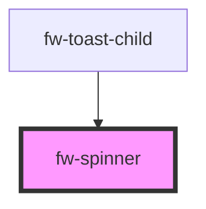

# Spinner (fw-spinner)
fw-spinner displays a continuous loader on the user interface, to indicate that a system is processing an entity.

## Usage

```html live
<fw-label value="A small loader" color="yellow"></fw-label><br/>
<fw-spinner size="small"></fw-spinner><br/><br/>
<fw-label value="A medium sized loader" color="yellow"></fw-label><br/>
<fw-spinner size="medium" color="green"></fw-spinner>
```

<!-- Auto Generated Below -->


## Properties

| Property | Attribute | Description                                                                | Type                                          | Default     |
| -------- | --------- | -------------------------------------------------------------------------- | --------------------------------------------- | ----------- |
| `color`  | `color`   | Color in which the loader is displayed, specified as a standard CSS color. | `string`                                      | `''`        |
| `size`   | `size`    | Size of the loader.                                                        | `"default" \| "large" \| "medium" \| "small"` | `'default'` |


## CSS Custom Properties

| Name              | Description          |
| ----------------- | -------------------- |
| `--spinner-color` | Color of the spinner |


## Dependencies

### Used by

 - [fw-toast-child](../toast-child)

### Graph


----------------------------------------------

Built with ❤ at Freshworks
