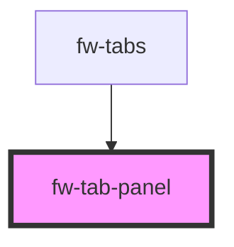

# Tab Panel (fw-tab-panel)

fw-tab-panel is used inside fw-tabs to show tabbed content.


## Demo

```html live
  <fw-tab-panel active>This is sample panel content</fw-tab-panel>
```

## Usage

<code-group>
<code-block title="HTML">
```html 
  <fw-tab-panel active>This is sample panel content</fw-tab-panel>
```
</code-block>

<code-block title="React">
```jsx
import React from "react";
import ReactDOM from "react-dom";
import { FwTabPanel } from "@freshworks/crayons/react";
function App() {
  return (<div>
          <FwTabPanel active>This is sample panel content</FwTabPanel>
    </div>);
}
```
</code-block>
</code-group>

<!-- Auto Generated Below -->


## Properties

| Property | Attribute | Description                                              | Type      | Default |
| -------- | --------- | -------------------------------------------------------- | --------- | ------- |
| `active` | `active`  | If true sets the panel display to block, none otherwise. | `boolean` | `false` |
| `name`   | `name`    | The panel name.                                          | `string`  | `''`    |


## CSS Custom Properties

| Name                    | Description                  |
| ----------------------- | ---------------------------- |
| `--fw-tab-panel-height` | height of the tab container. |
| `--fw-tab-panel-width`  | width of the tab container.  |


## Dependencies

### Used by

 - [fw-tabs](../tabs)

### Graph


----------------------------------------------

Built with ❤ at Freshworks
