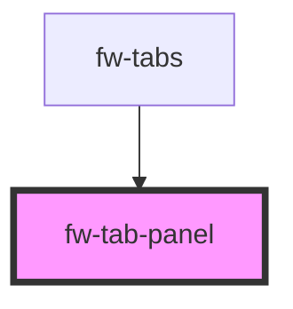

# Tab Panel (fw-tab-panel)

fw-tab-panel is used inside fw-tabs to show tabbed content.

## Usage

```html live
  <fw-tab-panel active>This is sample panel content</fw-tab-panel>
```

<!-- Auto Generated Below -->


## Properties

| Property | Attribute | Description                                              | Type      | Default |
| -------- | --------- | -------------------------------------------------------- | --------- | ------- |
| `active` | `active`  | If true sets the panel display to block, none otherwise. | `boolean` | `false` |
| `name`   | `name`    | The panel name.                                          | `string`  | `''`    |


## Dependencies

### Used by

 - [fw-tabs](../tabs)

### Graph


----------------------------------------------

Built with ❤ at Freshworks
