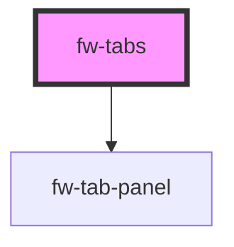

# Tabs (fw-tabs)

fw-tabs displays a series of tabs on the user interface and enables tab-style navigation. The component doesn’t have any attributes that impart styling, it merely functions as a container for the tabs. It makes use of `fw-tab` and `fw-tab-panel`. Each tab must be slotted into `tab` slot and panel must refer to fw-tab-panel of same name.

## Demo

```html live
<fw-tabs>
  <fw-tab slot="tab" panel="personal">Personal</fw-tab>
  <fw-tab slot="tab" panel="official">Official</fw-tab>

  <fw-tab-panel name="personal">
    <fw-input
      label="Name"
      icon-left="add-contact"
      warning-text="Do not enter your user ID"
      state="warning"
      placeholder="Enter your official name"
      required
      clear-input
    >
    </fw-input>
    <fw-button color="secondary">Submit</fw-button>
    <fw-button color="secondary">Save</fw-button>
  </fw-tab-panel>

  <fw-tab-panel name="official">
    <fw-select multiple label="Select location of preference" required="true">
      <fw-select-option value="1">Chennai</fw-select-option>
      <fw-select-option value="2">Bangalore</fw-select-option>
      <fw-select-option value="3">Hyderabad</fw-select-option>
    </fw-select>
    <fw-button color="secondary">Submit</fw-button>
    <fw-button color="secondary">Save</fw-button>
  </fw-tab-panel>
</fw-tabs>
```

## Usage

<code-group>
<code-block title="HTML">
```html 
<fw-tabs>
  <fw-tab slot="tab" panel="personal">Personal</fw-tab>
  <fw-tab slot="tab" panel="official">Official</fw-tab>

  <fw-tab-panel name="personal">
    <fw-input
      label="Name"
      icon-left="add-contact"
      warning-text="Do not enter your user ID"
      state="warning"
      placeholder="Enter your official name"
      required
      clear-input>
    </fw-input>
    <fw-button color="secondary">Submit</fw-button>
    <fw-button color="secondary">Save</fw-button>
  </fw-tab-panel>

  <fw-tab-panel name="official">
    <fw-select multiple label="Select location of preference" required="true">
      <fw-select-option value="1">Chennai</fw-select-option>
      <fw-select-option value="2">Bangalore</fw-select-option>
      <fw-select-option value="3">Hyderabad</fw-select-option>
    </fw-select>
    <fw-button color="secondary">Submit</fw-button>
    <fw-button color="secondary">Save</fw-button>
  </fw-tab-panel>
</fw-tabs>
```
</code-block>

<code-block title="React">
```jsx
import React from "react";
import ReactDOM from "react-dom";
import { FwButton, FwSelect, FwSelectOption, FwInput, FwTabs, FwTab, FwTabPanel } from "@freshworks/crayons/react";
function App() {
  return (<div>
          <FwTabs>
            <FwTab slot="tab" panel="personal">Personal</FwTab>
            <FwTab slot="tab" panel="official">Official</FwTab>

            <FwTabPanel name="personal">
              <FwInput
                label="Name"
                iconLeft="add-contact"
                warningText="Do not enter your user ID"
                state="warning"
                placeholder="Enter your official name"
                required
                clearInput>
              </FwInput>
              <FwButton color="secondary">Submit</FwButton>
              <FwButton color="secondary">Save</FwButton>
            </FwTabPanel>

            <FwTabPanel name="official">
              <FwSelect multiple label="Select location of preference" required="true">
                <FwSelectOption value="1">Chennai</FwSelectOption>
                <FwSelectOption value="2">Bangalore</FwSelectOption>
                <FwSelectOption value="3">Hyderabad</FwSelectOption>
              </FwSelect>
              <FwButton color="secondary">Submit</FwButton>
              <FwButton color="secondary">Save</FwButton>
            </FwTabPanel>
          </FwTabs>
    </div>);

}

```
</code-block>
</code-group>


<!-- Auto Generated Below -->


## Properties

| Property         | Attribute          | Description                                                                                   | Type                | Default     |
| ---------------- | ------------------ | --------------------------------------------------------------------------------------------- | ------------------- | ----------- |
| `activeTabIndex` | `active-tab-index` | The index of the activated Tab(Starts from 0)                                                 | `number`            | `0`         |
| `activeTabName`  | `active-tab-name`  | The name of the tab to be activated.                                                          | `string`            | `undefined` |
| `label`          | `label`            | Describes the purpose of set of tabs.                                                         | `string`            | `''`        |
| `variant`        | `variant`          | The style of tab headers that needs to be displayed, box will display headers in a container. | `"box" \| "normal"` | `'normal'`  |


## Events

| Event      | Description                                      | Type               |
| ---------- | ------------------------------------------------ | ------------------ |
| `fwChange` | Triggered when a the view switches to a new tab. | `CustomEvent<any>` |


## Methods

### `activateTab(index?: number, name?: string) => Promise<void>`

Activates the tab based based on tabindex or name.

#### Returns

Type: `Promise<void>`


## CSS Custom Properties

| Name                      | Description                     |
| ------------------------- | ------------------------------- |
| `--fw-tabs-height`        | height of the tab container.    |
| `--fw-tabs-margin-l`      | left margin for the tab items   |
| `--fw-tabs-margin-r`      | right margin for the tab items  |
| `--fw-tabs-padding-left`  | left padding for the tab items  |
| `--fw-tabs-padding-right` | right padding for the tab items |
| `--fw-tabs-width`         | width of the tab container.     |


## Dependencies

### Depends on

- [fw-tab-panel](../tab-panel)

### Graph


----------------------------------------------

Built with ❤ at Freshworks
