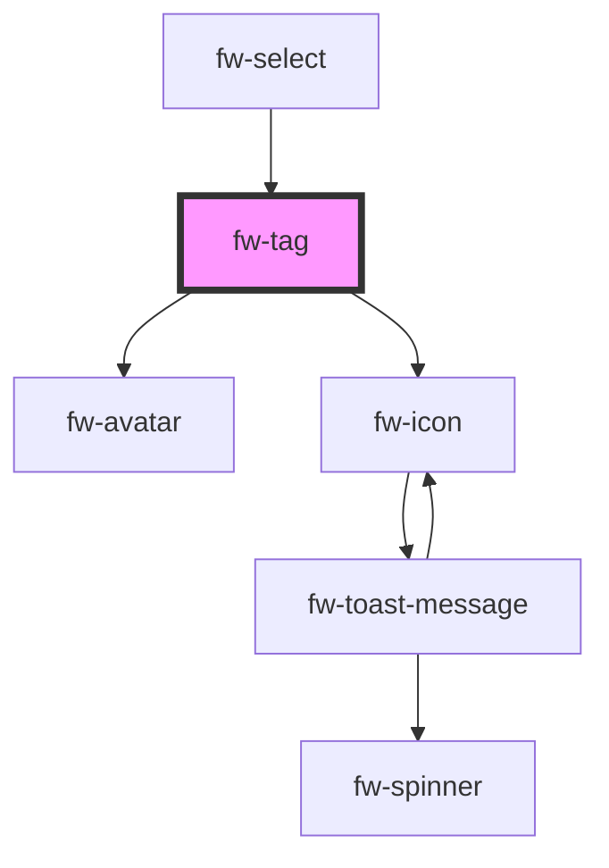

# Tag (fw-tag)

fw-tag provides a child component that is used to enable selecting multiple options in the Select component.

## Demo

```html live
<fw-tag text="Option"></fw-tag>

<fw-tag id="avatarTag" variant="avatar" text="Option"></fw-tag>

<script type="application/javascript">
  avatarTag = document.getElementById('avatarTag');
  avatarTag.graphicsProps = {
    image:
      'https://images.unsplash.com/photo-1529778873920-4da4926a72c2?ixlib=rb-1.2.1&auto=format&fit=crop&w=300&q=80',
  };
</script>
```

## Usage

<code-group>
<code-block title="HTML">
```html 
<fw-tag text="Option"></fw-tag>

<fw-tag id="avatarTag" variant="avatar" text="Option"></fw-tag>

<script type="application/javascript">
  avatarTag = document.getElementById('avatarTag');
  avatarTag.graphicsProps = {
    image:
      'https://images.unsplash.com/photo-1529778873920-4da4926a72c2?ixlib=rb-1.2.1&auto=format&fit=crop&w=300&q=80',
  };
</script>

````
</code-block>

<code-block title="React">
```jsx
import React from "react";
import { FwTag } from "@freshworks/crayons/react";

function App() {

  return (<div>
    <FwTag text="Option"></FwTag>

    <FwTag variant="avatar" graphicsProps={{
      image:
        'https://images.dog.ceo/breeds/chow/n02112137_8862.jpg'
    }} text="Chow Wolowitz"></FwTag>

  </div >);
}

export default App;

````

</code-block>
</code-group>

<!-- Auto Generated Below -->


## Properties

| Property        | Attribute   | Description                                                                                                                             | Type                     | Default      |
| --------------- | ----------- | --------------------------------------------------------------------------------------------------------------------------------------- | ------------------------ | ------------ |
| `closable`      | `closable`  | Whether the Tag can be closed.                                                                                                          | `boolean`                | `true`       |
| `disabled`      | `disabled`  | Sets the state of the tag to disabled. The close button is disabled. If the attribute’s value is undefined, the value is set to false.  | `boolean`                | `undefined`  |
| `focusable`     | `focusable` | Whether the Tag is focusable.                                                                                                           | `boolean`                | `true`       |
| `graphicsProps` | --          | The props need to be passed for the variant. If the variant is avatar then use this prop to send the props for the fw-avatar component. | `{}`                     | `{}`         |
| `text`          | `text`      | Display text in the tag component.                                                                                                      | `string`                 | `undefined`  |
| `value`         | `value`     | Value associated with the tag component, that is saved when the form data is saved.                                                     | `number \| string`       | `undefined`  |
| `variant`       | `variant`   | The variant of tag to be displayed.                                                                                                     | `"avatar" \| "standard"` | `'standard'` |


## Events

| Event      | Description                           | Type               |
| ---------- | ------------------------------------- | ------------------ |
| `fwClosed` | Triggered when the tag is deselected. | `CustomEvent<any>` |


## Methods

### `setFocus() => Promise<any>`


#### Returns

Type: `Promise<any>`


## Dependencies

### Used by

 - [fw-select](../select)

### Depends on

- [fw-avatar](../avatar)
- [fw-icon](../icon)

### Graph


----------------------------------------------

Built with ❤ at Freshworks
