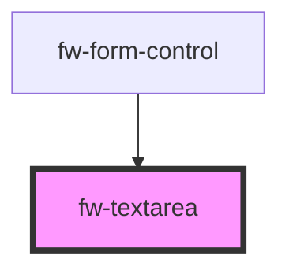

# Textarea (fw-textarea)
fw-textarea displays an input box on the user interface and enables assigning multi-line text value to it. The size of the input box is based on the cols and rows attributes.

## Demo

```html live
<fw-textarea cols=75 rows=5 maxlength=190 minlength=5
  label="Address"
  state-text="Do not enter your temporary address"
  state="warning"
  placeholder="Enter your permanent address"
  required>
</fw-textarea>
<fw-textarea cols=75 rows=5
  label="Passcode"
  state-text="Passcode is incorrect"
  state="error"
  required>
</fw-textarea>
<fw-textarea cols=75 rows=5
  label="Location identifier"
placeholder="Enter landmark details"
  state="normal">
</fw-textarea>
<fw-textarea cols=75 rows=1
  label="Plot number"
  value="not applicable"
   disabled
  state="normal">
</fw-textarea>
```

## Usage

<code-group>
<code-block title="HTML">
```html 
<fw-textarea cols=75 rows=5 maxlength=190 minlength=5
  label="Address"
  state-text="Do not enter your temporary address"
  state="warning"
  placeholder="Enter your permanent address"
  required>
</fw-textarea>
<fw-textarea cols=75 rows=5
  label="Passcode"
  state-text="Passcode is incorrect"
  state="error"
  required>
</fw-textarea>
<fw-textarea cols=75 rows=5
  label="Location identifier"
placeholder="Enter landmark details"
  state="normal">
</fw-textarea>
<fw-textarea cols=75 rows=1
  label="Plot number"
  value="not applicable"
   disabled
  state="normal">
</fw-textarea>
```
</code-block>

<code-block title="React">
```jsx
import React from "react";
import ReactDOM from "react-dom";
import { FwTextarea } from "@freshworks/crayons/react";
function App() {
  return (<div>
            <FwTextarea cols={75} rows={5} maxlength={190} minlength={5}
              label="Address"
              stateText="Do not enter your temporary address"
              state="warning"
              placeholder="Enter your permanent address"
              required>
            </FwTextarea>
            <FwTextarea cols={75} rows={5}
              label="Passcode"
              stateText="Passcode is incorrect"
              state="error"
              required>
            </FwTextarea>
            <FwTextarea cols={75} rows={5}
              label="Location identifier"
              placeholder="Enter landmark details"
              state="normal">
            </FwTextarea>
            <FwTextarea cols={75} rows={1}
              label="Plot number"
              value="not applicable"
              disabled
              state="normal">
            </FwTextarea>
    </div>);
}
```
</code-block>
</code-group>


<!-- Auto Generated Below -->


## Properties

| Property      | Attribute     | Description                                                                                                                                                                                                                                                       | Type                               | Default     |
| ------------- | ------------- | ----------------------------------------------------------------------------------------------------------------------------------------------------------------------------------------------------------------------------------------------------------------- | ---------------------------------- | ----------- |
| `cols`        | `cols`        | Width of the input box, specified as number of columns.                                                                                                                                                                                                           | `number`                           | `undefined` |
| `disabled`    | `disabled`    | Disables the text area on the interface. If the attribute’s value is undefined, the value is set to false.                                                                                                                                                        | `boolean`                          | `false`     |
| `formId`      | `form-id`     | id for the form using this component. This prop is set from the `fw-form`                                                                                                                                                                                         | `string`                           | `''`        |
| `label`       | `label`       | Label displayed on the interface, for the component.                                                                                                                                                                                                              | `string`                           | `''`        |
| `maxlength`   | `maxlength`   | Maximum number of characters a user can enter in the input box.                                                                                                                                                                                                   | `number`                           | `undefined` |
| `minlength`   | `minlength`   | Minimum number of characters a user must enter in the input box for the value to be valid.                                                                                                                                                                        | `number`                           | `undefined` |
| `name`        | `name`        | Name of the component, saved as part of form data.                                                                                                                                                                                                                | `string`                           | `''`        |
| `placeholder` | `placeholder` | Text displayed in the input box before a user enters a value.                                                                                                                                                                                                     | `string`                           | `undefined` |
| `readonly`    | `readonly`    | If true, the user cannot enter a value in the input box. If the attribute’s value is undefined, the value is set to false.                                                                                                                                        | `boolean`                          | `false`     |
| `required`    | `required`    | Specifies the input box as a mandatory field and displays an asterisk next to the label. If the attribute’s value is undefined, the value is set to false.                                                                                                        | `boolean`                          | `false`     |
| `rows`        | `rows`        | Height of the input box, specified as number of rows.                                                                                                                                                                                                             | `number`                           | `undefined` |
| `state`       | `state`       | Theme based on which the input box is styled.                                                                                                                                                                                                                     | `"error" \| "normal" \| "warning"` | `'normal'`  |
| `stateText`   | `state-text`  | Descriptive or instructional text displayed below the input box.                                                                                                                                                                                                  | `string`                           | `''`        |
| `value`       | `value`       | Default value displayed in the input box.                                                                                                                                                                                                                         | `string`                           | `''`        |
| `wrap`        | `wrap`        | Type of text wrapping used by the input box. If the value is hard, the text in the textarea is wrapped (contains line breaks) when the form data is saved. If the value is soft, the text in the textarea is saved as a single line, when the form data is saved. | `"hard" \| "soft"`                 | `'soft'`    |


## Events

| Event      | Description                                            | Type                         |
| ---------- | ------------------------------------------------------ | ---------------------------- |
| `fwBlur`   | Triggered when the input box loses focus.              | `CustomEvent<any>`           |
| `fwChange` | Triggered when the value in the input box is modified. | `CustomEvent<any>`           |
| `fwFocus`  | Triggered when the input box comes into focus.         | `CustomEvent<void>`          |
| `fwInput`  | Triggered when a value is entered in the input box.    | `CustomEvent<KeyboardEvent>` |


## Methods

### `setFocus() => Promise<void>`

Sets focus on a specific `fw-textarea`. Use this method instead of the global `input.focus()`.

#### Returns

Type: `Promise<void>`


## CSS Custom Properties

| Name                       | Description                    |
| -------------------------- | ------------------------------ |
| `--input-color`            | Color of the textarea input    |
| `--textarea-margin-bottom` | Bottom margin for the textarea |


## Dependencies

### Used by

 - [fw-form-control](../form-control)

### Graph


----------------------------------------------

Built with ❤ at Freshworks
