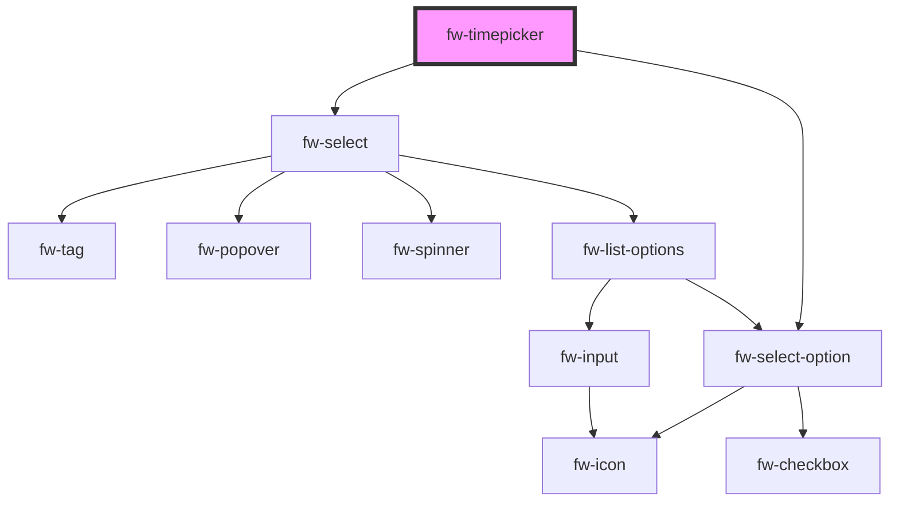

# Timepicker (fw-timepicker)
fw-timepicker displays a list or drop-down box with prepopulated time values and enables picking a time. The time values displayed in the list box are based on the fw-timepicker attribute values.


## Demo

```html live
<fw-label value="An interval based picker" color="yellow"></fw-label><br/> 
<fw-timepicker interval=45 hour-format="hh:mm p"></fw-timepicker>
<fw-label value="A range based picker" color="yellow"></fw-label><br/>
<fw-timepicker min-time="04:30" max-time="08:30 PM"></fw-timepicker>
```

## Usage

<code-group>
<code-block title="HTML">
```html 
<fw-label value="An interval based picker" color="yellow"></fw-label><br/> 
<fw-timepicker interval=45 hour-format="hh:mm p"></fw-timepicker>
<fw-label value="A range based picker" color="yellow"></fw-label><br/>
<fw-timepicker min-time="04:30" max-time="08:30 PM"></fw-timepicker>
```
</code-block>

<code-block title="React">
```jsx
import React from "react";
import ReactDOM from "react-dom";
import { FwTimepicker } from "@freshworks/crayons/react";
function App() {
  return (<div>
          <label>An interval based picker</label><br/> 
          <FwTimepicker interval={45} hourFormat="hh:mm p"></FwTimepicker>
          <label>A range based picker</label><br/>
          <FwTimepicker minTime="04:30" maxTime="08:30 PM"></FwTimepicker>
    </div>);
}
```
</code-block>
</code-group>


<!-- Auto Generated Below -->


## Properties

| Property   | Attribute  | Description                                                                                                                                                                                    | Type                   | Default                                        |
| ---------- | ---------- | ---------------------------------------------------------------------------------------------------------------------------------------------------------------------------------------------- | ---------------------- | ---------------------------------------------- |
| `disabled` | `disabled` | Set true to disable the element                                                                                                                                                                | `boolean`              | `false`                                        |
| `format`   | `format`   | Format in which time values are populated in the list box. If the value is hh:mm p, the time values are in the 12-hour format. If the value is hh:mm, the time values are in the 24-hr format. | `"HH:mm" \| "hh:mm A"` | `'hh:mm A'`                                    |
| `interval` | `interval` | Time interval between the values displayed in the list, specified in minutes.                                                                                                                  | `number`               | `30`                                           |
| `maxTime`  | `max-time` | Upper time-limit for the values displayed in the list. If this attribute’s value is in the hh:mm format, it is assumed to be hh:mm AM.                                                         | `string`               | `this.isMeridianFormat ? '11:30 PM' : '23:30'` |
| `minTime`  | `min-time` | Lower time-limit for the values displayed in the list. If this attribute’s value is in the hh:mm format, it is assumed to be hh:mm AM.                                                         | `string`               | `this.isMeridianFormat ? '12:00 AM' : '00:00'` |
| `name`     | `name`     | Name of the component, saved as part of form data.                                                                                                                                             | `string`               | `''`                                           |
| `value`    | `value`    | Time output value                                                                                                                                                                              | `string`               | `undefined`                                    |


## Dependencies

### Depends on

- [fw-select](../select)
- [fw-select-option](../select-option)

### Graph


----------------------------------------------

Built with ❤ at Freshworks
