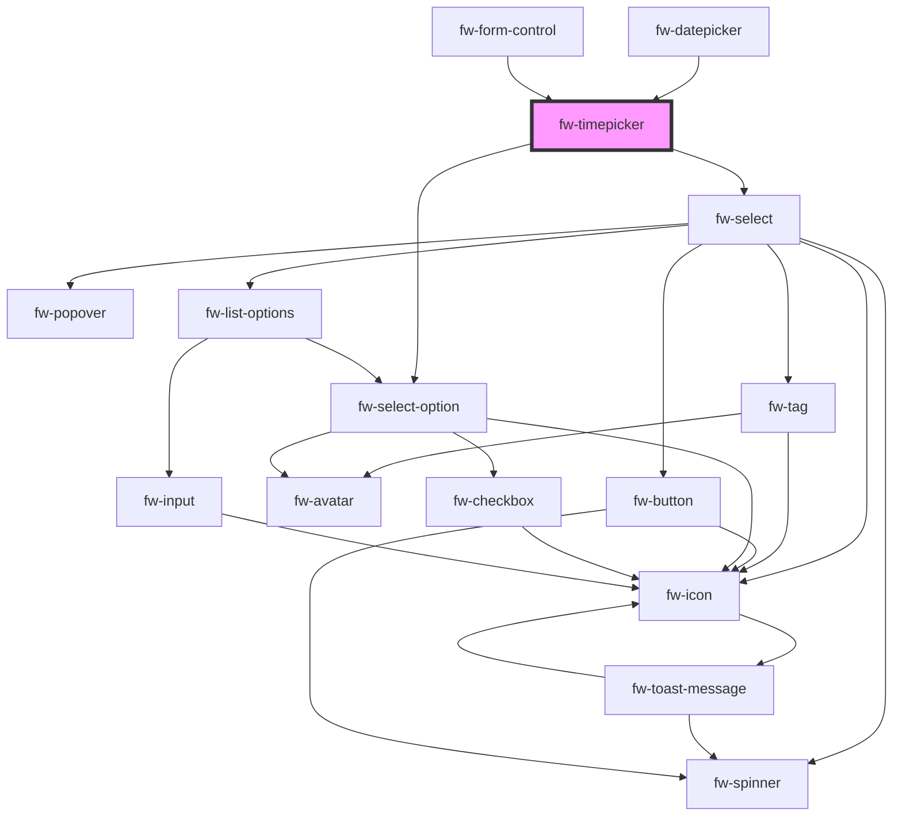

# Timepicker (fw-timepicker)

fw-timepicker displays a list or drop-down box with prepopulated time values and enables picking a time. The time values displayed in the list box are based on the fw-timepicker attribute values.

## Demo

```html live
<fw-label value="An interval based picker" color="yellow"></fw-label><br />
<fw-timepicker interval="45" format="hh:mm p"></fw-timepicker>
<fw-label value="A range based picker" color="yellow"></fw-label><br />
<fw-timepicker min-time="04:30 PM" max-time="08:30 PM"></fw-timepicker>
```

## Usage

<code-group>
<code-block title="HTML">
```html 
<fw-label value="An interval based picker" color="yellow"></fw-label><br/> 
<fw-timepicker interval=45 format="hh:mm p"></fw-timepicker>
<fw-label value="A range based picker" color="yellow"></fw-label><br/>
<fw-timepicker min-time="04:30 PM" max-time="08:30 PM"></fw-timepicker>
```
</code-block>

<code-block title="React">
```jsx
import React from "react";
import ReactDOM from "react-dom";
import { FwTimepicker } from "@freshworks/crayons/react";
function App() {
  return (<div>
          <label>An interval based picker</label><br/> 
          <FwTimepicker interval={45} format="hh:mm p"></FwTimepicker>
          <label>A range based picker</label><br/>
          <FwTimepicker minTime="04:30 PM" maxTime="08:30 PM"></FwTimepicker>
    </div>);
}
```
</code-block>
</code-group>

<!-- Auto Generated Below -->


## Properties

| Property           | Attribute           | Description                                                                                                                                                                                    | Type                                                                                                                                                                 | Default                                        |
| ------------------ | ------------------- | ---------------------------------------------------------------------------------------------------------------------------------------------------------------------------------------------- | -------------------------------------------------------------------------------------------------------------------------------------------------------------------- | ---------------------------------------------- |
| `caret`            | `caret`             | Whether the arrow/caret should be shown in the timepicker.                                                                                                                                     | `boolean`                                                                                                                                                            | `true`                                         |
| `disabled`         | `disabled`          | Set true to disable the element                                                                                                                                                                | `boolean`                                                                                                                                                            | `false`                                        |
| `errorText`        | `error-text`        | Error text displayed below the text box.                                                                                                                                                       | `string`                                                                                                                                                             | `''`                                           |
| `format`           | `format`            | Format in which time values are populated in the list box. If the value is hh:mm p, the time values are in the 12-hour format. If the value is hh:mm, the time values are in the 24-hr format. | `"HH:mm" \| "hh:mm a"`                                                                                                                                               | `'hh:mm a'`                                    |
| `hintText`         | `hint-text`         | Hint text displayed below the text box.                                                                                                                                                        | `string`                                                                                                                                                             | `''`                                           |
| `interval`         | `interval`          | Time interval between the values displayed in the list, specified in minutes.                                                                                                                  | `number`                                                                                                                                                             | `30`                                           |
| `label`            | `label`             | Label displayed on the interface, for the component.                                                                                                                                           | `string`                                                                                                                                                             | `''`                                           |
| `maxTime`          | `max-time`          | Upper time-limit for the values displayed in the list. If this attribute's value is in the hh:mm format, it is assumed to be hh:mm AM.                                                         | `string`                                                                                                                                                             | `this.isMeridianFormat ? '11:30 PM' : '23:30'` |
| `minTime`          | `min-time`          | Lower time-limit for the values displayed in the list. If this attribute's value is in the hh:mm format, it is assumed to be hh:mm AM.                                                         | `string`                                                                                                                                                             | `this.isMeridianFormat ? '12:00 AM' : '00:00'` |
| `name`             | `name`              | Name of the component, saved as part of form data.                                                                                                                                             | `string`                                                                                                                                                             | `''`                                           |
| `optionsPlacement` | `options-placement` | Placement of the options list with respect to timepicker.                                                                                                                                      | `"bottom" \| "bottom-end" \| "bottom-start" \| "left" \| "left-end" \| "left-start" \| "right" \| "right-end" \| "right-start" \| "top" \| "top-end" \| "top-start"` | `'bottom'`                                     |
| `placeholder`      | `placeholder`       | Text displayed in the select before an option is selected.                                                                                                                                     | `string`                                                                                                                                                             | `undefined`                                    |
| `required`         | `required`          | Specifies the input box as a mandatory field and displays an asterisk next to the label. If the attribute's value is undefined, the value is set to false.                                     | `boolean`                                                                                                                                                            | `false`                                        |
| `sameWidth`        | `same-width`        | Whether the dropdown should be same width as that of the input.                                                                                                                                | `boolean`                                                                                                                                                            | `true`                                         |
| `state`            | `state`             | Theme based on which the input of the timepicker is styled.                                                                                                                                    | `"error" \| "normal" \| "warning"`                                                                                                                                   | `'normal'`                                     |
| `value`            | `value`             | Time output value                                                                                                                                                                              | `string`                                                                                                                                                             | `undefined`                                    |
| `warningText`      | `warning-text`      | Warning text displayed below the text box.                                                                                                                                                     | `string`                                                                                                                                                             | `''`                                           |


## Events

| Event      | Description                                                                 | Type               |
| ---------- | --------------------------------------------------------------------------- | ------------------ |
| `fwBlur`   | Triggered when the list box loses focus.                                    | `CustomEvent<any>` |
| `fwChange` | Triggered when a value is selected or deselected from the list box options. | `CustomEvent<any>` |
| `fwFocus`  | Triggered when the list box comes into focus.                               | `CustomEvent<any>` |


## Methods

### `setFocus() => Promise<void>`

Sets focus on a specific `fw-timepicker`.

#### Returns

Type: `Promise<void>`


## Dependencies

### Used by

 - [fw-datepicker](../datepicker)
 - [fw-form-control](../form-control)

### Depends on

- [fw-select](../select)
- [fw-select-option](../select-option)

### Graph


----------------------------------------------

Built with ❤ at Freshworks
