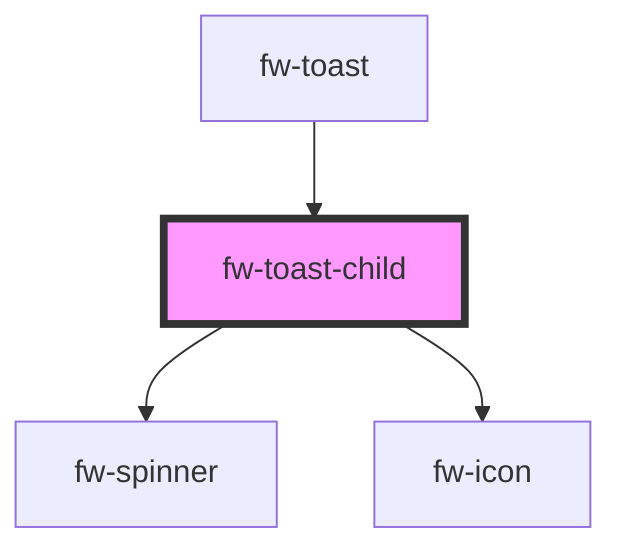

# Toast Child (fw-toast-child)

Toast Child used internally by Toast component to render toast message.

## Usage

```html live
 <fw-toast-child id="type_toast" sticky=true type="success" content="success"></fw-toast-child>
 <fw-toast-child id="type_toast" sticky=true type="error" content="error"></fw-toast-child>
 <fw-toast-child id="type_toast" sticky=true type="warning" content="warning"></fw-toast-child>
 <fw-toast-child id="type_toast" sticky=true type="inprogress" content="inprogress"></fw-toast-child>
```

<!-- Auto Generated Below -->


## Properties

| Property         | Attribute          | Description                                              | Type                                                | Default     |
| ---------------- | ------------------ | -------------------------------------------------------- | --------------------------------------------------- | ----------- |
| `actionLinkText` | `action-link-text` | The Content of the action link                           | `string`                                            | `''`        |
| `content`        | `content`          | The content to be diaplyed in toast                      | `string`                                            | `undefined` |
| `pauseOnHover`   | `pause-on-hover`   | Pause the toast from hiding on mouse hover               | `boolean`                                           | `undefined` |
| `sticky`         | `sticky`           | won't close automatically                                | `boolean`                                           | `false`     |
| `timeout`        | `timeout`          | Time duration of the toast visibility                    | `number`                                            | `4000`      |
| `type`           | `type`             | Type of the toast - success,failure, warning, inprogress | `"error" \| "inprogress" \| "success" \| "warning"` | `'warning'` |


## Events

| Event           | Description                                                                                                                  | Type               |
| --------------- | ---------------------------------------------------------------------------------------------------------------------------- | ------------------ |
| `fwLinkClick`   | Triggered when the action link clicked.                                                                                      | `CustomEvent<any>` |
| `fwRemoveToast` | Triggered on closing the toast message. This event gets used by the parent container to remove the toast message from itself | `CustomEvent<any>` |


## Dependencies

### Used by

 - [fw-toast](../toast)

### Depends on

- [fw-spinner](../spinner)
- [fw-icon](../icon)

### Graph


----------------------------------------------

Built with ❤ at Freshworks
