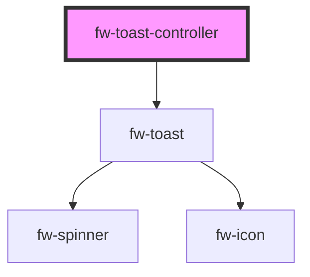

# fw-toast-controller

<!-- Auto Generated Below -->

## Properties

| Property   | Attribute  | Description                                  | Type                                        | Default        |
| ---------- | ---------- | -------------------------------------------- | ------------------------------------------- | -------------- |
| `position` | `position` | position of the toast notification in screen | `"top-center" \| "top-left" \| "top-right"` | `'top-center'` |

## Methods

### `trigger(opts: any) => Promise<void>`

#### Returns

Type: `Promise<void>`

## Dependencies

### Depends on

- [fw-toast](../toast)

### Graph

----------------------------------------------

Built with ❤ at Freshworks
