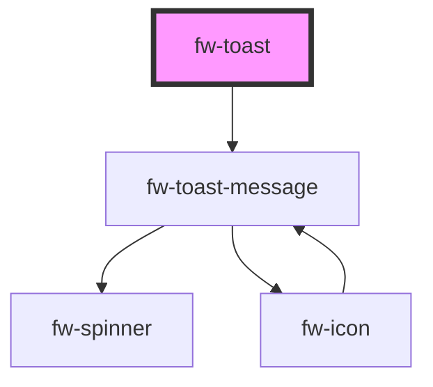

# Toast (fw-toast)

Toasts are used to show pop-up messages that lasts on the screen for a while. Use them to show users alerts or messages. You can also use custom HTML content with in toast


## Demo

```html live
<fw-toast id="type_toast"></fw-toast>
<fw-toast id="type_toast_right" position="top-right"></fw-toast>
<fw-toast id="type_toast_left" position="top-left"></fw-toast>

<fw-toast-message type='success' id="custom-toast" timeout="6000">
  <div>
    <span class="custom-text">Custom content</span>
    <h4>custom html contents can be added</h4>
    <button onclick="alert('clicked')">custom btn</button>
  </div>
</fw-toast-message>


<fw-button onclick="document.querySelector('#type_toast').trigger({type:'success', content: 'Successfullly triggered'})">Success</fw-button>
<fw-button onclick="document.querySelector('#type_toast_right').trigger({type:'error', content:'something went wrong!'})">Error</fw-button>
<fw-button onclick="document.querySelector('#type_toast_left').trigger({type:'warning', content:'This is a warning!'})">Warning</fw-button>
<fw-button onclick="document.querySelector('#type_toast').trigger({type:'inprogress', content:'Request is in progress'})">Inprogress</fw-button>
<fw-button onclick="document.querySelector('#type_toast').trigger({type:'success', contentref:'#custom-toast'})">Custom Toast Content</fw-button>

```

## Usage

<code-group>
<code-block title="HTML">
```html 
<fw-toast id="type_toast"></fw-toast>
<fw-toast id="type_toast_right" position="top-right"></fw-toast>
<fw-toast id="type_toast_left" position="top-left"></fw-toast>

<fw-toast-message type='success' id="custom-toast" timeout="6000">
  <div>
    <span class="custom-text">Custom content</span>
    <h4>custom html contents can be added</h4>
    <button onclick="alert('clicked')">custom btn</button>
  </div>
</fw-toast-message>


<fw-button onclick="document.querySelector('#type_toast').trigger({type:'success', content: 'Successfullly triggered'})">Success</fw-button>
<fw-button onclick="document.querySelector('#type_toast_right').trigger({type:'error', content:'something went wrong!'})">Error</fw-button>
<fw-button onclick="document.querySelector('#type_toast_left').trigger({type:'warning', content:'This is a warning!'})">Warning</fw-button>
<fw-button onclick="document.querySelector('#type_toast').trigger({type:'inprogress', content:'Request is in progress'})">Inprogress</fw-button>
<fw-button onclick="document.querySelector('#type_toast').trigger({type:'success', contentref:'#custom-toast'})">Custom Toast Content</fw-button>
```
</code-block>

<code-block title="React">
```jsx
import React, {useRef, useEffect} from "react";
import ReactDOM from "react-dom";
import { FwButton, ToastController, FwToast, FwToastMessage } from "@freshworks/crayons/react";
function App() {
  const el = useRef(null);
  const el1 = useRef(null);
  const toast = ToastController({ position:'top-right'})

  useEffect(() => {
   el1.current.onclick = function() {
     console.log("custom action handled here");
   }
  },[])

  return (<div>

          <FwToastMessage type='success' id="custom-temp">
            <div>
              <FwButton onclick={()=> console.log("custom action here")}>custom action element</FwButton>
              <FwButton ref={el1}>custom action element in Typescript apps</FwButton>
              <p> Please make sure here in the above element, the event handler name is in lowercase. use `onclick` instead of `onClick`. </p>
              <p className="cus-style">custom style element</p>
            </div>
          </FwToastMessage>
        
          <FwToast id="type_toast" ref={el} timeout={5000}></FwToast>

          <FwButton onClick={()=> toast.trigger({type:'success', content: 'Successfullly triggered'})}>Success</FwButton>
          <FwButton onClick={()=> el.current.trigger({type:'error', content:'something went wrong!'})}>Error</FwButton>
          <FwButton onClick={()=> el.current.trigger({type:'warning', content:'This is a warning!'})}>Warning</FwButton>
          <FwButton onClick={()=> el.current.trigger({type:'inprogress', content:'Request is in progress'})}>Inprogress</FwButton>
          <FwButton onClick={() => toast.trigger({contentref:'#custom-temp'})}>trigger custom </FwButton>
    </div>);
}
```
</code-block>
</code-group>


## ToastController 
You can also use `ToastController` to create Toast like below:
```js 
Javascript - import {  ToastController } from "@freshworks/crayons"
React - import {  ToastController } from "@freshworks/crayons/react"
```
Create an instance of `ToastController` by passing [ToastOptions](#toastoptions) (optional) and use [Methods](#methods) to manage toast
```js
const toast = ToastController({ position:'top-right'})
toast.trigger({type:'success', content: 'Successfullly triggered'})
```
## ToastOptions
Below is the interface for `ToastOptions` that can be used for creating the toast
```js
interface ToastOptions {
  /**
   * The Content of the action link
   */
  actionLinkText?: string;
  /**
   * The content to be displayed in toast
   */
  content?: string;
  /**
   * The document selector for the toast-message component
   * which can be used to embed custom html content in the toast message
   */
  contentref?: string;
  /**
   * Pause the toast from hiding on mouse hover
   */
  pauseOnHover?: boolean;
  /**
   * won't close automatically
   * Default is `false`
   */
  sticky?: boolean;
  /**
   * Time duration of the toast visibility
   * Default is `4000`
   */
  timeout?: number;
  /**
   * Type of the toast - success,failure, warning, inprogress
   * Default is `warning`
   */
  type?: 'success' | 'error' | 'warning' | 'inprogress';
  /**
   *  position of the toast notification in screen
   *  Default is `top-center`
   */
  position?: 'top-center' | 'top-left' | 'top-right';
}
```

### Custom template event naming
              
              
Please make sure when using event handler inside `custom template` in a `React app`, the event handler name is in `lowercase`. For example use `onclick` instead of `onClick`. This helps in cloning the event handlers used in the template when displaying multiple toast messages.
Refer [usage](#usage)
```js
 useEffect(() => {
   el1.current.onclick = function() {
     console.log("custom action handled here");
   }
  },[])
 <FwButton onclick={()=> console.log("custom action here")}>Action button</FwButton>
 <FwButton ref={el1}>In Typescript apps</FwButton>
```

<!-- Auto Generated Below -->


## Properties

| Property         | Attribute          | Description                                              | Type                                                | Default        |
| ---------------- | ------------------ | -------------------------------------------------------- | --------------------------------------------------- | -------------- |
| `actionLinkText` | `action-link-text` | The Content of the action link                           | `string`                                            | `''`           |
| `content`        | `content`          | The content to be displayed in toast                     | `string`                                            | `undefined`    |
| `pauseOnHover`   | `pause-on-hover`   | Pause the toast from hiding on mouse hover               | `boolean`                                           | `undefined`    |
| `position`       | `position`         | position of the toast notification in screen             | `"top-center" \| "top-left" \| "top-right"`         | `'top-center'` |
| `sticky`         | `sticky`           | won't close automatically                                | `boolean`                                           | `false`        |
| `timeout`        | `timeout`          | Time duration of the toast visibility                    | `number`                                            | `4000`         |
| `type`           | `type`             | Type of the toast - success,failure, warning, inprogress | `"error" \| "inprogress" \| "success" \| "warning"` | `'warning'`    |


## Methods

### `trigger(opts: ToastOptions) => Promise<void>`


#### Returns

Type: `Promise<void>`


## Dependencies

### Depends on

- [fw-toast-message](../toast-message)

### Graph


----------------------------------------------

Built with ❤ at Freshworks
