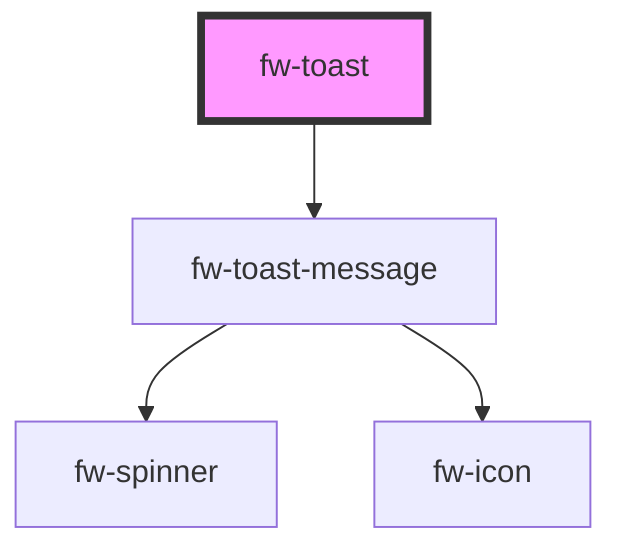

# Toast (fw-toast)

Toasts are used to show pop-up messages that lasts on the screen for a while. Use them to show users alerts or messages.


## Demo

```html live
<fw-toast id="type_toast"></fw-toast>
<fw-button onclick="document.querySelector('#type_toast').trigger({type:'success', content: 'Successfullly triggered'})">Success</fw-button>
<fw-button onclick="document.querySelector('#type_toast').trigger({type:'error', content:'something went wrong!'})">Error</fw-button>
<fw-button onclick="document.querySelector('#type_toast').trigger({type:'warning', content:'This is a warning!'})">Warning</fw-button>
<fw-button onclick="document.querySelector('#type_toast').trigger({type:'inprogress', content:'Request is in progress'})">Inprogress</fw-button>
```

## Usage

<code-group>
<code-block title="HTML">
```html 
<fw-toast id="type_toast"></fw-toast>
<fw-button onclick="document.querySelector('#type_toast').trigger({type:'success', content: 'Successfullly triggered'})">Success</fw-button>
<fw-button onclick="document.querySelector('#type_toast').trigger({type:'error', content:'something went wrong!'})">Error</fw-button>
<fw-button onclick="document.querySelector('#type_toast').trigger({type:'warning', content:'This is a warning!'})">Warning</fw-button>
<fw-button onclick="document.querySelector('#type_toast').trigger({type:'inprogress', content:'Request is in progress'})">Inprogress</fw-button>
```
</code-block>

<code-block title="React">
```jsx
import React, {useRef} from "react";
import ReactDOM from "react-dom";
import { FwButton, ToastController, FwToast } from "@freshworks/crayons/react";
function App() {
  const el = useRef(null);
  const toast = ToastController()
  return (<div>
          <FwToast id="type_toast" ref={el}></FwToast>
          <FwButton onClick={()=> toast.trigger({type:'success', content: 'Successfullly triggered'})}>Success</FwButton>
          <FwButton onClick={()=> el.current.trigger({type:'error', content:'something went wrong!'})}>Error</FwButton>
          <FwButton onClick={()=> el.current.trigger({type:'warning', content:'This is a warning!'})}>Warning</FwButton>
          <FwButton onClick={()=> el.current.trigger({type:'inprogress', content:'Request is in progress'})}>Inprogress</FwButton>
    </div>);
}
```
</code-block>
</code-group>

<!-- Auto Generated Below -->


## Properties

| Property         | Attribute          | Description                                              | Type                                                | Default        |
| ---------------- | ------------------ | -------------------------------------------------------- | --------------------------------------------------- | -------------- |
| `actionLinkText` | `action-link-text` | The Content of the action link                           | `string`                                            | `''`           |
| `content`        | `content`          | The content to be displayed in toast                     | `string`                                            | `undefined`    |
| `pauseOnHover`   | `pause-on-hover`   | Pause the toast from hiding on mouse hover               | `boolean`                                           | `undefined`    |
| `position`       | `position`         | position of the toast notification in screen             | `"top-center" \| "top-left" \| "top-right"`         | `'top-center'` |
| `sticky`         | `sticky`           | won't close automatically                                | `boolean`                                           | `false`        |
| `timeout`        | `timeout`          | Time duration of the toast visibility                    | `number`                                            | `4000`         |
| `type`           | `type`             | Type of the toast - success,failure, warning, inprogress | `"error" \| "inprogress" \| "success" \| "warning"` | `'warning'`    |


## Methods

### `trigger(opts: ToastOptions) => Promise<void>`


#### Returns

Type: `Promise<void>`


## Dependencies

### Depends on

- [fw-toast-message](../toast-message)

### Graph


----------------------------------------------

Built with ❤ at Freshworks
