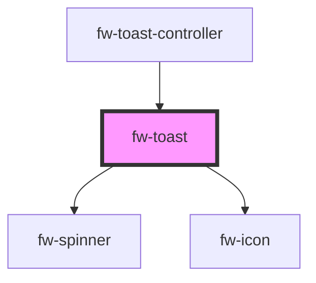

# Toast (fw-toast)

Toasts are used to show pop-up messages that lasts on the screen for a while. Use them to show users alerts or messages.

## Usage

```html live
<fw-toast id="type_toast"></fw-toast>
<fw-button onClick="document.querySelector('#type_toast').trigger({type:'success', content: 'Successfullly triggered'})">Success</fw-button>
<fw-button onClick="document.querySelector('#type_toast').trigger({type:'error', content:'something went wrong!'})">Error</fw-button>
<fw-button onClick="document.querySelector('#type_toast').trigger({type:'warning', content:'This is a warning!'})">Warning</fw-button>
<fw-button onClick="document.querySelector('#type_toast').trigger({type:'inprogress', content:'Request is in progress'})">Inprogress</fw-button>
```

<!-- Auto Generated Below -->


## Properties

| Property         | Attribute          | Description                                              | Type                                                | Default     |
| ---------------- | ------------------ | -------------------------------------------------------- | --------------------------------------------------- | ----------- |
| `actionLinkText` | `action-link-text` | The Content of the action link                           | `string`                                            | `''`        |
| `content`        | `content`          | The content to be diaplyed in toast                      | `string`                                            | `undefined` |
| `pauseOnHover`   | `pause-on-hover`   | Pause the toast from hiding on mouse hover               | `boolean`                                           | `undefined` |
| `sticky`         | `sticky`           | won't close automatically                                | `boolean`                                           | `false`     |
| `timeout`        | `timeout`          | Time duration of the toast visibility                    | `number`                                            | `4000`      |
| `type`           | `type`             | Type of the toast - success,failure, warning, inprogress | `"error" \| "inprogress" \| "success" \| "warning"` | `'warning'` |


## Events

| Event              | Description                                                   | Type               |
| ------------------ | ------------------------------------------------------------- | ------------------ |
| `fwLinkClick`      | Triggered when the action link clicked.                       | `CustomEvent<any>` |
| `removeToastChild` | Remove toast element from the parent on closing toast message | `CustomEvent<any>` |


## Dependencies

### Used by

 - [fw-toast-controller](../toast-controller)

### Depends on

- [fw-spinner](../spinner)
- [fw-icon](../icon)

### Graph


----------------------------------------------

Built with ❤ at Freshworks
