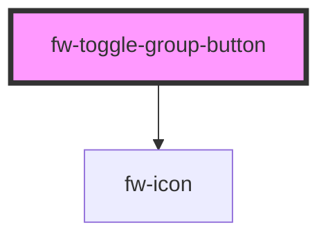

# ToggleGroupButton (fw-toggle-group-button)

fw-toggle-group-button displays a button on the user interface and enables performing specific actions based on the button type. This button can be used as a card or an icon button

## Demo

```html live
<section>
  <fw-label value="Icon button"></fw-label>
  <fw-toggle-group-button
    icon-name="phone"
    value="aa"
    type="icon"
  ></fw-toggle-group-button>
  <fw-toggle-group-button
    icon-name="phone"
    value="aa"
    type="delete"
  ></fw-toggle-group-button>
</section>

<br />

<section>
  <fw-label value="Card button"></fw-label>
  <fw-toggle-group-button
    header="Header A"
    description="This is a sample description of the card component."
    value="aa"
  ></fw-toggle-group-button>
  <fw-toggle-group-button
    header="Header B"
    description="This is a sample description of the card component."
    value="bb"
  ></fw-toggle-group-button>
</section>
```

## Usage

<code-group>
<code-block title="HTML">
```html 
        <fw-toggle-group-button
          header="Header A"
          description="This is a sample description of the card component."
          value="aa"
        ></fw-toggle-group-button>
          <fw-toggle-group-button
            icon-name="agent"
            value="bb"
            type="icon"
          ></fw-toggle-group-button>
````
</code-block>

<code-block title="React">
```jsx
    import React from "react";
    import ReactDOM from "react-dom";
    import { FWToggleGroupButton } from '@Freshworks/crayons/react'
    function App() {
    return (<div>
            <FWToggleGroupButton key="aa" value="aa" header="Header 1" description="This is a sample description 1"/>
            <FWToggleGroupButton key="cc" value="cc" iconName="agent" type="icon"/>
        </div>);
    }
````

<!-- Auto Generated Below -->


## Properties

| Property        | Attribute         | Description                                                                                                              | Type                           | Default           |
| --------------- | ----------------- | ------------------------------------------------------------------------------------------------------------------------ | ------------------------------ | ----------------- |
| `baseClassName` | `base-class-name` | sets the default base class name and the rest of the class names for the other states are automatically appended to this | `string`                       | `'fw-card-radio'` |
| `description`   | `description`     | Label displayed as description in the card.                                                                              | `string`                       | `''`              |
| `disabled`      | `disabled`        | Disables the component on the interface. If the attribute’s value is undefined, the value is set to false.               | `boolean`                      | `false`           |
| `header`        | `header`          | Label displayed as header in the card.                                                                                   | `string`                       | `''`              |
| `iconName`      | `icon-name`       | If the button type is icon, set the icon path to be used                                                                 | `string`                       | `''`              |
| `index`         | `index`           | index attached inside the parent group component                                                                         | `number`                       | `-1`              |
| `isCheckbox`    | `is-checkbox`     | Enables the component to be used as a part of multi selection group                                                      | `boolean`                      | `false`           |
| `name`          | `name`            | Name of the component, saved as part of the form data.                                                                   | `string`                       | `''`              |
| `selectable`    | `selectable`      | Enables the component to be used as a toggle button or just to be used as a normal button                                | `boolean`                      | `true`            |
| `selected`      | `selected`        | Sets the state to selected. If the attribute’s value is undefined, the value is set to false.                            | `boolean`                      | `false`           |
| `type`          | `type`            | sets the type of the button                                                                                              | `"card" \| "custom" \| "icon"` | `'card'`          |
| `value`         | `value`           | Identifier corresponding to the component, that is saved when the form data is saved.                                    | `string`                       | `''`              |


## Events

| Event       | Description                                   | Type               |
| ----------- | --------------------------------------------- | ------------------ |
| `fwToggled` | Triggered when the card in focus is selected. | `CustomEvent<any>` |


## Methods

### `setFocus() => Promise<void>`

Public method exposed to set the focus for the button component - to be used for accessibility

#### Returns

Type: `Promise<void>`


## CSS Custom Properties

| Name                                   | Description                                               |
| -------------------------------------- | --------------------------------------------------------- |
| `--toggle-card-description-max-height` | maximum height for the description text.                  |
| `--toggle-card-description-max-lines`  | maximum lines that can be displayed for description text. |
| `--toggle-card-height`                 | height of the content.                                    |
| `--toggle-card-width`                  | width of the card.                                        |


## Dependencies

### Depends on

- [fw-icon](../icon)

### Graph


----------------------------------------------

Built with ❤ at Freshworks
