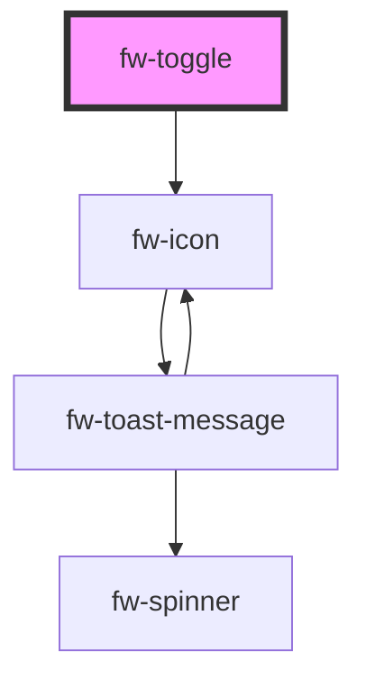

# Toggle (fw-toggle)

fw-toggle displays an input control that enables modifying an element’s state between two settings. 

## Demo

```html live
<fw-toggle size="small">Small not selected</fw-toggle><br><br>
<fw-toggle size="medium" checked>Mid-sized and selected</fw-toggle>
```

## Usage

<code-group>
<code-block title="HTML">
```html 
<fw-toggle size="small">Small not selected</fw-toggle><br><br>
<fw-toggle size="medium" checked>Mid-sized and selected</fw-toggle>
```
</code-block>

<code-block title="React">
```jsx
import React from "react";
import ReactDOM from "react-dom";
import { FwToggle } from "@freshworks/crayons/react";
function App() {
  return (<div>
          <FwToggle size="small">Small not selected</FwToggle><br/><br/>
          <FwToggle size="medium" checked>Mid-sized and selected</FwToggle>
    </div>);
}
```
</code-block>
</code-group>
<!-- Auto Generated Below -->


## Properties

| Property   | Attribute   | Description                                                                                                                             | Type                             | Default    |
| ---------- | ----------- | --------------------------------------------------------------------------------------------------------------------------------------- | -------------------------------- | ---------- |
| `checked`  | `checked`   | Sets the selected state as the default state. If the attribute’s value is undefined, the value is set to false.                         | `boolean`                        | `false`    |
| `disabled` | `disabled`  | Specifies whether to disable the control on the interface. If the attribute’s value is undefined, the value is set to false.            | `boolean`                        | `false`    |
| `label`    | `label`     | Label for the component, that can be used by screen readers.                                                                            | `string`                         | `''`       |
| `name`     | `name`      | Name of the component, saved as part of the form data.                                                                                  | `string`                         | `''`       |
| `showIcon` | `show-icon` | Specifies whether to show the check and cancel icons on toggle button. If the attribute’s value is undefined, the value is set to true. | `boolean`                        | `true`     |
| `size`     | `size`      | Size of the input control.                                                                                                              | `"large" \| "medium" \| "small"` | `'medium'` |


## Events

| Event      | Description                                                 | Type               |
| ---------- | ----------------------------------------------------------- | ------------------ |
| `fwChange` | Triggered when the input control is selected or deselected. | `CustomEvent<any>` |


## CSS Custom Properties

| Name                                       | Description                                          |
| ------------------------------------------ | ---------------------------------------------------- |
| `--fw-toggle-off-bg`                       | Background of toggle off state                       |
| `--fw-toggle-small-height`                 | height of toggle small variant                       |
| `--fw-toggle-small-switch-position-bottom` | Bottom position of toggle switch - small variant     |
| `--fw-toggle-small-switch-translate`       | Translation value of toggle switch                   |
| `--fw-toggle-small-width`                  | Width of toggle small variant                        |
| `--fw-toggle-switch-checked-border`        | Border color of toggle switch checked- small variant |


## Dependencies

### Depends on

- [fw-icon](../icon)

### Graph


----------------------------------------------

Built with ❤ at Freshworks
