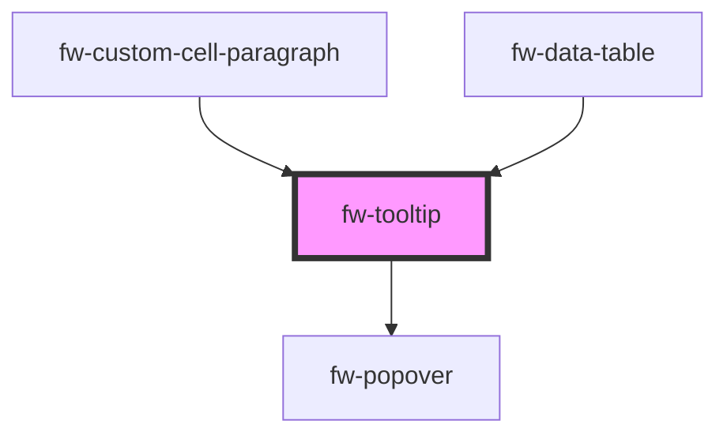

# Tooltip (fw-tooltip)

Tooltips are used to show additional information on a target during hover interactions.

## Demo & Usage

#### Basic demo

```html live
<fw-tooltip content="This is the first tooltip example">
  <fw-button> Show tooltip </fw-button>
</fw-tooltip>
```

#### Basic usage
<code-group>
<code-block title="HTML">
```html 
  <fw-tooltip content="This is the first tooltip example">
    <fw-button> Show tooltip </fw-button>
  </fw-tooltip>
```
</code-block>

<code-block title="React">
```jsx
import React from "react";
import ReactDOM from "react-dom";
import { FwButton, FwTooltip } from "@freshworks/crayons/react";
function App() {
  return (<div>
    <FwTooltip content="This is the first tooltip example">
      <FwButton> Show tooltip </FwButton>
    </FwTooltip>
 </div>);
}
```
</code-block>
</code-group>

#### Placement demo

```html live
<template>
  <div>
    <div>
      Hover over the tiles:
      <br /><br /><br />
    </div>
    <div class="tooltip-placement-example">
      <div class="tooltip-placement-example-row">
        <fw-tooltip content="top-start" placement="top-start">
          <button></button>
        </fw-tooltip>

        <fw-tooltip content="top" placement="top">
          <button></button>
        </fw-tooltip>

        <fw-tooltip content="top-end" placement="top-end">
          <button></button>
        </fw-tooltip>
      </div>

      <div class="tooltip-placement-example-row">
        <fw-tooltip content="left-start" placement="left-start">
          <button></button>
        </fw-tooltip>

        <fw-tooltip content="right-start" placement="right-start">
          <button></button>
        </fw-tooltip>
      </div>

      <div class="tooltip-placement-example-row">
        <fw-tooltip content="left" placement="left">
          <button></button>
        </fw-tooltip>

        <fw-tooltip content="right" placement="right">
          <button></button>
        </fw-tooltip>
      </div>

      <div class="tooltip-placement-example-row">
        <fw-tooltip content="left-end" placement="left-end">
          <button></button>
        </fw-tooltip>

        <fw-tooltip content="right-end" placement="right-end">
          <button></button>
        </fw-tooltip>
      </div>

      <div class="tooltip-placement-example-row">
        <fw-tooltip content="bottom-start" placement="bottom-start">
          <button></button>
        </fw-tooltip>

        <fw-tooltip content="bottom" placement="bottom">
          <button></button>
        </fw-tooltip>

        <fw-tooltip content="bottom-end" placement="bottom-end">
          <button></button>
        </fw-tooltip>
      </div>
    </div>
  </div>
</template>

<style>
  .tooltip-placement-example {
    width: 270px;
    margin-left: calc(50% - 135px);
  }

  .tooltip-placement-example-row {
    display: flex;
    justify-content: space-between;
  }

  .tooltip-placement-example button {
    display: block;
    height: 50px;
    width: 50px;
    border: 0px;
    background-color: rgb(38, 73, 102);
    background-image: linear-gradient(rgb(38, 73, 102), rgb(18, 52, 77));
    border-radius: 4px;
    margin: 2px;
  }

  .tooltip-placement-example-row:first-child, .tooltip-placement-example-row:last-child {
    justify-content: center;
  }
</style>
```

#### Triggers demo

```html live 
<div>
  Activating through click:
  <br /><br />
</div>
<fw-tooltip placement="right" trigger="click" content="This is the tooltip that activates on click">
  <fw-button> Click </fw-button>
</fw-tooltip>
<div>
  <br /><br />
  Activating through hover:
  <br /><br />
</div>
<fw-tooltip placement="right" trigger="hover" content="This is the tooltip that activates on hover">
  <fw-button> Hover </fw-button>
</fw-tooltip>
<div>
  <br /><br />
  Activating through manual trigger outside tooltip:
  <br /><br />
</div>
<fw-tooltip placement="right" id="tooltip" trigger="manual" content="Alice Schneier">
  <fw-avatar initials="AS"></fw-avatar>
</fw-tooltip>
<div><br /><fw-button id="trigger"> Show Name </fw-button></div>
<script type="application/javascript">
  document.getElementById("trigger").addEventListener("click", function () {
    document.getElementById("tooltip").show();
  })
</script>
```

#### Triggers usage
<code-group>
<code-block title="HTML">
```html 
  <div>
    Activating through click:
    <br /><br />
  </div>
  <fw-tooltip placement="right" trigger="click" content="This is the tooltip that activates on click">
    <fw-button> Click </fw-button>
  </fw-tooltip>
  <div>
    <br /><br />
    Activating through hover:
    <br /><br />
  </div>
  <fw-tooltip placement="right" trigger="hover" content="This is the tooltip that activates on hover">
    <fw-button> Hover </fw-button>
  </fw-tooltip>
  <div>
    <br /><br />
    Activating through manual trigger outside tooltip:
    <br /><br />
  </div>
  <fw-tooltip placement="right" id="tooltip" trigger="manual" content="Alice Schneier">
    <fw-avatar initials="AS"></fw-avatar>
  </fw-tooltip>
  <div><br /><fw-button id="trigger"> Show Name </fw-button></div>
  <script type="application/javascript">
    document.getElementById("trigger").addEventListener("click", function () {
      document.getElementById("tooltip").show();
    })
  </script>
```
</code-block>

<code-block title="React">
```jsx
import React from "react";
import ReactDOM from "react-dom";
import { FwButton, FwTooltip, FwAvatar } from "@freshworks/crayons/react";
function App() {
  const triggerRef = useRef(null);
  const tooltipRef = useRef(null);
  return (<div>
      <div>
        Activating through click:
        <br /><br />
      </div>
      <FwTooltip placement="right" trigger="click" content="This is the tooltip that activates on click">
        <FwButton> Click </FwButton>
      </FwTooltip>
      <div>
        <br /><br />
        Activating through hover:
        <br /><br />
      </div>
      <FwTooltip placement="right" trigger="hover" content="This is the tooltip that activates on hover">
        <FwButton> Hover </FwButton>
      </FwTooltip>
      <div>
        <br /><br />
        Activating through manual trigger outside tooltip:
        <br /><br />
      </div>
      <FwTooltip placement="right" id="tooltip" trigger="manual" content="Alice Schneier" ref={tooltipRef}>
        <FwAvatar initials="AS"></FwAvatar>
      </FwTooltip>
      <div><br /><FwButton ref={triggerRef} onClick={() => tooltipRef.current.show()}> Show Name </FwButton></div>
    </div>);
}
```
</code-block>
</code-group>

#### HTML in Tooltip

```html live
<fw-tooltip>
  <fw-button> Show tooltip </fw-button>
  <div slot="tooltip-content">
    This tooltip has <b>HTML</b> content.
  </div>
</fw-tooltip>
```

#### HTML in tooltip Usage
<code-group>
<code-block title="HTML">
```html 
  <fw-tooltip>
    <fw-button> Show tooltip </fw-button>
    <div slot="tooltip-content">
      This tooltip has <b>HTML</b> content.
    </div>
  </fw-tooltip>
```
</code-block>

<code-block title="React">
```jsx
import React from "react";
import ReactDOM from "react-dom";
import { FwButton, FwTooltip } from "@freshworks/crayons/react";
function App() {
  return (<div>
    <FwTooltip>
      <FwButton> Show tooltip </FwButton>
      <div slot="tooltip-content">
        This tooltip has <b>HTML</b> content.
      </div>
    </FwTooltip>
 </div>);
}
```
</code-block>
</code-group>


#### Hoisting

```html live
<template>
  <div class="limit">
    <fw-tooltip content="This is a tooltip">
      <fw-button> No hoist </fw-button>
    </fw-tooltip>
    <fw-tooltip content="This is a hoisted tooltip" hoist>
      <fw-button> Hoist </fw-button>
    </fw-tooltip>
  </div>
</template>
<style>
  .limit {
    position: relative;
    display: inline-block;
    overflow: hidden;
    padding: 15px 0px;
  }
</style>
```

#### Hoisting usage
<code-group>
<code-block title="HTML">
```html 
  <template>
    <div class="limit">
      <fw-tooltip content="This is a tooltip">
        <fw-button> No hoist </fw-button>
      </fw-tooltip>
      <fw-tooltip content="This is a hoisted tooltip" hoist>
        <fw-button> Hoist </fw-button>
      </fw-tooltip>
    </div>
  </template>
  <style>
    .limit {
      position: relative;
      display: inline-block;
      overflow: hidden;
      padding: 15px 0px;
    }
  </style>
```
</code-block>
</code-group>


<!-- Auto Generated Below -->


## Properties

| Property             | Attribute   | Description                                                                                                                                                              | Type                                                                                                                                                                 | Default   |
| -------------------- | ----------- | ------------------------------------------------------------------------------------------------------------------------------------------------------------------------ | -------------------------------------------------------------------------------------------------------------------------------------------------------------------- | --------- |
| `content`            | `content`   | Content of the tooltip.                                                                                                                                                  | `string`                                                                                                                                                             | `''`      |
| `distance`           | `distance`  | Distance defines the distance between the popover trigger and the popover content along y-axis.                                                                          | `string`                                                                                                                                                             | `'10'`    |
| `fallbackPlacements` | --          | Alternative placement for popover if the default placement is not possible.                                                                                              | `[PopoverPlacementType]`                                                                                                                                             | `['top']` |
| `hoist`              | `hoist`     | Option to prevent the tooltip from being clipped when the component is placed inside a container with `overflow: auto\|hidden\|scroll`.                                  | `boolean`                                                                                                                                                            | `false`   |
| `placement`          | `placement` | Placement of the popover content with respect to the popover trigger.                                                                                                    | `"bottom" \| "bottom-end" \| "bottom-start" \| "left" \| "left-end" \| "left-start" \| "right" \| "right-end" \| "right-start" \| "top" \| "top-end" \| "top-start"` | `'top'`   |
| `trigger`            | `trigger`   | The trigger event on which the popover-content is displayed. The available options are 'click' \| 'manual' \| 'hover', in case of 'manual' no trigger event will be set. | `"click" \| "hover" \| "manual"`                                                                                                                                     | `'hover'` |


## Methods

### `hide() => Promise<boolean>`

Hides the tooltip.

#### Returns

Type: `Promise<boolean>`

promise that resolves to true

### `show() => Promise<boolean>`

Shows the tooltip.

#### Returns

Type: `Promise<boolean>`

promise that resolves to true


## Dependencies

### Used by

 - [fw-custom-cell-paragraph](../data-table/custom-cells/paragraph)
 - [fw-data-table](../data-table)

### Depends on

- [fw-popover](../popover)

### Graph


----------------------------------------------

Built with ❤ at Freshworks
