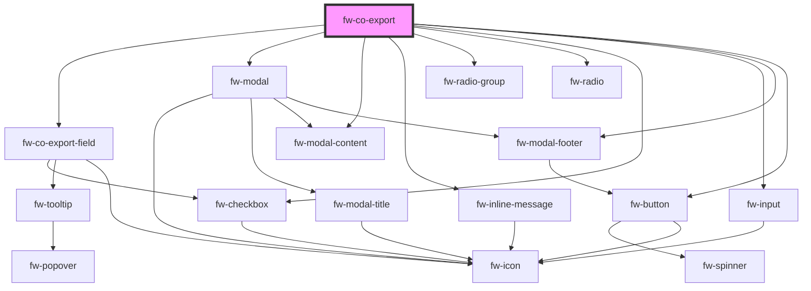

# Export (fw-co-export)

fw-co-export can be used to export the fields in a specific format by selecting the fields required in export.

## Demo

```html live
<fw-co-export id="export"></fw-co-export>
<fw-button id="btnExport">Export</fw-button>

<script type="application/javascript">
  var exportValues = {
    filter: { value: true, filtered: 10, total: 200 },
    formats: {
      selectedValue: 'csv',
      options: [
        { label: 'CSV', value: 'csv' },
        { label: 'Excel', value: 'excel' },
      ],
    },
    fields: [
      {
        id: 'unique_id_in_this_array_to_be_used_for_export',
        label: 'Record id',
        selected: true,
        disabled: true,
        info: 'It is an internal id used in the backend to distinguish the records',
      },
      { id: 'field_id_name', label: 'Hotel Name', selected: true },
      { id: 'field_id_name_2', label: 'Location' },
      { id: 'field_id_name_3', label: 'Price' },
      { id: 'field_id_name_4', label: 'Ratings' },
      { id: 'field_id_name_5', label: 'Review' },
      { id: 'field_id_name_6', label: 'Description' },
      { id: 'field_id_name_7', label: 'Menu' },
      { id: 'field_id_name_8', label: 'Booking' },
      { id: 'field_id_name_9', label: 'Rooms' },
      { id: 'field_id_name_10', label: 'Membership' },
      { id: 'field_id_name_11', label: 'Event Spaces' },
      { id: 'field_id_name_12', label: 'Spas' },
      { id: 'field_id_name_13', label: 'Offers' },
      { id: 'field_id_name_14', label: 'About us' },
    ],
  };

  var fwExport = document.getElementById('export');
  fwExport.value = exportValues;

  fwExport.addEventListener('fwExport', (event) => {
    console.log(`Exported Values ---  ${JSON.stringify(event.detail)}`);
    fwExport.isOpen = false;
  });

  fwExport.addEventListener('fwCloseExport', (event) => {
    fwExport.isOpen = false;
  });

  document.querySelector('#btnExport').addEventListener('click', () => {
    fwExport.isOpen = true;
  });
</script>
```

## Usage

<code-group>
<code-block title="HTML">
```html
<fw-co-export id="export"></fw-co-export>
<fw-button id="btnExport">Export</fw-button>

<script type="application/javascript">
  var exportValues = {
    filter: { value: true, filtered: 10, total: 200 },
    formats: {
      selectedValue: 'csv',
      options: [
        { label: 'CSV', value: 'csv' },
        { label: 'Excel', value: 'excel' },
      ],
    },
    fields: [
      {
        id: 'unique_id_in_this_array_to_be_used_for_export',
        label: 'Record id',
        selected: true,
        disabled: true,
        info: 'It is an internal id used in the backend to distinguish the records',
      },
      { id: 'field_id_name', label: 'Hotel Name', selected: true },
      { id: 'field_id_name_2', label: 'Location' },
      { id: 'field_id_name_3', label: 'Price' },
      { id: 'field_id_name_4', label: 'Ratings' },
      { id: 'field_id_name_5', label: 'Review' },
      { id: 'field_id_name_6', label: 'Description' },
      { id: 'field_id_name_7', label: 'Menu' },
      { id: 'field_id_name_8', label: 'Booking' },
      { id: 'field_id_name_9', label: 'Rooms' },
      { id: 'field_id_name_10', label: 'Membership' },
      { id: 'field_id_name_11', label: 'Event Spaces' },
      { id: 'field_id_name_12', label: 'Spas' },
      { id: 'field_id_name_13', label: 'Offers' },
      { id: 'field_id_name_14', label: 'About us' },
    ],
  };

  var fwExport = document.getElementById('export');
  fwExport.value = exportValues;

  fwExport.addEventListener('fwExport', (event) => {
    console.log(`Exported Values ---  ${JSON.stringify(event.detail)}`);
    fwExport.isOpen = false;
  });

  fwExport.addEventListener('fwCloseExport', (event) => {
    fwExport.isOpen = false;
  });

  document.querySelector('#btnExport').addEventListener('click', () => {
    fwExport.isOpen = true;
  });
</script>

````
</code-block>

<code-block title="React">
```jsx
import React, { useState } from 'react';
import { FwCoExport } from '@freshworks/platform-ui/react';
import { FwButton } from '@freshworks/crayons/react';

export default function ExportFields() {
  const initialValues = {
    filter: { value: true, filtered: 10, total: 200 },
    formats: {
      selectedValue: 'csv',
      options: [
        { label: 'CSV', value: 'csv' },
        { label: 'Excel', value: 'excel' },
      ],
    },
    fields: [
      {
        id: 'unique_id_in_this_array_to_be_used_for_export',
        label: 'Record id',
        selected: true,
        disabled: true,
        info: 'It is an internal id used in the backend to distinguish the records',
      },
      { id: 'field_id_name', label: 'Hotel Name', selected: true },
      { id: 'field_id_name_2', label: 'Location' },
      { id: 'field_id_name_3', label: 'Price' },
      { id: 'field_id_name_4', label: 'Ratings' },
      { id: 'field_id_name_5', label: 'Review' },
      { id: 'field_id_name_6', label: 'Description' },
      { id: 'field_id_name_7', label: 'Menu' },
      { id: 'field_id_name_8', label: 'Booking' },
      { id: 'field_id_name_9', label: 'Rooms' },
      { id: 'field_id_name_10', label: 'Membership' },
      { id: 'field_id_name_11', label: 'Event Spaces' },
      { id: 'field_id_name_12', label: 'Spas' },
      { id: 'field_id_name_13', label: 'Offers' },
      { id: 'field_id_name_14', label: 'About us' },
    ],
  };

  const [isOpen, setOpen] = useState(false);
  const [formValues, setFormValues] = useState(initialValues);

  const exportHandler = async event => {
    console.info(`Exported Values ---  ${JSON.stringify(event.detail)}`);
    setFormValues(initialValues);
    setOpen(false);
  };

  const closeExportHandler = async event => {
    setOpen(false);
  };

  const openExportHandler = async event => {
    setOpen(true);
  };

  return (
    <div style={{ padding: '40px' }}>
      <FwCoExport isOpen={isOpen} value={formValues} onFwExport={exportHandler} onFwCloseExport={closeExportHandler}></FwCoExport>
      <FwButton onFwClick={openExportHandler}>{'Export'}</FwButton>
    </div>
  );
}

````

</code-block>
</code-group>

<!-- Auto Generated Below -->

## Properties

| Property | Attribute | Description                                             | Type      | Default |
| -------- | --------- | ------------------------------------------------------- | --------- | ------- |
| `isOpen` | `is-open` | The value to show the modal or close                    | `boolean` | `false` |
| `value`  | `value`   | The value to populate the export details in json format | `any`     | `null`  |

## Events

| Event           | Description                                            | Type               |
| --------------- | ------------------------------------------------------ | ------------------ |
| `fwCloseExport` | Triggered whenever the cancel/close button is selected | `CustomEvent<any>` |
| `fwExport`      | Triggered whenever the export button is selected       | `CustomEvent<any>` |

## Methods

### `close() => Promise<boolean>`

#### Returns

Type: `Promise<boolean>`

### `open() => Promise<boolean>`

#### Returns

Type: `Promise<boolean>`

## Dependencies

### Depends on

- [fw-co-export-field](components)
- fw-modal
- fw-modal-content
- fw-inline-message
- fw-radio-group
- fw-radio
- fw-checkbox
- fw-input
- fw-modal-footer
- fw-button

### Graph



---

_Built with [StencilJS](https://stenciljs.com/)_

```

```

```

```
