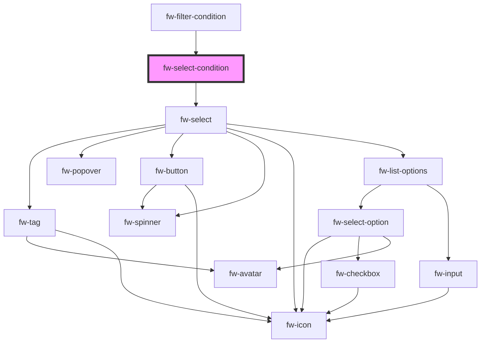

# fw-input-condition

<!-- Auto Generated Below -->

## Properties

| Property       | Attribute    | Description                                      | Type      | Default     |
| -------------- | ------------ | ------------------------------------------------ | --------- | ----------- |
| `controlProps` | --           | The props to be passed to the crayons component. | `{}`      | `{}`        |
| `error`        | `error`      | Whether the component have any error.            | `boolean` | `false`     |
| `showError`    | `show-error` | Whether to show the error.                       | `boolean` | `true`      |
| `value`        | `value`      | The value of the input                           | `any`     | `undefined` |

## Methods

### `isValid() => Promise<any>`

#### Returns

Type: `Promise<any>`

### `refresh() => Promise<any>`

#### Returns

Type: `Promise<any>`

### `setError(error: any, errorText?: any) => Promise<any>`

#### Returns

Type: `Promise<any>`

## Dependencies

### Used by

 - [fw-filter-condition](../filter-condition)

### Depends on

- fw-select

### Graph

----------------------------------------------

*Built with [StencilJS](https://stenciljs.com/)*
