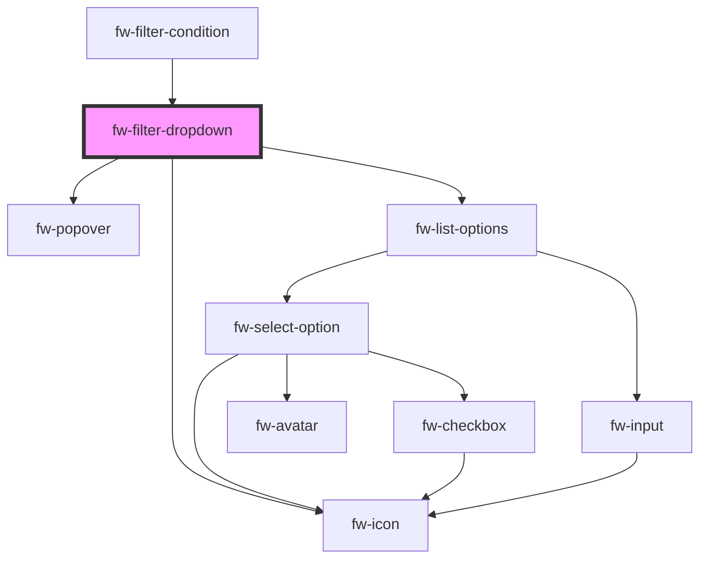

# fw-filter-dropdown

<!-- Auto Generated Below -->

## Properties

| Property  | Attribute | Description        | Type  | Default     |
| --------- | --------- | ------------------ | ----- | ----------- |
| `options` | `options` | The filter schema  | `any` | `undefined` |
| `value`   | `value`   | The selected value | `any` | `undefined` |

## Dependencies

### Used by

 - [fw-filter-condition](../filter-condition)

### Depends on

- fw-popover
- fw-icon
- fw-list-options

### Graph

----------------------------------------------

*Built with [StencilJS](https://stenciljs.com/)*
