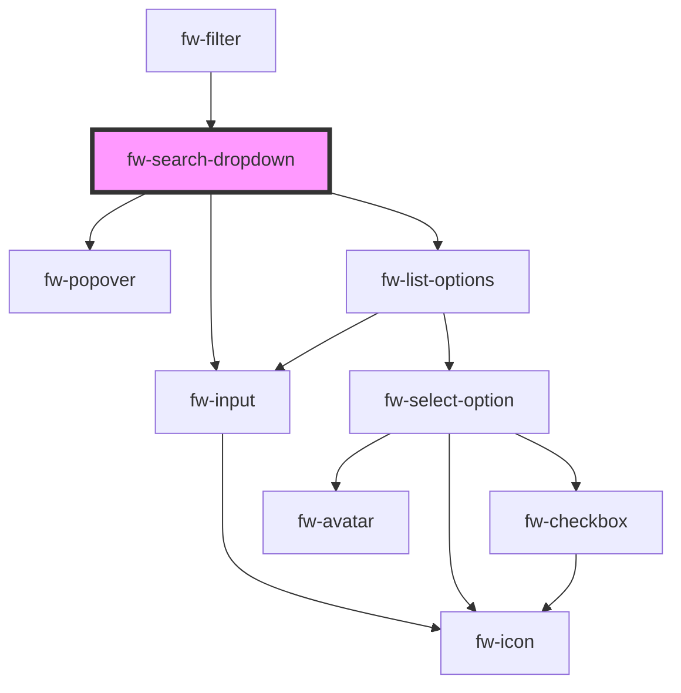

# fw-search-dropdown

<!-- Auto Generated Below -->

## Properties

| Property  | Attribute | Description       | Type  | Default     |
| --------- | --------- | ----------------- | ----- | ----------- |
| `options` | `options` | The filter schema | `any` | `undefined` |

## Events

| Event      | Description     | Type               |
| ---------- | --------------- | ------------------ |
| `fwChange` | On Change event | `CustomEvent<any>` |

## Dependencies

### Used by

 - [fw-filter](../filter)

### Depends on

- fw-popover
- fw-input
- fw-list-options

### Graph

----------------------------------------------

*Built with [StencilJS](https://stenciljs.com/)*
